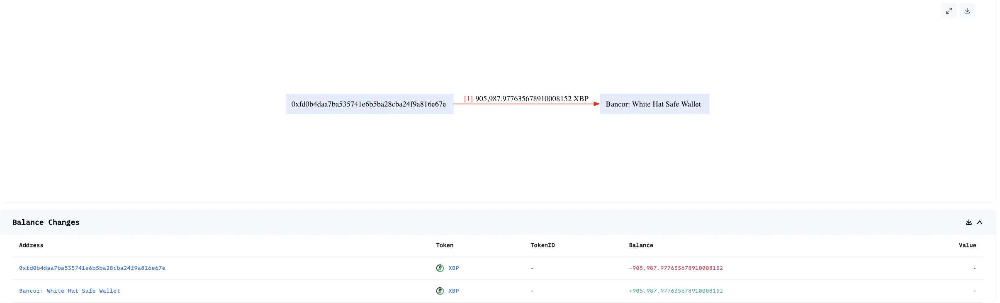
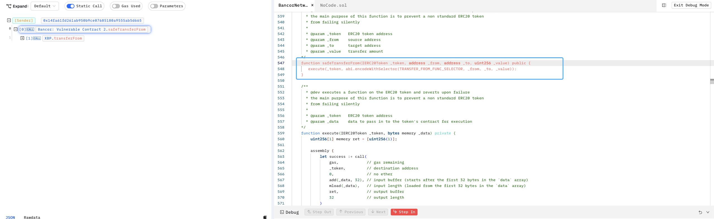
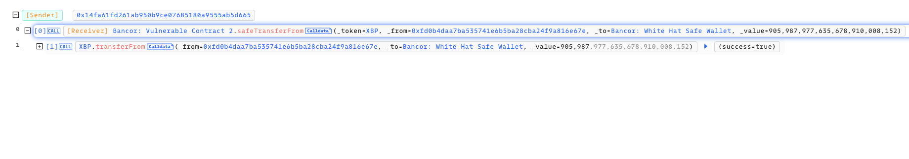

# 20200621 - Bancor -  逻辑错误 ～ 90K $XBP

## 相关地址

攻击者地址: 0x29551fc9c39a95d8f93ad4209944ff05846a05f3

被攻击合约地址: 0x5f58058c0ec971492166763c8c22632b583f667f

攻击交易: 0x4643b63dcbfc385b8ab8c86cbc46da18c2e43d277de3e5bc3b4516d3c0fdeb9f

攻击合约地址: 0x5f58058c0ec971492166763c8c22632b583f667f

## 攻击分析



漏洞出现在 Bancor 合同中 safeTransferFrom 方法



```solidity
    function safeTransferFrom(IERC20Token _token, address _from, address _to, uint256 _value) public {
       execute(_token, abi.encodeWithSelector(TRANSFER_FROM_FUNC_SELECTOR, _from, _to, _value));
    }
```

该方法允许任何人转出任意地址的 $XRP 代币导致漏洞

