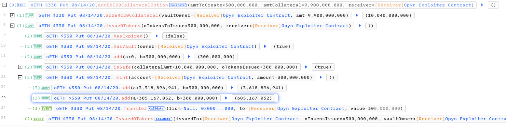
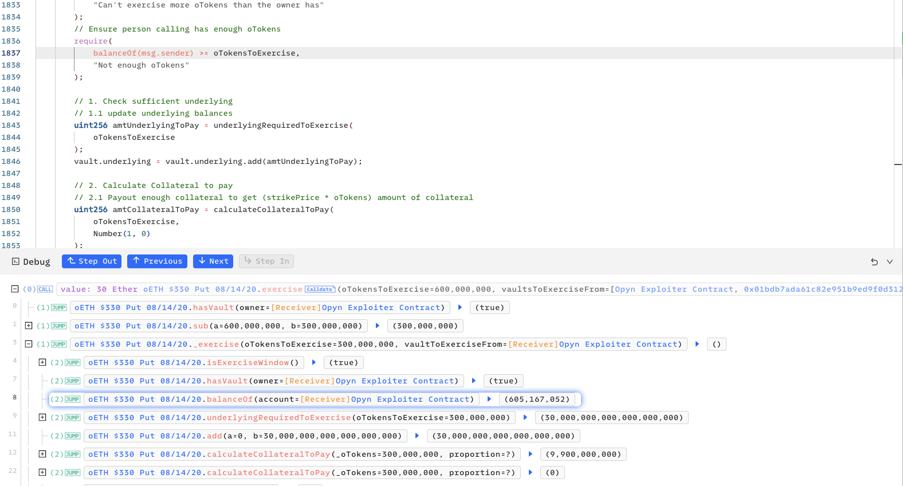
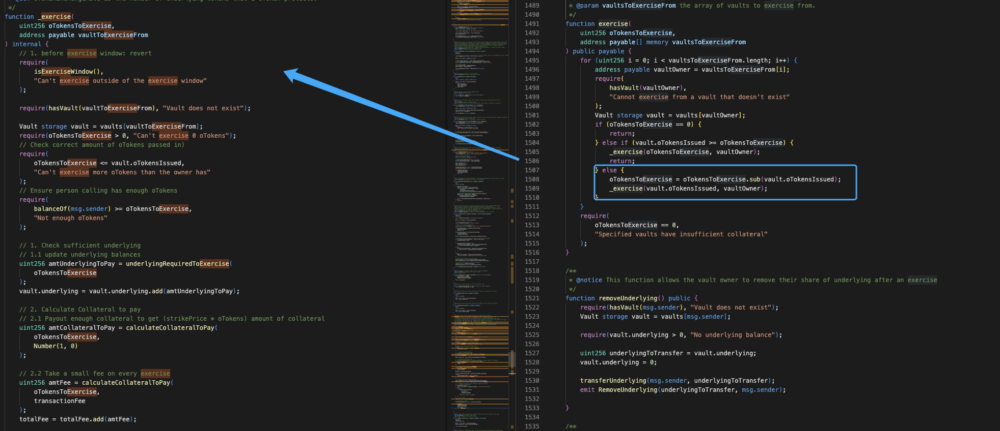
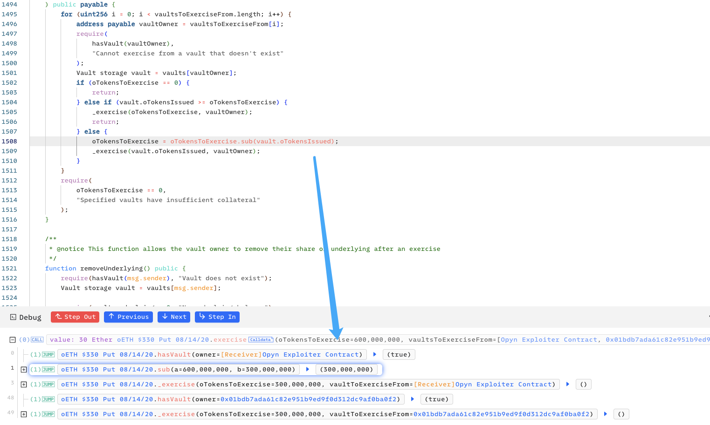
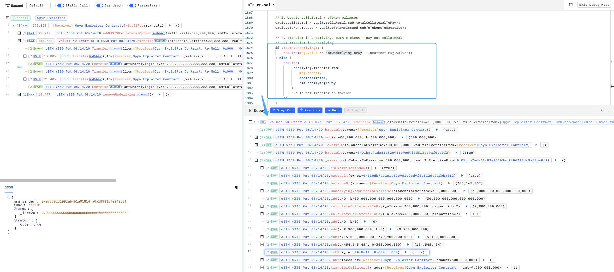

# 20200804 - Opyn - 参数可控 ～ 100K $USDC

## 相关地址

攻击者地址: 0x915c2d6f571d3d47a182dd59d5f41e87d4c3fb8e

被攻击合约地址: 0x951d51baefb72319d9fbe941e1615938d89abfe2

攻击交易: 0x56de6c4bd906ee0c067a332e64966db8b1e866c7965c044163a503de6ee6552a

攻击合约地址: 0xe7870231992ab4b1a01814fa0a599115fe94203f

## 攻击分析

攻击者首先通过合约中的函数 addERC20CollateralOption 买入 30份 看跌期权

后续调用 exercise函数 时有 require检测余额是否大于参数 oTokensToExercise，所以需要 30 + 原有份额 >= oTokensToExercise，这里攻击者原有期权为 30.5 份

代码中 exercise 函数会根据 vaultsToExerciseFrom.length 来判断循环次数

参数 oTokensToExercise > vault.oTokensIssued 时会走到最后的 else 代码

第一次调用 _exercise 时正常销毁期权转出 $USDC 给用户，但第二次调用 _exercise 时由于 msg.value == amtUnderlyingToPay 将代币转给攻击者

