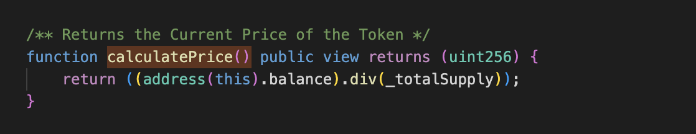

# 20210816 - xSurge - 重入攻击 ～ 12K $BNB

## 相关地址

攻击者地址: 0x59c686272e6f11dc8701a162f938fb085d940ad3

被攻击合约地址: 0xe1e1aa58983f6b8ee8e4ecd206cea6578f036c21

攻击交易: 0x7e2a6ec08464e8e0118368cb933dc64ed9ce36445ecf9c49cacb970ea78531d2

攻击合约地址: 0x1514aaa4dcf56c4aa90da6a4ed19118e6800dc46

## 攻击分析


攻击者通过闪电贷借入 10000 $BNB


调用合约的 fallback 重复买入 xSurge Token


第一次买入正常买入，第二次sell函数调用时出现了重入漏洞 


sell 函数中 seller 可控，msg.sender 调用 call 后程序控制权来到攻击者合约中，而代码下部分为 totalSupplu 的计算，如果此时攻击者控制程序到其他函数中会导致 totalSupply 的计算出现错误，totalSupply不变将影响 Token价格，攻击者不断通过重入漏洞调用函数 purchase 就会导致总量 _totalSupply 不断增加



xSurge BNB余额 / _totalSupply, 买入时(purchase)总量增加价格减小，卖出时(sell)总量减小价格增加

```solidity
// sell 函数时
bnb1 = xSurge * 0.94 * (address(this).balance)/ (_totalSupply)

// purchase 函数时
xSurge =  _totalSupply * bnb * 0.94 / (address(this).balance) - bnb;

bnb2 = (xSurge * (address(this).balance)) / (0.94 * totalSupply + xSurge) 
```

根据上面的公式，攻击者如果要获利需要 bnb1 > bnb2 ，也就是重入后最后一次sell时 xSuger 代币数量需要为总供应量 12.38% 以上，而此时攻击者由于不断重入函数 purchase 导致 totalSupply 不断变大，使每次攻击者使用 $BNB 兑换 $xSurge 代币调用时，兑换的数量会越来越大

```solidity
xSurge * 0.94 * (address(this).balance)/ (_totalSupply) > (xSurge * (address(this).balance)) / (0.94 * totalSupply + xSurge) 

// 解不等式
xSuger < ((1 − 0.94 * 0.94)/0.94) * totalSupply = 0.1238 * totalSupply
```


攻击者只需要重复 sell 并重入 purchase 就可以获取越来越多的 Token，在第8次时达到最大获利点停止重入获利离场