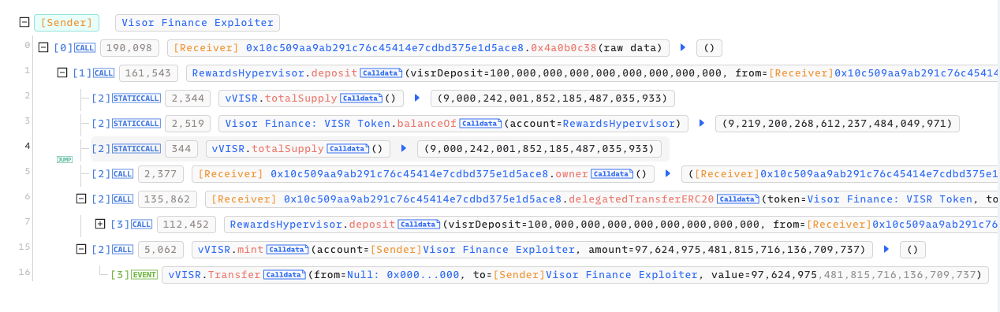
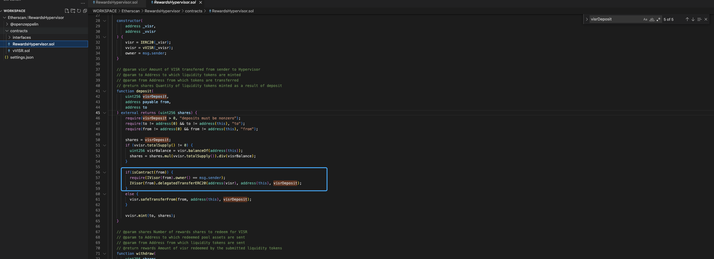
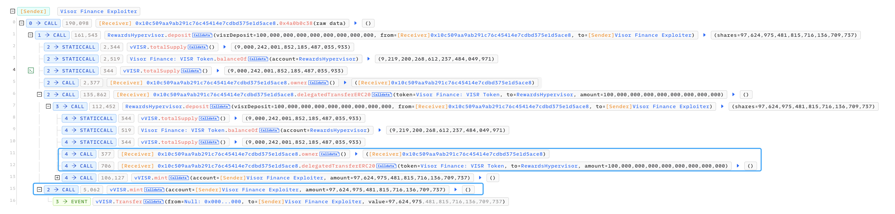

#  20211222 - Visor Finance - 合约逻辑漏洞 ～ 195KK $vVISR

## 相关地址

攻击者地址: 0x8efab89b497b887cdaa2fb08ff71e4b3827774b2

被攻击合约地址: 0xC9f27A50f82571C1C8423A42970613b8dBDA14ef

攻击交易: 0x69272d8c84d67d1da2f6425b339192fa472898dce936f24818fda415c1c1ff3f

攻击合约地址: 0x10c509aa9ab291c76c45414e7cdbd375e1d5ace8

## 攻击分析

攻击者通过攻击合约调用 RewardsHypervisor 合约中的 deposit 函数

在函数中 from 地址是可控的，if(isContract(from)) 逻辑里调用的是 from 地址的 owner函数 和 delegatedTransferERC20 函数

最后根据合约逻辑调用攻击合约 owner 和 delegatedTransferERC20 函数后，通过 vVISR.mint 获利

