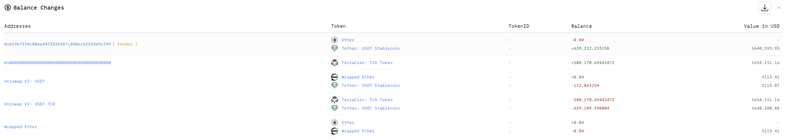
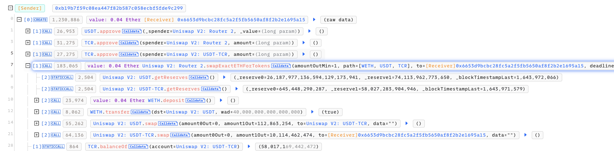
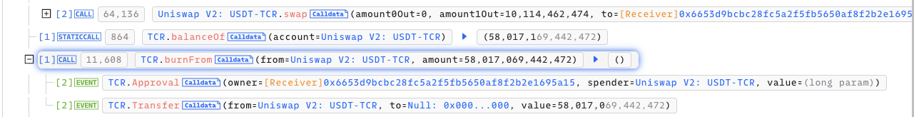
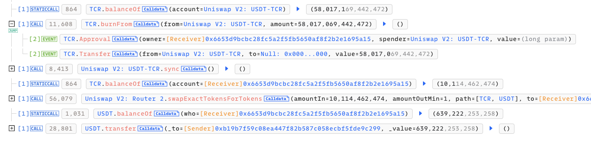

# 20220204 - TecraSpace - 逻辑错误 ~ 639K $USDT

## 相关地址

攻击者地址：0xb19b7f59c08ea447f82b587c058ecbf5fde9c299

攻击合约：0x6653d9bcbc28fc5a2f5fb5650af8f2b2e1695a15

被攻击合约：0xe38b72d6595fd3885d1d2f770aa23e94757f91a1

攻击交易：0x81e9918e248d14d78ff7b697355fd9f456c6d7881486ed14fdfb69db16631154

## 攻击分析



攻击者首先通过 0.4 $ETH swap 出部分 $TCR 代币



接着通过函数 burnFrom 销毁了池中的 $TRC 代币



漏洞出现在函数中的 msg.sender 与 from 的顺序中

```solidity
function burnFrom(address from, uint256 amount) external {
        require(_allowances[msg.sender][from] >= amount, ERROR_ATL);
        require(_balances[from] >= amount, ERROR_BTL);
        _approve(msg.sender, from, _allowances[msg.sender][from] - amount);
        _burn(from, amount);
    }
```

函数的功能为销毁 from 地址的 amount 数量的 Token， 其中通过 _allowances[msg.sender][from] >= amount 来判断 from 地址是否给予 msg.sender 代币授权，可代码中写反了参数位置，导致 require 无效，攻击者可任意销毁任意地址的 $TRC 代币

```solidity
_allowances[from][msg.sender] --->  A(msg.sender) 销毁 B (from) 检测 B 是否对 A 有代币授权
_allowances[msg.sender][from] --->  B (from) 销毁 A(msg.sender) 检测 A 是否对 B 有代币授权

uniswap 计算公式： F(x)=(0.997x/(0.997x+Rx))∗Ry
流动池中的代币假设为X和Y，其中：
F(x)表示用户可以用 x 数量的代币 X 可以兑换出来的代币 Y 的数量。
RX:流动性池中代币X的余额
RY:流动性池中代币Y的余额
```

此时 RY 余额不变，RX 大量减少导致 F(x) 变大，此时攻击者可以用少量的 $TRC 兑换大量的 $USDT, 攻击者大幅度销毁池中的代币后，将之前准备的 $TRC 全部出售兑换为 $USDT

