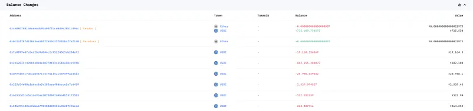
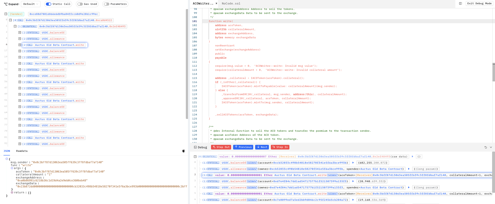
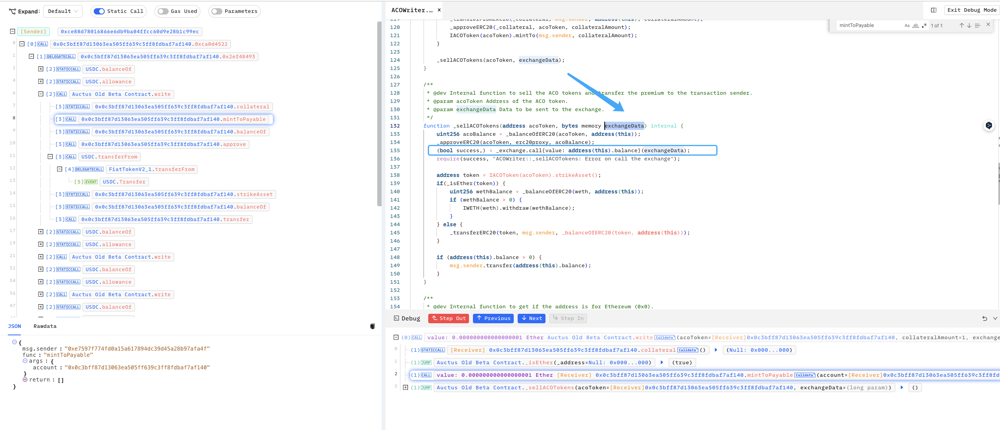
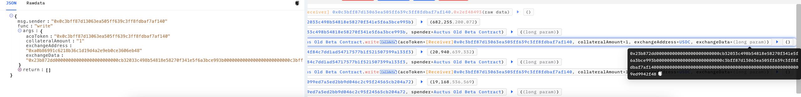
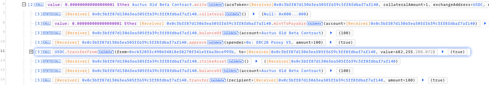

# 20220326 - Auctus acoToken - 参数可控 ～ 725K $USDC

## 相关地址

受害者地址: 0xcb32033c498b54818e58270f341e5f6a3bce993b

攻击交易地址: 0x2e7d7e7a6eb157b98974c8687fbd848d0158d37edc1302ea08ee5ddb376befea

漏洞合约地址: 0xE7597F774fD0a15A617894dc39d45A28B97AFa4f

攻击者地址: 0xce88D78016866e6db9BA04FFCc60d9e28B1c99EC

攻击合约地址: 0x0c3bff87d13063ea505ff639c3ff8fdbaf7af140

## 攻击分析



漏洞出现在合约的 write 函数中



```solidity
    function write(
        address acoToken, 
        uint256 collateralAmount, 
        address exchangeAddress, 
        bytes memory exchangeData
    ) 
        nonReentrant 
        setExchange(exchangeAddress) 
        public 
        payable 
    {
        require(msg.value > 0,  "ACOWriter::write: Invalid msg value");
        require(collateralAmount > 0,  "ACOWriter::write: Invalid collateral amount");
        
        address _collateral = IACOToken(acoToken).collateral();
        if (_isEther(_collateral)) {
            IACOToken(acoToken).mintToPayable{value: collateralAmount}(msg.sender);
        } else {
            _transferFromERC20(_collateral, msg.sender, address(this), collateralAmount);
            _approveERC20(_collateral, acoToken, collateralAmount);
            IACOToken(acoToken).mintTo(msg.sender, collateralAmount);
        }
        
        _sellACOTokens(acoToken, exchangeData);
    }
```

该函数的功能是接收一定数量的以太币或 ERC20 抵押品，然后将相应的抵押品转换为选项合约的代币 

acoToken



在 _sellACOTokens 函数中存在一个可控的 calldata 调用，来源为 参数 exchangeData



攻击者直接构造恶意 calldata 将受害者 $USDC 全部转出

