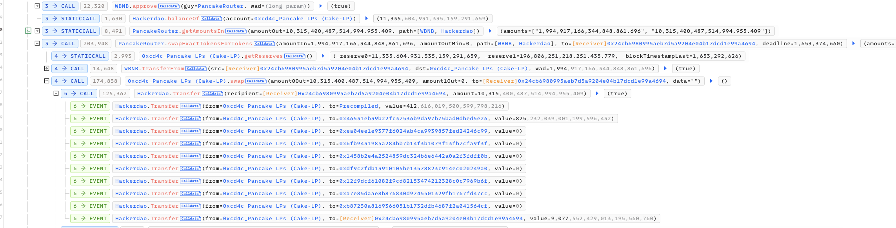
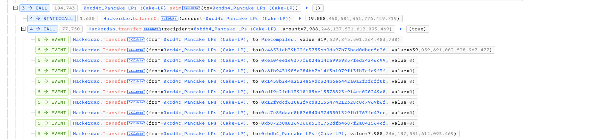

# 20220524 - HackerDao - 价格操纵 ～ 175 $BNB

## 相关地址

攻击者地址：0xcfc591db031b760961fe8943a183741ed7cd1f82

攻击合约：0x24cb6980995aeb7d5a9204e04b17dcd1e99a4694

被攻击合约：0x94e06c77b02ade8341489ab9a23451f68c13ec1c

攻击交易：0x04673c95054247588bb8380dbc7d361f08f8f0baa319366f48ad46e51d08422d

## 攻击分析

攻击者通过闪电贷借入 WBNB 购买 Token

购买获取的 Token 数量为 swap 计算的 88% , 其中 12% 将用于销毁和手续费

将 Token 发送至 LP 中，并调用 skim 将 Token 发送到 USDT LP 

在 _transfer 函数中当 recipient == uniswapV2Pair 时，fee 手续费将扣除发送者的

调用 skim 将 token 从 WBNB LP 发送到 USDT LP 时，符合代码逻辑，fee 手续费将扣除 WBNB LP 中的 Token 余额，所以此时 skim 发送到 USDT LP 时数量不变

此时 WBNB LP 中扣除了手续费，使池中的 Token 减少，WBNB 数量不变，相当于拉升了 Token 价格，攻击者想要最大获利如下图

计算出的结果为 x < 10371 , 当借款接近该值时，将会通过扣除手续费将 WBNB LP 中的 Token 数量接近 0 ，攻击者通过买入 10315 Token，skim 后 LP 中只剩 61 Token，此时攻击者将 Token 全部转换为 WBNB 获利离场

