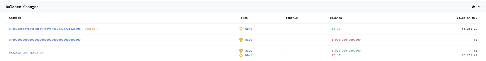
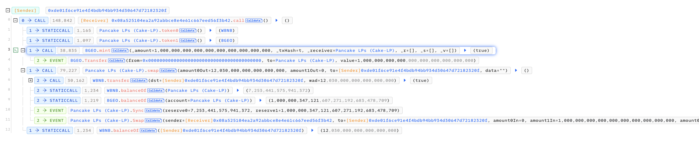
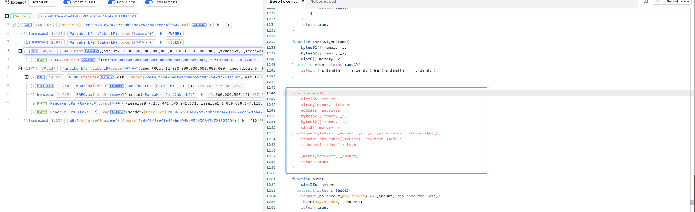

# 20221019 - BEGO - 权限缺失 ～ 12 $BNB

## 相关地址

攻击交易地址: 0x9f4ef3cc55b016ea6b867807a09f80d1b2e36f6cd6fccfaf0182f46060332c57

漏洞合约地址: 0xc342774492b54ce5f8ac662113ed702fc1b34972

攻击者地址: 0xde01f6ce91e4f4bdb94bb934d30647d72182320f

攻击合约地址: 0x08a525104ea2a92abbce8e4e61c667eed56f3b42

## 攻击分析

攻击者调用 mint 函数增发了大量 $BEGO

合约中的 mint 函数允许外部调用，且没有限制地址导致漏洞

