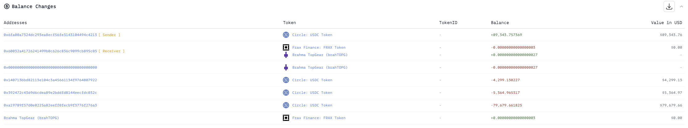
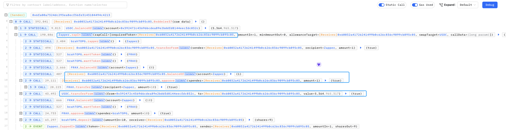
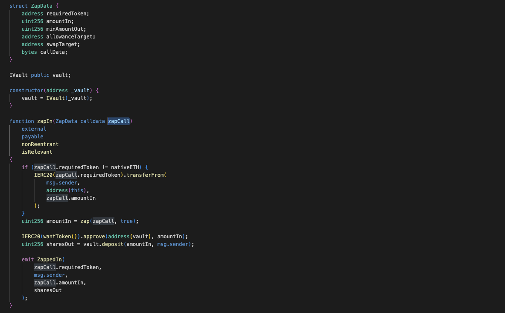
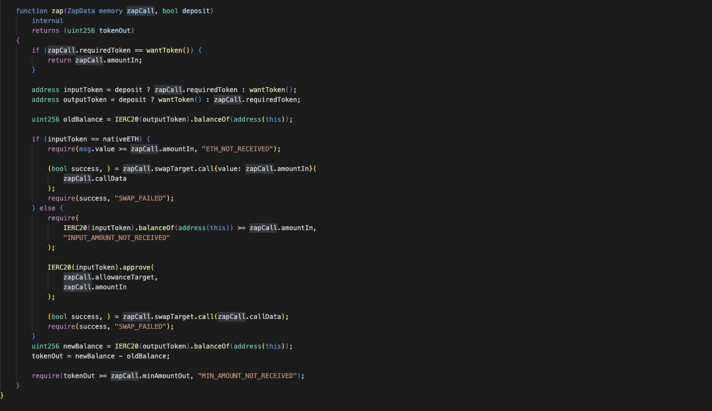

# 20221109 - brahTOPG - 参数可控 ～ 89K $USDC

## 相关地址

攻击者地址: 0x6fa00a7324dc293ea8ecf56fe3143104494c4213

被攻击合约地址: 0xd248b30a3207a766d318c7a87f5cf334a439446d

攻击交易: 0xeaef2831d4d6bca04e4e9035613be637ae3b0034977673c1c2f10903926f29c0

攻击合约地址: 0x60032a41726241499b0c626c836c9099cb895c05

## 攻击分析

攻击者调用 Zapper 合约的 zapIn 函数，将受害者的 USDC 转出

函数代码如下

这里由于 zapCall 是用户可控的，而在 zap 函数中存在 calldata 调用导致漏洞

