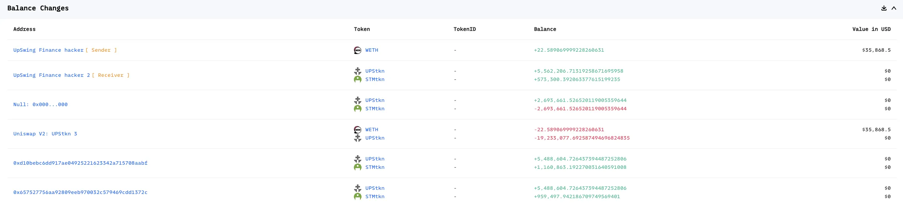
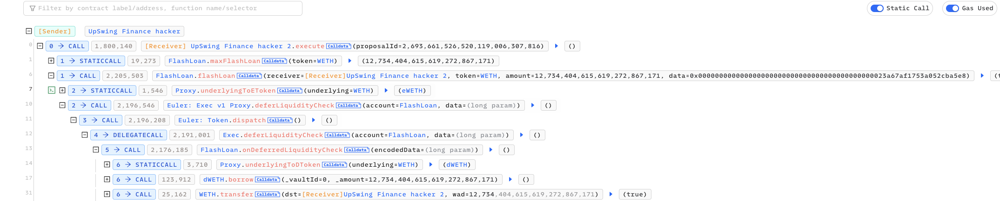
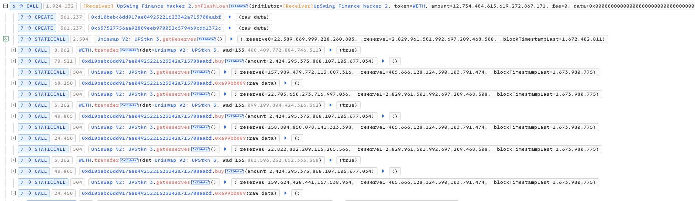
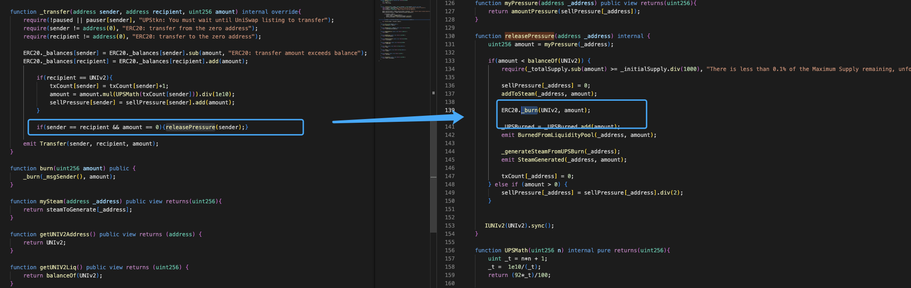
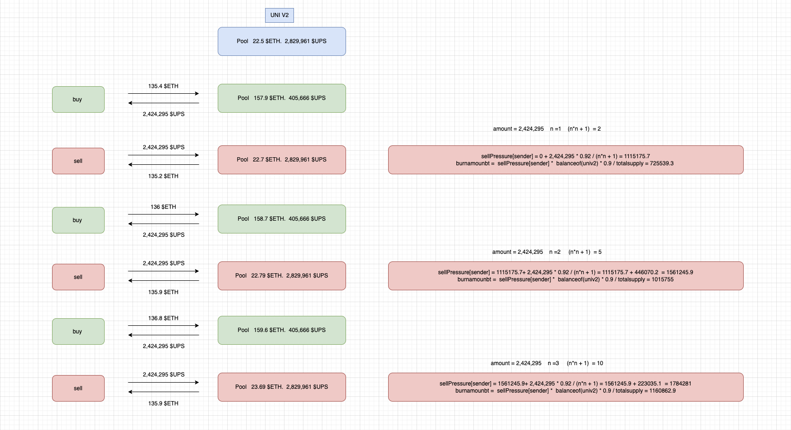
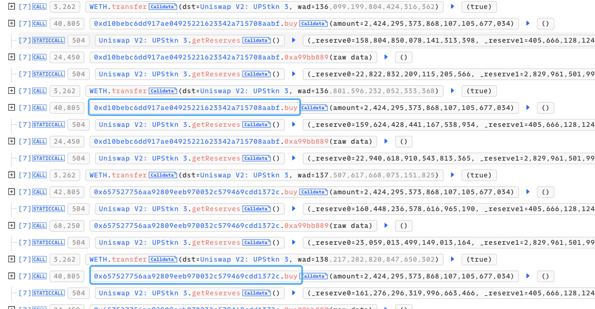
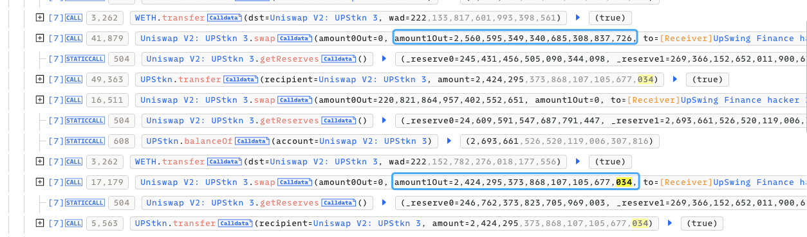
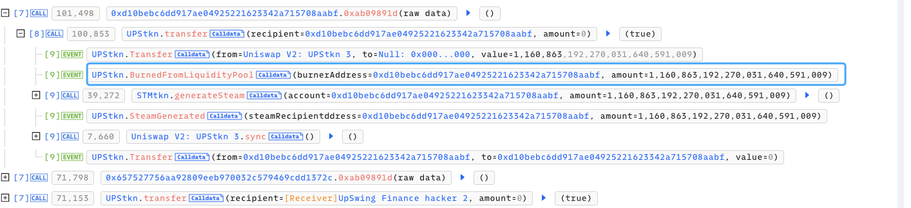
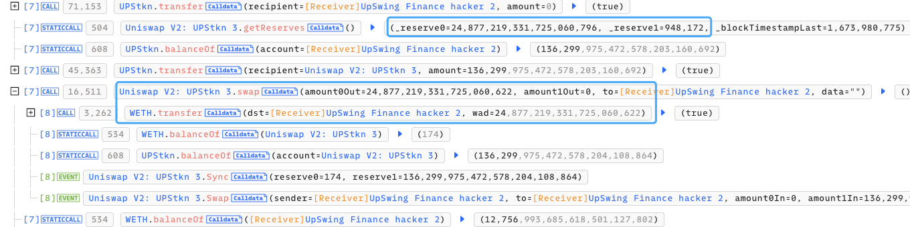

# 20230117 - UpSwingFinance - 逻辑错误 ~ 22 $ETH

## 相关地址

攻击者地址：0x8a2d94ea342cbdd6d57db614b24f20cae286cac6

攻击合约：0x22898dc59145eae79471dd1f06b7e542e0982d30

被攻击合约：0xffee5ecde135a7b10a0ac0e6e617798e6ad3d0d6

攻击交易：0xd099a41830b964e93415e9a8607cd92567e40d3eeb491d52f3b66eee6b0357eb

## 攻击分析



攻击者通过闪电贷获取初始资金



额外创建两个合约不断做买入卖出动作



这么做的原因为 releasePressure 函数中存在 burn 代币销毁功能，且对应的参数是可控的



销毁量为每次卖出量通过内部函数计算得到的，销毁量和 sellPressure 参数计算



```solidity
burnamounbt =  sellPressure[sender] *  balanceof(univ2) * 0.9 / totalsupply
```

由于 txCount 计数机会随着交易变多而变大，使销毁量逐渐变低，所以攻击者用三个不同的地址去重复三次买卖功能



销毁结束时地址中需要含有部分 $UPS 将池中的 $ETH 换出来，攻击者在其中一次 buy 中多购买一部分 Token



控制 amount 和 recipient 参数将池中的 Token 进行销毁，最后卖出 Token 归还闪电贷获利离场



