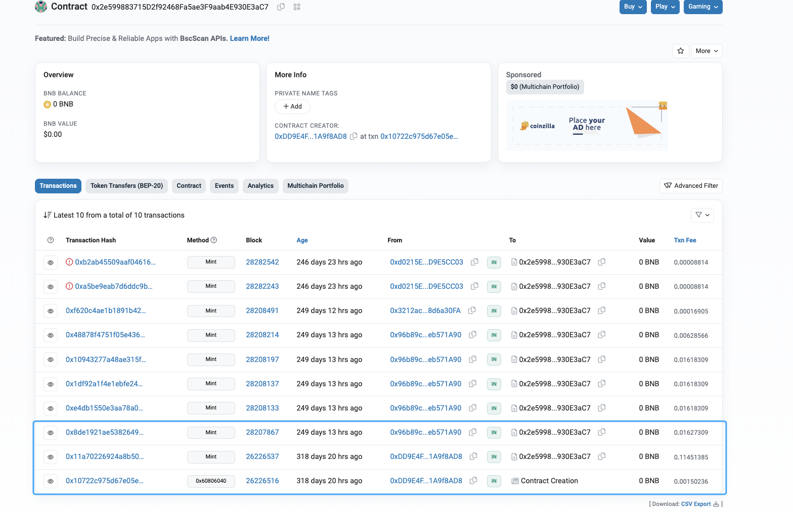

# 20230515 - landNFT - 权限缺失 ～ 149K $USDT

## 相关地址

攻击者地址: 0x96b89c2560bcc43c342c12ba9c33dab7eb571a90

被攻击合约地址: 0x1a62fe088F46561bE92BB5F6e83266289b94C154

攻击交易: 0x8de1921ae538264917f99f8ebd567890061d39c92a8fe58f4abd108d2373a265

攻击合约地址: 0x2e599883715D2f92468Fa5ae3F9aab4E930E3aC7

## 攻击分析


攻击者通过调用合约 0x2e599883715d2f92468fa5ae3f9aab4e930e3ac7 中的 mint方法给自己制造了 200个NFT


```solidity
function mint(address player,uint256 amount) external whenNotPaused() onlyMiner{
  uint256 _tokenId = totalSupply();
  require(_tokenId.add(amount)<=MAX_SUPPLY,"MAX_SUPPLY err");
  _safeMint(player, amount);
}
```

跟踪交易可以发现被调用合约历史交易中也使用了 Mint 去制造 NFT，其中前两笔不为攻击者调用



由于 mint 方法只有 Minner 才可以调用，这里可以在被攻击合约历史调用找到 set Minner方法


其中一笔交易 0xbd5ae8c102fa7e0cca34355aadaf54cbb2cbac528ffb80cee55b748d4c127250 中

就可以发现是项目方对 0x2e5998 合约进行了方法调用授权，由于此合约中 mint 方法没有做合适的鉴权，攻击者发现后直接多次调用了该合约的 mint 方法制造了大量的NFT，直到达到铸造最大限制

