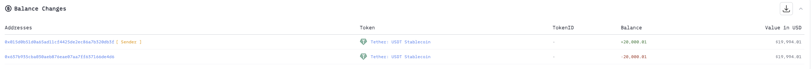
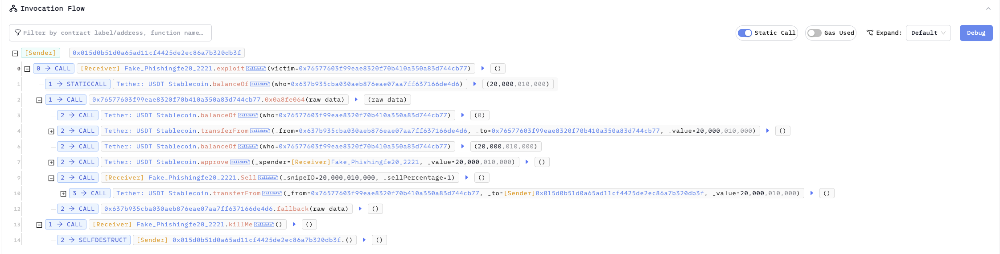
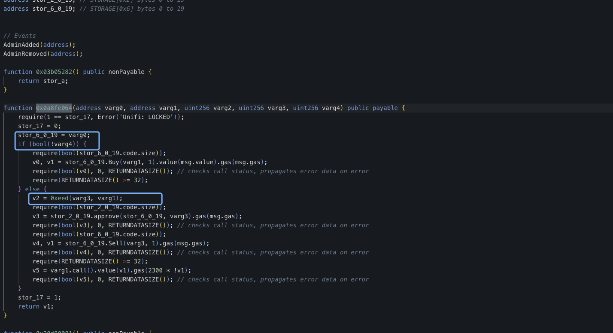
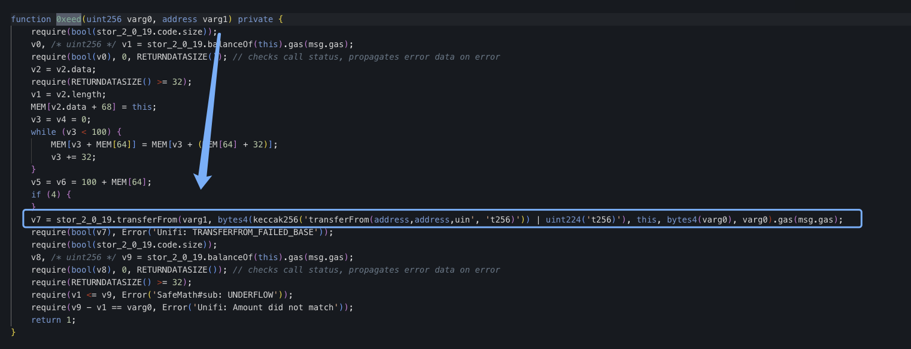
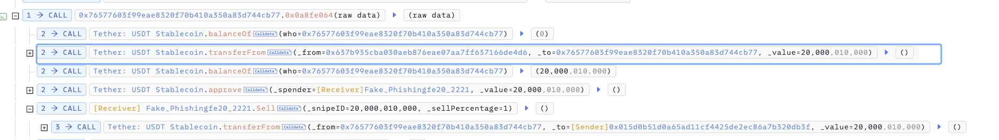
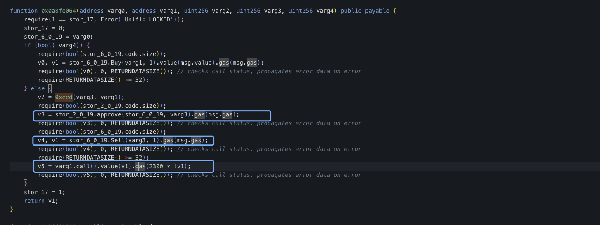
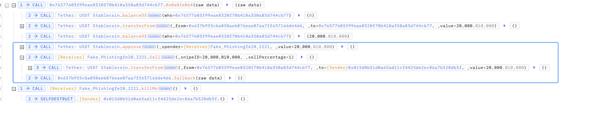

# 20230619 - Contracts_0x7657760 - 参数可控 ～ 20K $USDT

## 相关地址

攻击者地址: 0x015d0b51d0a65ad11cf4425de2ec86a7b320db3f

被攻击合约地址: 0x76577603f99eae8320f70b410a350a83d744cb77

攻击交易: 0x74279a131dccd6479378b3454ea189a6ce350cce51de47d81a0ef23db1b134d5

攻击合约地址: 0xfe2011dad32ad6dfd128e55490c0fd999f3d2221

## 攻击分析

在函数 0x0a8fe064 中可以控制 varg4 参数使合约调用 0xeed 函数

由于 varg1 参数可控，且函数中调用了 transferFrom 进行转账，此时可以将给合约授权的用户的 USDT 全部转入合约中

给合约授权过的 0x637b 为受害者，转入合约 20K $USDT

之后将 USDT 授权至参数 varg0 的地址，再调用该地址下的 Sell 函数

攻击者通过在攻击合约下构造 Sell 函数，将合约中授权用户转给合约的 $USDT 全部转出

