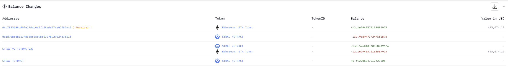
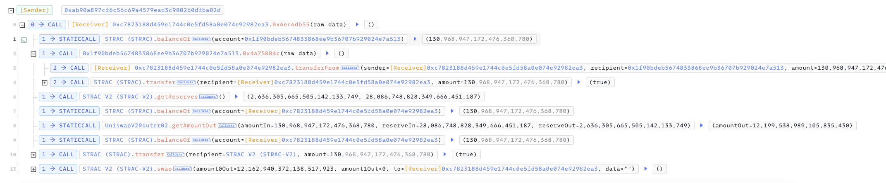
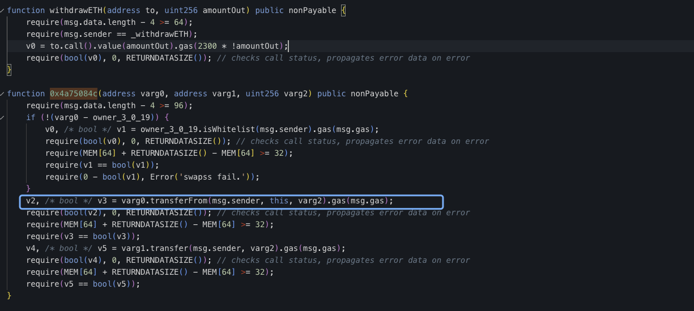
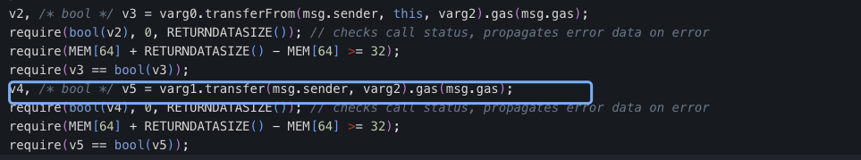
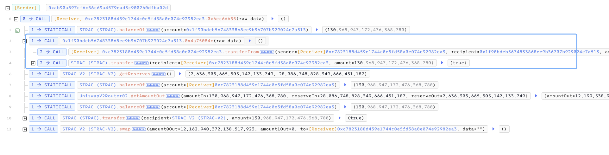

# 20230627 - STRAC - 参数可控 ～ 12 $ETH

## 相关地址

攻击者地址: 0xc7823188d459e1744c0e5fd58a0e074e92982ea3

被攻击合约地址: 0x1f90bdeb5674833868ee9b36707b929024e7a513

攻击交易: 0x1147b3c0f3ebdd524c4e58430bb736eba9f7fa522158f5ad81eb3e2394b466d0

攻击合约地址: 0xc7823188d459e1744c0e5fd58a0e074e92982ea3

## 攻击分析

合约中 0x4a75084c 函数存在漏洞

其中代码块中包含一个 transferFrom 调用，但 varg0 为可控参数

之后会将 varg1 参数的代币 发送给 msg.sender , 由于 varg0 varg1 均可控，攻击者可以构造参数转出合约中的代币

这里攻击者在攻击合约中构造 transferFrom 给漏洞合约调用，最后接受漏洞合约发送代币

