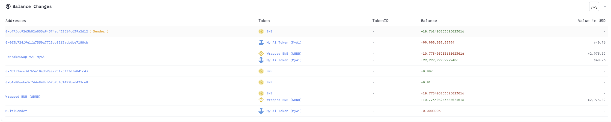
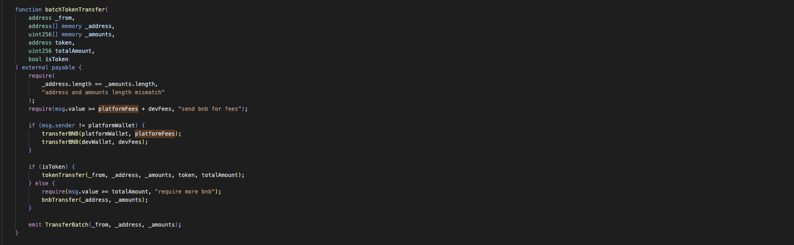
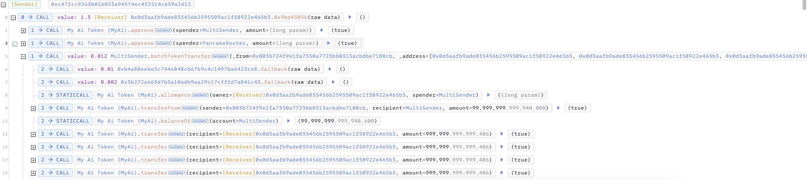
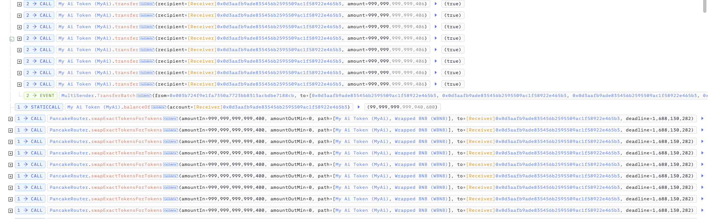

# 20230630 - MyAi - 权限缺失 ～10 $BNB

## 相关地址

攻击者地址: 0xc47fcc9263b026033a94574ec432514c639a2d12

被攻击合约地址: 0xdb103fd28ca4b18115f5ce908baaeed7e0f1f101

攻击交易: 0x346f65ac333eb6d69886f5614aaf569a561a53a8d93db4384bd7c0bec15ae9f6

攻击合约地址: 0x0d3aafb9ade835456b2595509ac1f58922e465b3

## 攻击分析

漏洞出现在合约 MultiSender 中的 batchTokenTransfer 函数

由于没有做权限设定，当 isToken 为 True 时，会将代币转入参数中的地址，这里攻击者传入攻击合约地址的数组，转入代币并出售

