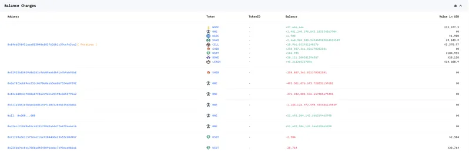
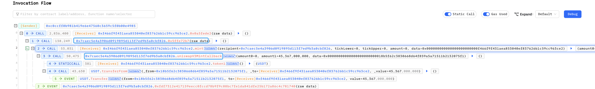
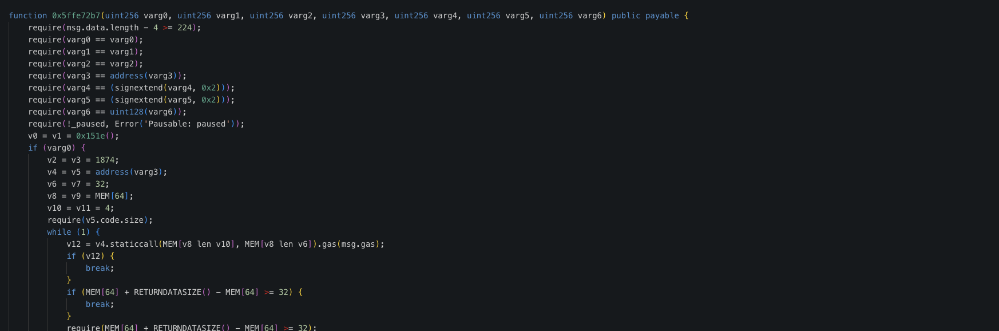
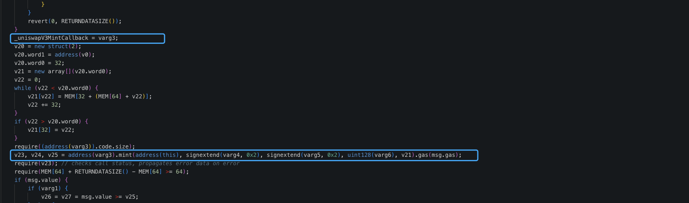
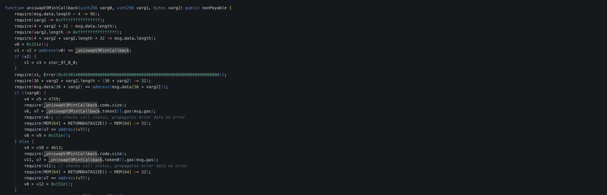
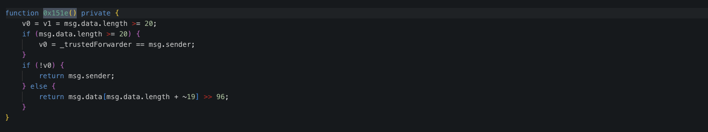
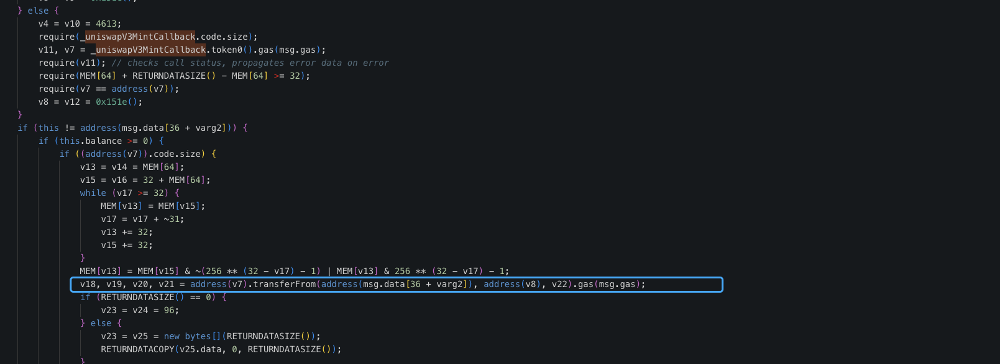

# 20230708 - Civfund - 权限缺失 ~ 180K $USDC

## 相关地址

攻击者地址: 0xc0ccff0b981b419e6e47560c3659c5f0b00e4985

被攻击合约地址: 0x7caec5e4a3906d0919895d113f7ed9b3a0cbf826

攻击交易: 0xc42fc0e22a0f60cc299be80eb0c0ddce83c21c14a3dddd8430628011c3e20d6b?line=2

攻击合约地址: 0xf466f9f431aea853040ef837626b1c59cc963ce2

## 攻击分析

攻击者调用合约的 uniswapV3MintCallback 和 0x5ffe72b7 将受害者的代币转出

反编译合约后在函数 0x5ffe72b7 中，当 varg3 可控时会调用 varg3 地址的 mint 函数, 并且赋值     _uniswapV3MintCallback

此时在攻击合约中使用 mint 函数调用 uniswapV3MintCallback 函数就可以通过地址检测

最后控制 v2 和 v8 将对合约授权的用户代币通过 transferFrom 取出

