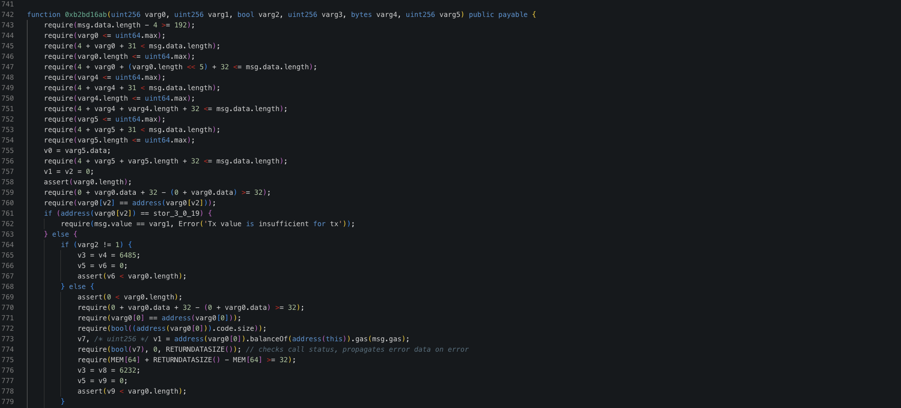

# 20231031 - UniBot - 参数可控 ～ 1K $UNIBOT

## 相关地址

攻击者地址: 0x413e4fb75c300b92fec12d7c44e4c0b4faab4d04

受害者地址: 0xa6c9da49553bcfec4633f4a0b81fbb4255f590fb

漏洞合约地址: 0x413e4fb75c300b92fec12d7c44e4c0b4faab4d04

攻击交易: 0xcbe521aea28911fe9983030748028e12541e347b8b6b974d026fa5065c22f0cf

攻击合约地址: 0x2b326a17b5ef826fa4e17d3836364ae1f0231a6f

## 攻击分析


攻击者调用未开源合约中 签名为 0xb2bd16ab 的函数


反编译查看该函数



```solidity
function 0xb2bd16ab(uint256 varg0, uint256 varg1, bool varg2, uint256 varg3, bytes varg4, uint256 varg5) public payable { 
    require(msg.data.length - 4 >= 192);
    require(varg0 <= uint64.max);
    require(4 + varg0 + 31 < msg.data.length);
    require(varg0.length <= uint64.max);
    require(4 + varg0 + (varg0.length << 5) + 32 <= msg.data.length);
    require(varg4 <= uint64.max);
    require(4 + varg4 + 31 < msg.data.length);
    require(varg4.length <= uint64.max);
    require(4 + varg4 + varg4.length + 32 <= msg.data.length);
    require(varg5 <= uint64.max);
    require(4 + varg5 + 31 < msg.data.length);
    require(varg5.length <= uint64.max);
    .......
  
    if (address(varg0[1]) == stor_3_0_19) {
        v36 = v37 = msg.sender.balance;
    } else {
        assert(1 < varg0.length);
        require(32 + varg0.data + 32 - (32 + varg0.data) >= 32);
        require(varg0[1] == address(varg0[1]));
        require(bool((address(varg0[1])).code.size));
        v38, /* uint256 */ v36 = address(varg0[1]).balanceOf(msg.sender).gas(msg.gas);
        require(bool(v38), 0, RETURNDATASIZE()); // checks call status, propagates error data on error
        require(MEM[64] + RETURNDATASIZE() - MEM[64] >= 32);
    }
    assert(2 < varg0.length);
    require(64 + varg0.data + 32 - (64 + varg0.data) >= 32);
    require(varg0[2] == address(varg0[2]));
    CALLDATACOPY(v39.data, varg4.data, varg4.length);
    MEM[varg4.length + v39.data] = 0;
    v40, /* uint256 */ v41, /* uint256 */ v42 = address(varg0[2]).call(v39.data).value(msg.value).gas(msg.gas);
    if (RETURNDATASIZE() != 0) {
        v43 = new bytes[](RETURNDATASIZE());
        RETURNDATACOPY(v43.data, 0, RETURNDATASIZE());
    }
```

函数中存在一个 call 调用，参数为 varg4.data ，而该参数外部可控

