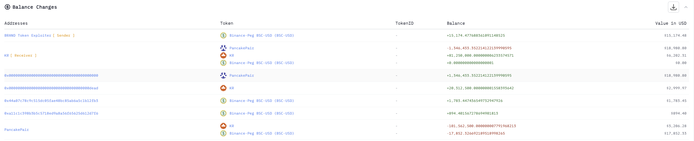
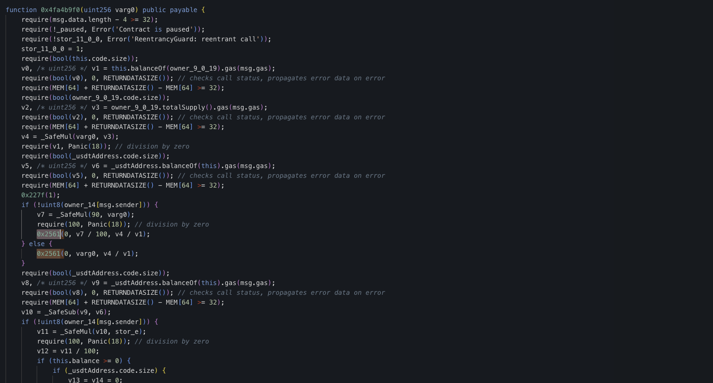
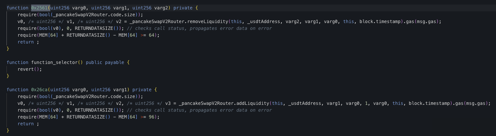
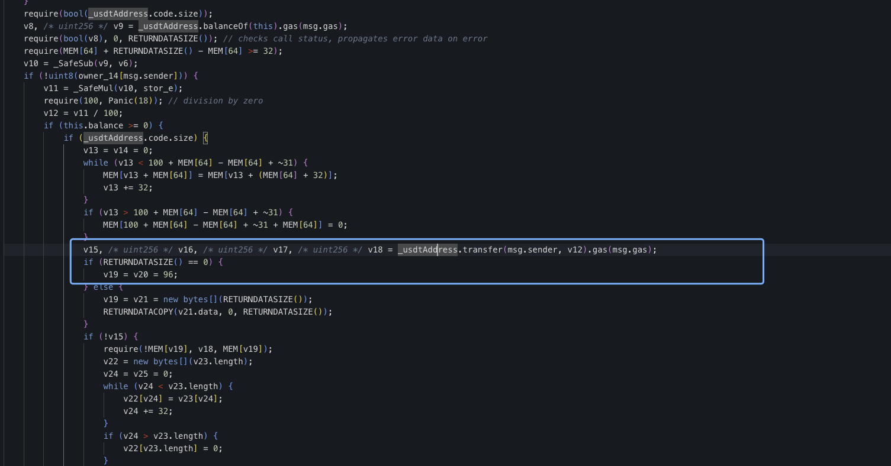
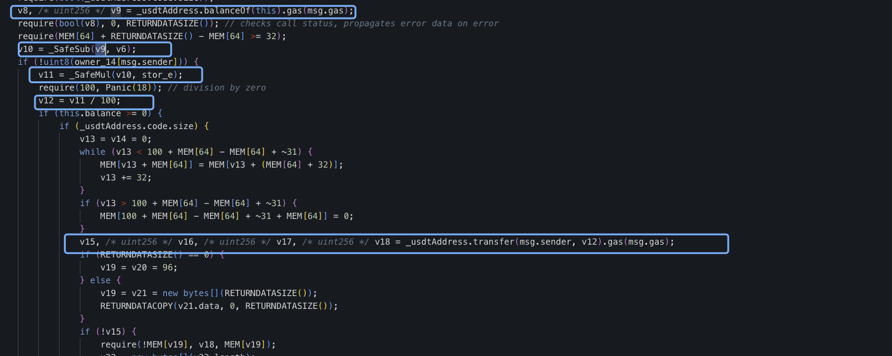
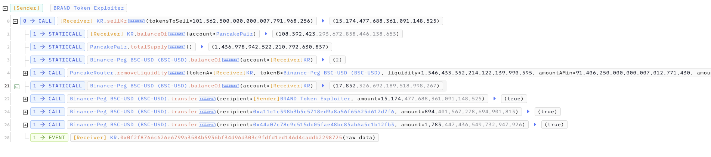

# 20231106 - KR - 权限缺失 ～ 15K $BUSD

## 相关地址

攻击者地址: 0x835b45d38cbdccf99e609436ff38e31ac05bc502

漏洞合约地址: 0x15b1ed79ca9d7955af3e169d7b323c4f1eeb5d12

攻击交易: 0x2abf871eb91d03bc8145bf2a415e79132a103ae9f2b5bbf18b8342ea9207ccd7

## 攻击分析

合约反编译后在函数 0x4fa4b9f0 中，调用了一次 0x2561 函数

而函数 0x2561 功能为移除流动性，并将移除的代币发送至合约本身

后续代码中有一块代码功能为将 $BUSD 发送至 msg.sender, _marketingAddress, _bonusAddress

发送数量的数值 V12 为合约余额的计算

由于合约该函数未检测权限，攻击者直接调用函数就可以移除池流动性获取合约中的 $BUSD

