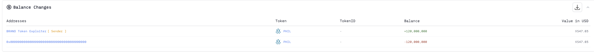
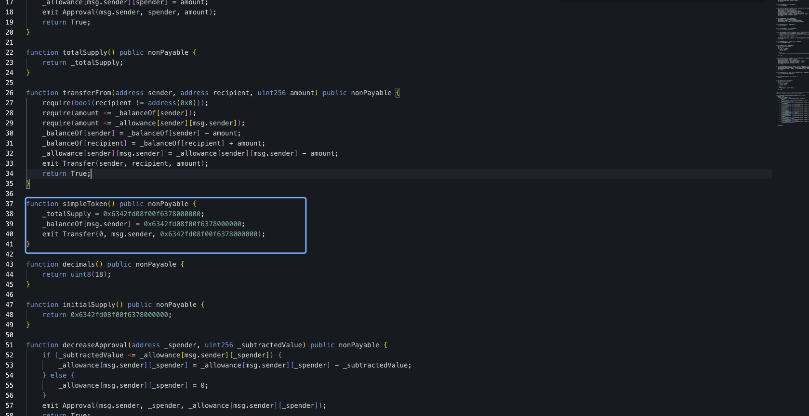
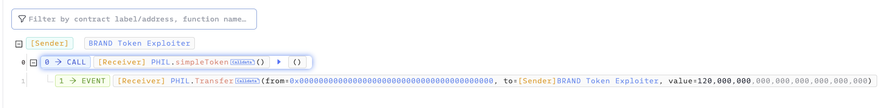

# 20231214 - PHIL - 权限缺失 ～ 2 $BNB

## 相关地址

攻击者地址: 0x835b45d38cbdccf99e609436ff38e31ac05bc502

漏洞合约地址: 0x4308d314096878d3bf16c9d8db86101f70bbebf1

攻击交易: 0x20ecd8310a2cc7f7774aa5a045c8a99ad84a8451d6650f24e0911e9f4355b13a

## 攻击分析

反编译合约后其中 simpleToken 函数没有做权限限制，直接给调用者铸造代币

