# 20231220 - Transit Finance - 参数可控 ～ 173 $BNB

## 相关地址

攻击者地址: 0xf7552ba0ee5bed0f306658f4a1201f421d703898

漏洞合约地址: 0x00000047bb99ea4d791bb749d970de71ee0b1a34

攻击交易: 0x93ae5f0a121d5e1aadae052c36bc5ecf2d406d35222f4c6a5d63fef1d6de1081

攻击合约地址: 0x7d7583724245eeebb745ebcb1cee0091ff43082b

## 攻击分析

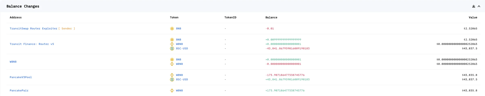

漏洞出现在函数 _executeV3Swap 中，该方法中接受的参数 pool 是可被控的

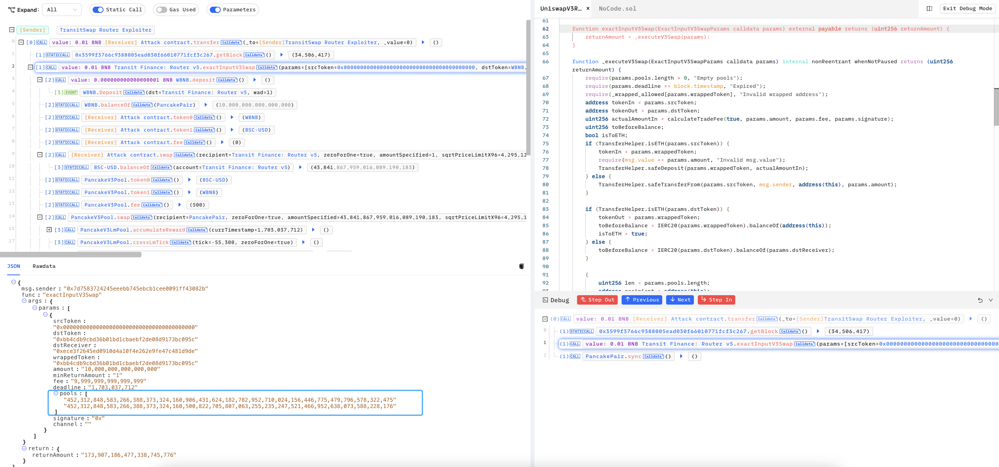

第一个为攻击者地址，第二个为 usd_bnb池

```solidity
// 0x7d7583724245eeebb745ebcb1cee0091ff43082b
// 0x36696169C63e42cd08ce11f5deeBbCeBae652050

pools:[
"452,312,848,583,266,388,373,324,160,906,431,624,182,782,952,710,024,156,446,775,479,796,578,322,475"
"452,312,848,583,266,388,373,324,160,500,822,705,807,063,255,235,247,521,466,952,638,073,588,228,176"
]
```

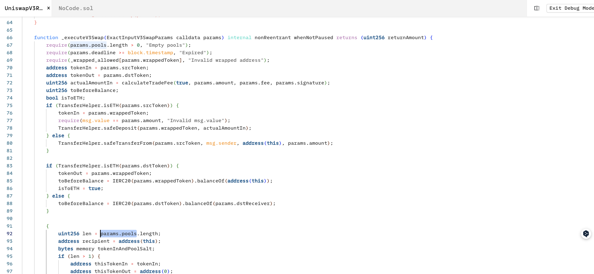

函数的主要功能是将用户的代币进行对等转换

```solidity
function _executeV3Swap(ExactInputV3SwapParams calldata params) internal nonReentrant whenNotPaused returns (uint256 returnAmount) {
        require(params.pools.length > 0, "Empty pools");
        require(params.deadline >= block.timestamp, "Expired");
        require(_wrapped_allowed[params.wrappedToken], "Invalid wrapped address");
        address tokenIn = params.srcToken;
        address tokenOut = params.dstToken;
        uint256 actualAmountIn = calculateTradeFee(true, params.amount, params.fee, params.signature);
        uint256 toBeforeBalance;
        bool isToETH;
        if (TransferHelper.isETH(params.srcToken)) {
            tokenIn = params.wrappedToken;
            require(msg.value == params.amount, "Invalid msg.value");
            TransferHelper.safeDeposit(params.wrappedToken, actualAmountIn);
        } else {
            TransferHelper.safeTransferFrom(params.srcToken, msg.sender, address(this), params.amount);
        }

        if (TransferHelper.isETH(params.dstToken)) {
            tokenOut = params.wrappedToken;
            toBeforeBalance = IERC20(params.wrappedToken).balanceOf(address(this));
            isToETH = true;
        } else {
            toBeforeBalance = IERC20(params.dstToken).balanceOf(params.dstReceiver);
        }

        {
            uint256 len = params.pools.length;
            address recipient = address(this);
            bytes memory tokenInAndPoolSalt;
            if (len > 1) {
                address thisTokenIn = tokenIn;
                address thisTokenOut = address(0);
                for (uint256 i; i < len; i++) {
                    uint256 thisPool = params.pools[i];
                    (thisTokenIn, tokenInAndPoolSalt) = _verifyPool(thisTokenIn, thisTokenOut, thisPool);
                    if (i == len - 1 && !isToETH) {
                        recipient = params.dstReceiver;
                        thisTokenOut = tokenOut;
                    } 
                    actualAmountIn = _swap(recipient, thisPool, tokenInAndPoolSalt, actualAmountIn);
                }
                returnAmount = actualAmountIn;
            } else {
                (, tokenInAndPoolSalt) = _verifyPool(tokenIn, tokenOut, params.pools[0]);
                if (!isToETH) {
                    recipient = params.dstReceiver;
                }
                returnAmount = _swap(recipient, params.pools[0], tokenInAndPoolSalt, actualAmountIn);
            }
        }

        if (isToETH) {
            returnAmount = IERC20(params.wrappedToken).balanceOf(address(this)).sub(toBeforeBalance);
            require(returnAmount >= params.minReturnAmount, "Too little received");
            TransferHelper.safeWithdraw(params.wrappedToken, returnAmount);
            TransferHelper.safeTransferETH(params.dstReceiver, returnAmount);
        } else {
            returnAmount = IERC20(params.dstToken).balanceOf(params.dstReceiver).sub(toBeforeBalance);
            require(returnAmount >= params.minReturnAmount, "Too little received");
        }
        
        _emitTransit(params.srcToken, params.dstToken, params.dstReceiver, params.amount, returnAmount, 0, params.channel);

    }
```

例如一笔正常交易, 这里的交易就是将 $BSC-USD 换成 $USDC 后再将 $USDC 换成 $WBNB

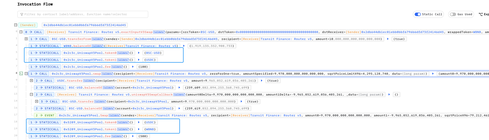

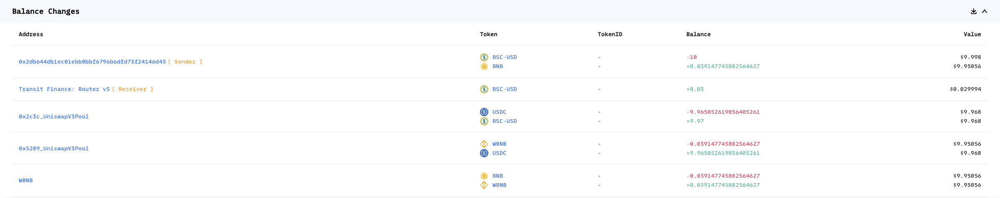

代码向下走跟进 _verifyPool 函数

```solidity
(thisTokenIn, tokenInAndPoolSalt) = _verifyPool(thisTokenIn, thisTokenOut, thisPool);
```

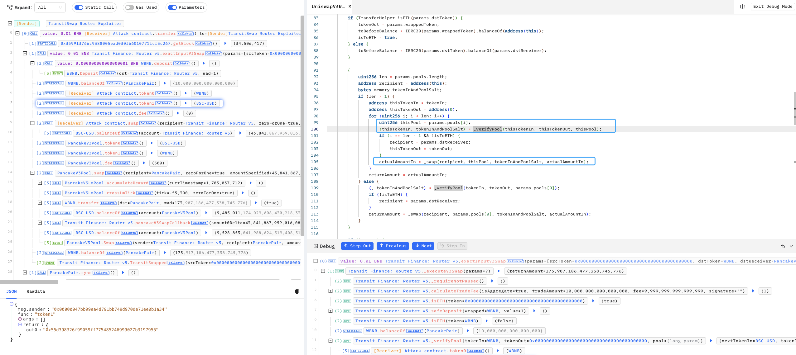

这里可以看到对应的 token0 和 token1 是在 攻击合约中获取的，也就是可控的 pool 参数中的攻击合约地址可以自行改变兑换代币名称

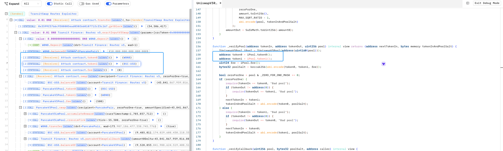

通过攻击合约中的 swap 函数告诉其代币兑换比例，例如攻击合约中的 swap 含义为 0个 $WBNB 兑换 43，841 $BSC-USD

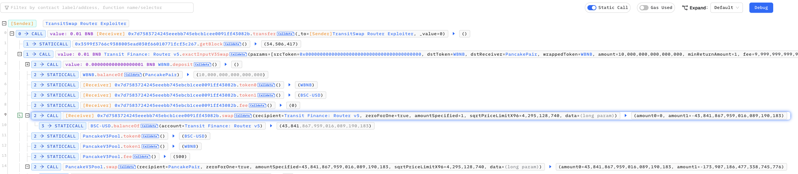

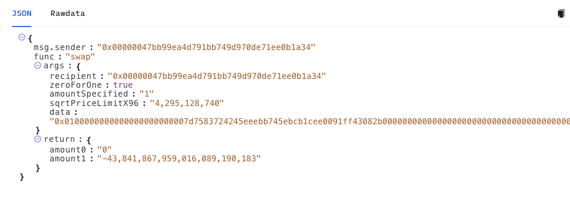

攻击合约中需要这几个函数实现相同效果

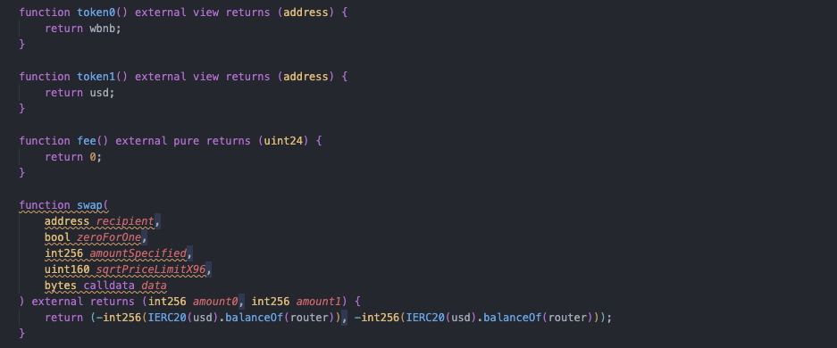

actualAmountIn 可控后就可以将所有的 $BSC-USD 全部提出

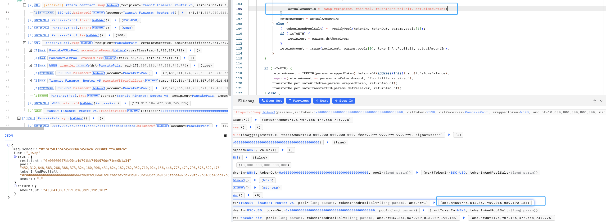

紧接着攻击者再通过第二个 pool参数，将刚刚获取的 $BSC-USD 全部兑换为 $WBNB

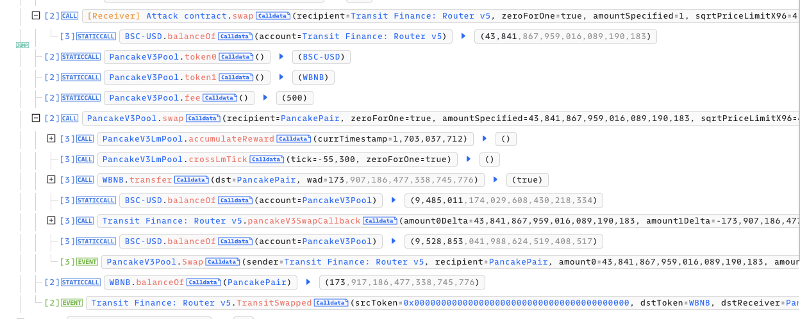