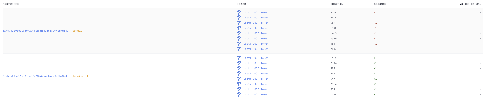
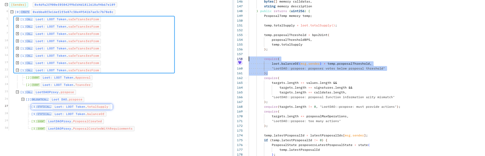
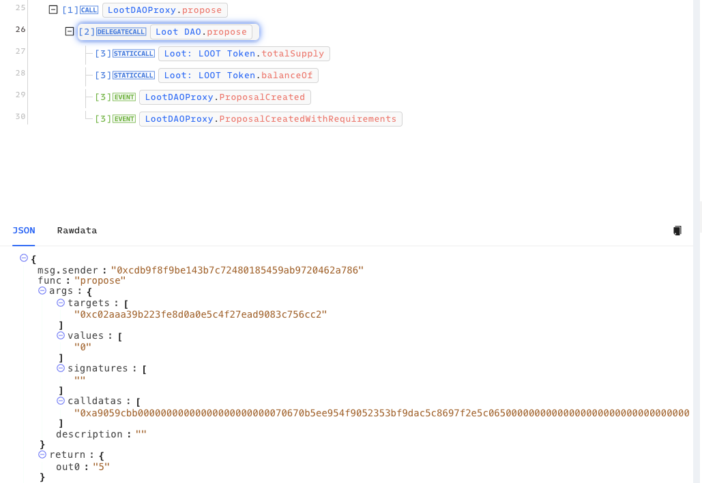
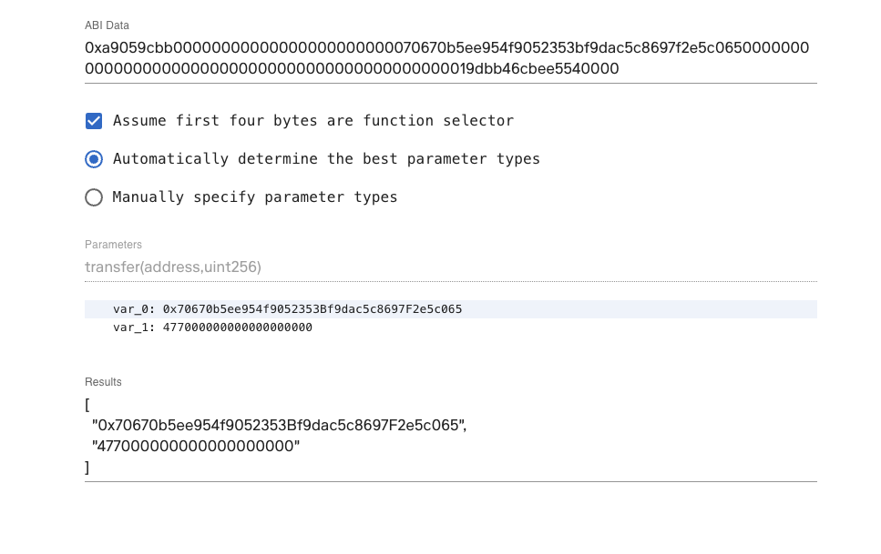
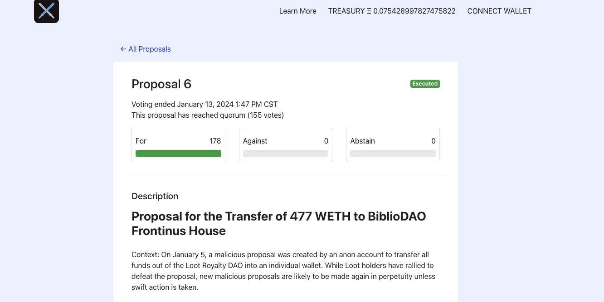

# 20240105 - Loot RoyalDAO - 治理攻击 ~ 477 $ETH

## 相关地址

攻击者地址: 0x469a2f900ef0504299bfd4d1812618a94b67e189

被攻击合约: 0x8cFDF9E9f7EA8c0871025318407A6f1Fbc5d5a18

攻击交易: 0xbc8c30b7db136e97251eaa9897853ddf125f155b7c63bbe4c06d704384a40556

## 攻击分析

首先攻击者将8个Loot NFT 转入攻击合约中，满足创建提案条件

通过方法 propose 创建提案

提案中的 calldatas 数据就是恶意的转出请求，由于合约中投票机制中没有锁定投票的代币，攻击者可以通过不断借用Token来通过恶意提案

最后提案被白帽团队及时告警，发起了新提案将代币转出，阻止了攻击

