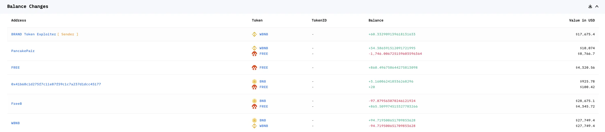
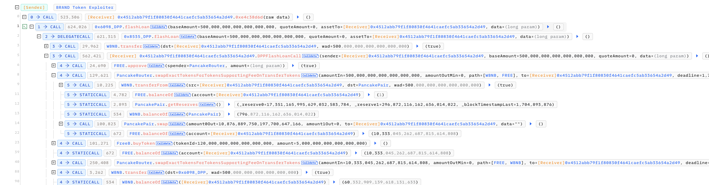
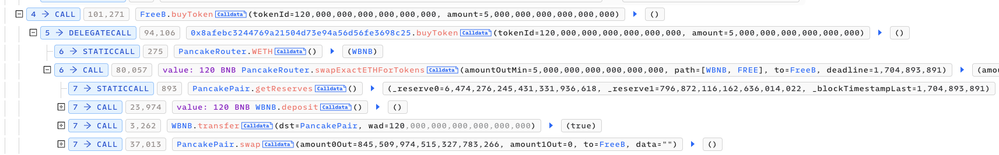
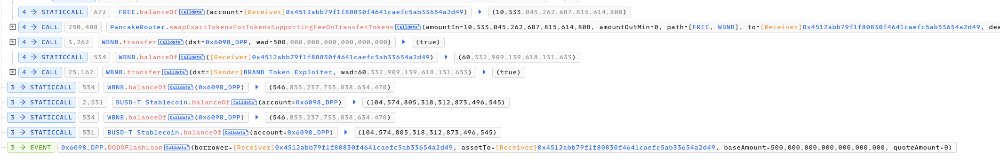

# 20240110 - Freedom - 价格操纵 ～ 60 $BNB

## 相关地址

攻击者地址：0x835b45d38cbdccf99e609436ff38e31ac05bc502

被攻击地址：0xae3ada8787245977832c6dab2d4474d3943527ab

攻击合约地址：0x4512abb79f1f80830f4641caefc5ab33654a2d49

攻击交易：0x309523343cc1bb9d28b960ebf83175fac941b4a590830caccff44263d9a80ff0

## 攻击分析

攻击者通过闪电贷获取 500 个 WBNB 买入 FREE

之后调用 FreeB 合约的 buyToken 函数，使用该合约中的 120 BNB 买入 FREE

此时相当于进行了一笔三明治交易，在大额买单前后插入一笔买卖交易

最后攻击者在 FreeB 买入后卖出之前买入的 Free 获利 60 WBNB 离场