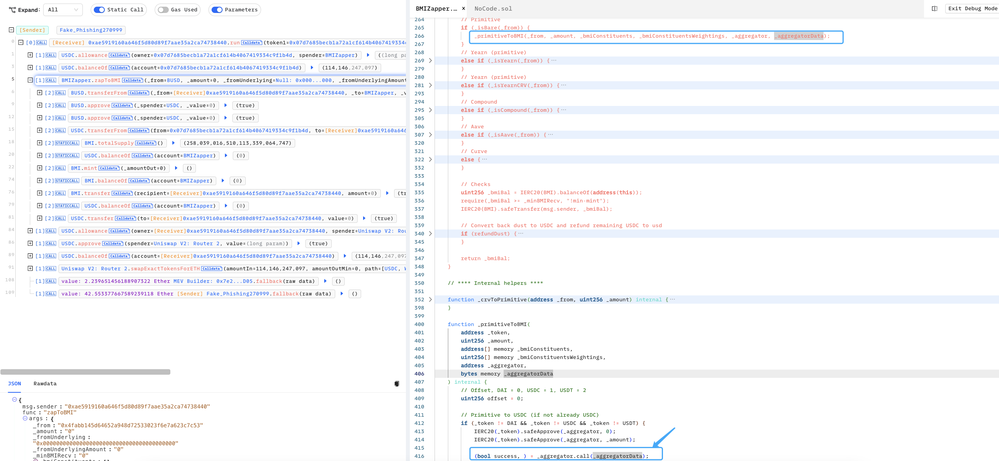

# 20240117 - BasketDAO - 参数可控 ～ 42 $ETH

## 相关地址

攻击者地址: 0x63136677355840f26c0695dd6de5c9e4f514f8e8

受害者地址: 0x07d7685bECB1a72a1Cf614b4067419334C9f1b4d

漏洞合约地址: 0x4622aff8e521a444c9301da0efd05f6b482221b8

攻击交易: 0x97201900198d0054a2f7a914f5625591feb6a18e7fc6bb4f0c964b967a6c15f6

攻击合约地址: 0xae5919160a646f5d80d89f7aae35a2ca74738440

## 攻击分析


 

漏洞出现于合约 BMIZapper 中的 zapToBMI 函数中


```solidity
   function zapToBMI(
        address _from,
        uint256 _amount,
        address _fromUnderlying,
        uint256 _fromUnderlyingAmount,
        uint256 _minBMIRecv,
        address[] memory _bmiConstituents,
        uint256[] memory _bmiConstituentsWeightings,
        address _aggregator,
        bytes memory _aggregatorData,
        bool refundDust
    ) public returns (uint256) {
        uint256 sum = 0;
        for (uint256 i = 0; i < _bmiConstituentsWeightings.length; i++) {
            sum = sum.add(_bmiConstituentsWeightings[i]);
        }

        // Sum should be between 0.999 and 1.000
        assert(sum <= 1e18);
        assert(sum >= 999e15);

        // Transfer to contract
        IERC20(_from).safeTransferFrom(msg.sender, address(this), _amount);

        // Primitive
        if (_isBare(_from)) {
            _primitiveToBMI(_from, _amount, _bmiConstituents, _bmiConstituentsWeightings, _aggregator, _aggregatorData);
        }
        // Yearn (primitive)
        else if (_isYearn(_from)) {
            IYearn(_from).withdraw();
            _primitiveToBMI(
                _fromUnderlying,
                _fromUnderlyingAmount,
                _bmiConstituents,
                _bmiConstituentsWeightings,
                _aggregator,
                _aggregatorData
            );
        }
        // Yearn (primitive)
        else if (_isYearnCRV(_from)) {
            IYearn(_from).withdraw();
            address crvToken = IYearn(_from).token();
            _crvToPrimitive(crvToken, IERC20(crvToken).balanceOf(address(this)));
            _primitiveToBMI(
                USDC,
                IERC20(USDC).balanceOf(address(this)),
                _bmiConstituents,
                _bmiConstituentsWeightings,
                address(0),
                ""
            );
        }
        // Compound
        else if (_isCompound(_from)) {
            require(ICToken(_from).redeem(_amount) == 0, "!ctoken-redeem");
            _primitiveToBMI(
                _fromUnderlying,
                _fromUnderlyingAmount,
                _bmiConstituents,
                _bmiConstituentsWeightings,
                _aggregator,
                _aggregatorData
            );
        }
        // Aave
        else if (_isAave(_from)) {
            IERC20(_from).safeApprove(AAVE_LENDING_POOL_V2, 0);
            IERC20(_from).safeApprove(AAVE_LENDING_POOL_V2, _amount);
            ILendingPoolV2(AAVE_LENDING_POOL_V2).withdraw(_fromUnderlying, type(uint256).max, address(this));

            _primitiveToBMI(
                _fromUnderlying,
                _fromUnderlyingAmount,
                _bmiConstituents,
                _bmiConstituentsWeightings,
                _aggregator,
                _aggregatorData
            );
        }
        // Curve
        else {
            _crvToPrimitive(_from, _amount);
            _primitiveToBMI(
                USDC,
                IERC20(USDC).balanceOf(address(this)),
                _bmiConstituents,
                _bmiConstituentsWeightings,
                address(0),
                ""
            );
        }

        // Checks
        uint256 _bmiBal = IERC20(BMI).balanceOf(address(this));
        require(_bmiBal >= _minBMIRecv, "!min-mint");
        IERC20(BMI).safeTransfer(msg.sender, _bmiBal);

        // Convert back dust to USDC and refund remaining USDC to usd
        if (refundDust) {
            for (uint256 i = 0; i < _bmiConstituents.length; i++) {
                _fromBMIConstituentToUSDC(_bmiConstituents[i], IERC20(_bmiConstituents[i]).balanceOf(address(this)));
            }
            IERC20(USDC).safeTransfer(msg.sender, IERC20(USDC).balanceOf(address(this)));
        }

        return _bmiBal;
    }
```

这个函数的目的是将指定的资产转换为 BMI代币，转换完成后，检查合约的BMI代币余额是否满足最小BMI接收量（_minBMIRecv），如果满足则将BMI代币转移给调用者。如果设置了refundDust参数为true，则将剩余的资产（如USDC）转换回USDC，并将USDC余额退还给调用者


而在 _primitiveToBMI 方法中存在一个 call 调用，而 _aggregatorData 参数是外部可控的




这里可以看到攻击者控制了calldata 进行攻击


成功转走受害者资产

