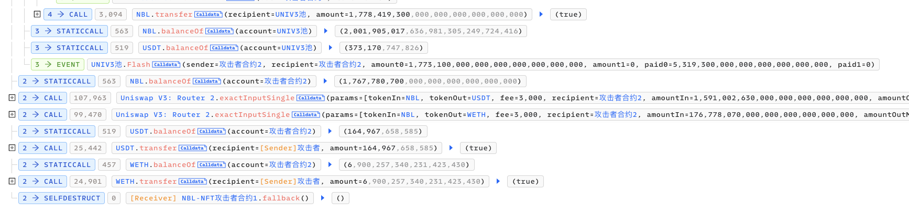

# 20240125 - NBLGAME - 重入攻击 ～ 180K $USDT

## 相关地址

攻击者地址: 0x1fd0a6a5e232eeba8020a40535ad07013ec4ef12

漏洞合约地址: 0x5499178919c79086fd580d6c5f332a4253244d91

攻击交易: 0xf4fc3b638f1a377cf22b729199a9aeb27fc62fe2983a65c4d14b99ee5c5b2328

攻击合约地址: 0xfc3b08555b1c328ecf8b8a0ccd85679bf59bba4c

## 攻击分析


攻击者首先通过向攻击合约转入 id为373 的 NFT 并调用闪电贷完成攻击前准备工作


接着向漏洞合约调用了 unlockSlot，depositNft，depositNbl，withdrawNft 函数


这几个函数功能分别为

```
1. unlockSlot：给用户解锁新的插槽
2. depositNft：存入用户的 NFT
3. depositNbl：存入用户的 NBL代币
4. withdrawNft：提取用户之前存入的 NFT 以及 NBL代币 
```


可以观察到在 withdrawNft 函数中使用的是 safeTransferFrom函数进行 NFT的转移并且后续代码中存在将 $NBL 发送给合约的逻辑，而 msg.sender 是攻击合约地址且函数没有限制重入，所以只需要在攻击合约中编写 onERC721Received 函数达到重入逻辑就可以将合约中的所有 $NBL 代币转移

```solidity
https://samczsun.com/the-dangers-of-surprising-code/
```


攻击者通过重入漏洞重复提取两次 $NBL 代币将合约中的Token掏空


最后归还闪电贷离场

