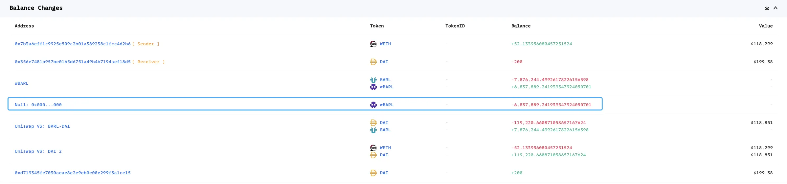
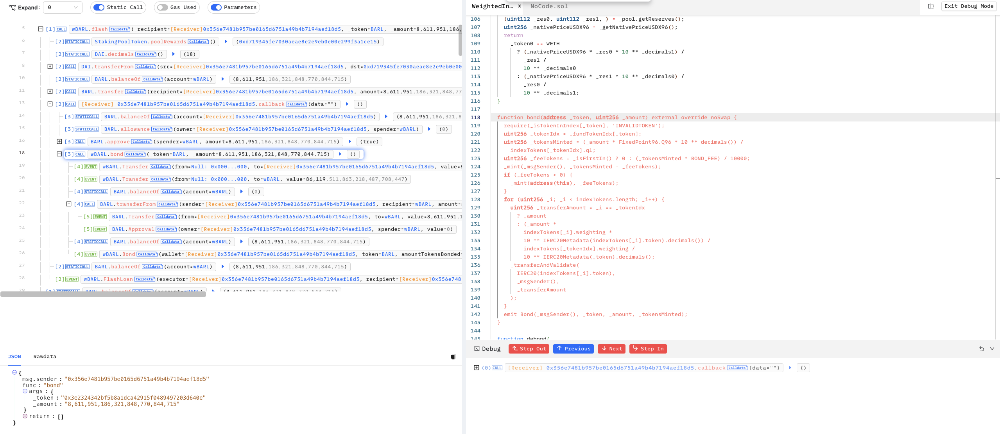
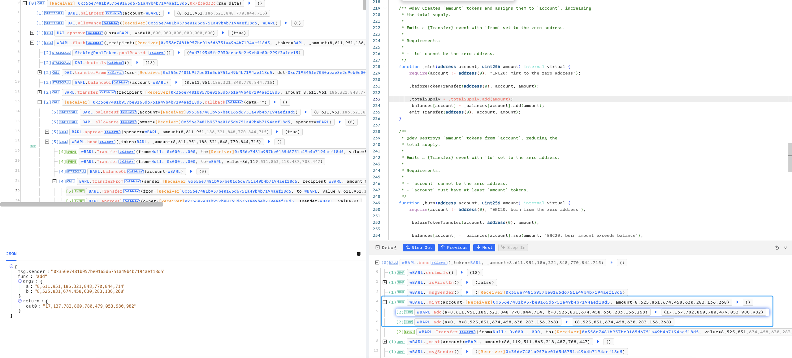
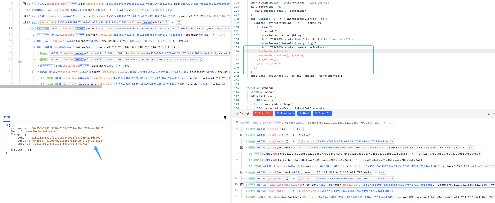
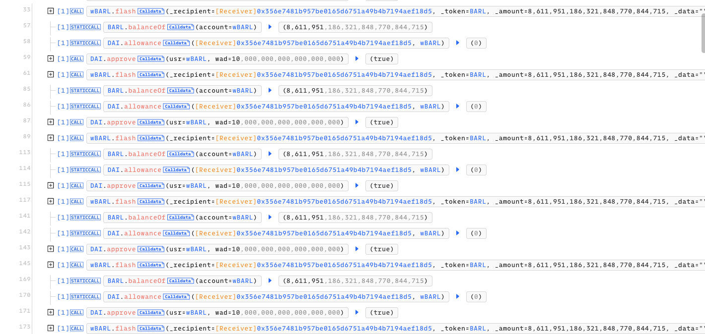
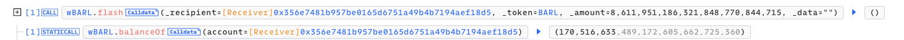
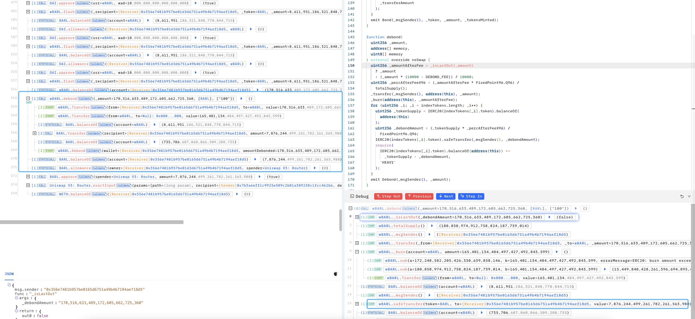

# 20240128 - Barley Finance - 重入 ~ 52 $ETH

## 相关地址

攻击者地址: 0x7b3a6eff1c9925e509c2b01a389238c1fcc462b6

漏洞合约地址: 0x04c80bb477890f3021f03b068238836ee20aa0b8

攻击交易: 0x995e880635f4a7462a420a58527023f946710167ea4c6c093d7d193062a33b01

攻击合约地址: 0x356e7481b957be0165d6751a49b4b7194aef18d5

## 攻击分析



合约中提供了借贷方法，攻击者调用 flash 函数将 $wBARL 中的 全部 $BARL  闪电贷到攻击合约中使用，同时转入 $DAI 充当手续费



```solidity
  function bond(address _token, uint256 _amount) external override noSwap {
    require(_isTokenInIndex[_token], 'INVALIDTOKEN');
    uint256 _tokenIdx = _fundTokenIdx[_token];
    uint256 _tokensMinted = (_amount * FixedPoint96.Q96 * 10 ** decimals()) /
      indexTokens[_tokenIdx].q1;
    uint256 _feeTokens = _isFirstIn() ? 0 : (_tokensMinted * BOND_FEE) / 10000;
    _mint(_msgSender(), _tokensMinted - _feeTokens);
    if (_feeTokens > 0) {
      _mint(address(this), _feeTokens);
    }
    for (uint256 _i; _i < indexTokens.length; _i++) {
      uint256 _transferAmount = _i == _tokenIdx
        ? _amount
        : (_amount *
          indexTokens[_i].weighting *
          10 ** IERC20Metadata(indexTokens[_i].token).decimals()) /
          indexTokens[_tokenIdx].weighting /
          10 ** IERC20Metadata(_token).decimals();
      _transferAndValidate(
        IERC20(indexTokens[_i].token),
        _msgSender(),
        _transferAmount
      );
    }
    emit Bond(_msgSender(), _token, _amount, _tokensMinted);
  }
```

这个函数实现了用户通过存入指定代币 ($BARL) 来获取 $wBARL,  这里攻击者使用闪电贷获取的 $BARL 来获取 $wBARL



函数中会将对应可获得的 $wBARL 计算出发送给攻击者，然后将攻击者钱包中的 $BARL 发送到池中



漏洞就出现在这一段代码上的逻辑错误，闪电贷调用还款验证主要是通过检查对应Token前后的余额实现的，这里由于 _transferAndValidate 函数将攻击者钱包中 $BARL 发送回到池中，导致闪电贷前后实际的 $BARL 代币数量 没有改变使其成功交易，这样攻击者实际上只花费了手续费就铸造了大量 $wBARL 代币进行获利



攻击者进行数次闪电贷操作获取大量 $wBARL，



最后通过 debond 方法将 $wBARL 全部转为 $BARL 后完成攻击，获利 7,876,244 $BARL，同类型的项目相同漏洞也曾出现过，详情可参考 

```solidity
https://sourcehat.com/audits/PeapodsFinance/
```

