# 20240130 - MIM SPELL - 精度错误 ～ 1800 $ETH

## 相关地址

攻击者地址：0x87F585809Ce79aE39A5fa0C7C96d0d159eb678C9

攻击合约：0xe1091d17473b049cccd65c54f71677da85b77a45

被攻击合约：0x7259e152103756e1616A77Ae982353c3751A6a90

攻击交易：0x26a83db7e28838dd9fee6fb7314ae58dcc6aee9a20bf224c386ff5e80f7e4cf2

## 攻击分析

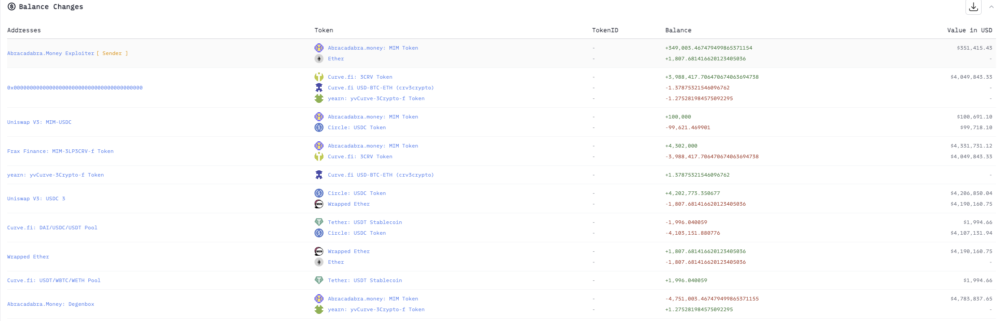

攻击者首先从闪电贷中借了 300,000 $MIM 代币

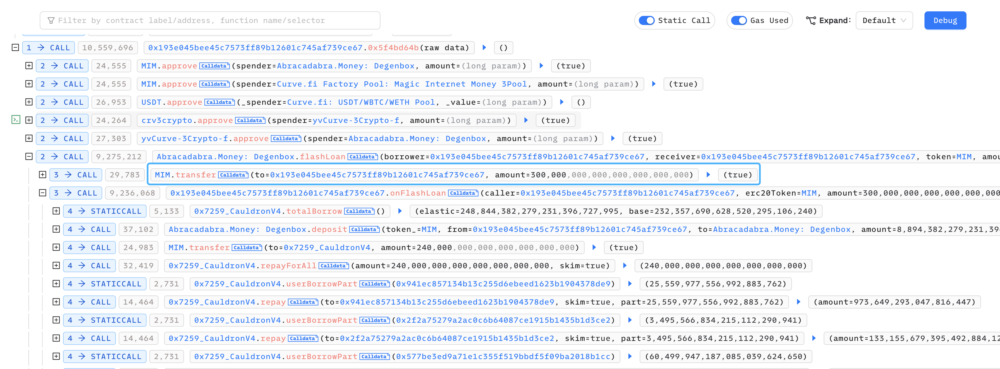

通过 totalBorrow 查询 合约中的总借款资金 (total.elastic) 和总借款份额 (total.base) 

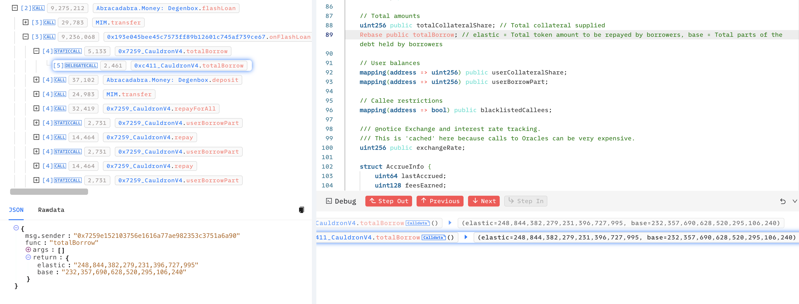

合约中 repayForAll 函数允许任何人偿还债务，并将 total.elastic 的值缩小

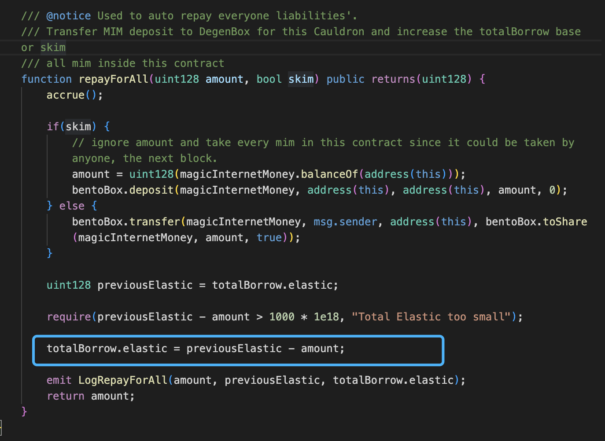

攻击者的目的是将总借款资金变成零去攻击四舍五入造成的漏洞，所以这里攻击者需要尽可能的将总借款资金清空，由于 repayForAll 函数中有 require 限制了总借款资金必须大于 1000 eth，所以不能一次性清空，攻击者先清除了一部分

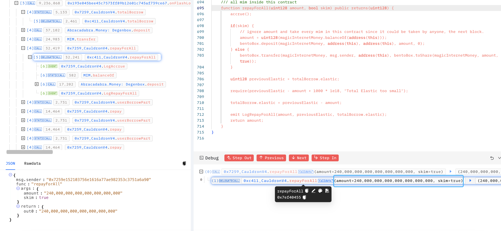

剩下部分通过 repay 函数将其他用户的借款资金偿还，其目的同样是将 total.elastic 尽可能变小

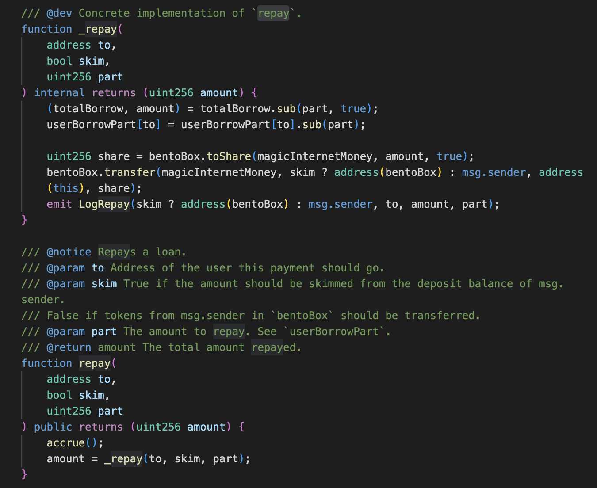

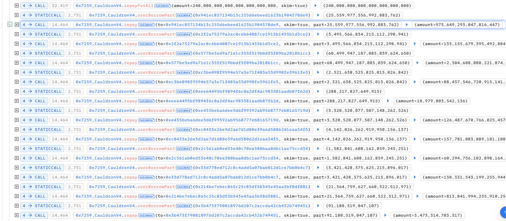

在剩下最后一个用户时，攻击者将 total.elastic 和 totla.base 控制在 3 和 100，然后多次还款 1 后将 total.elastic 清空，此时 total.elastic 和 totla.base 分别为 0 和 97

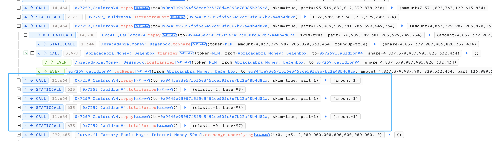

攻击者将前置工作完成后，开始了漏洞攻击

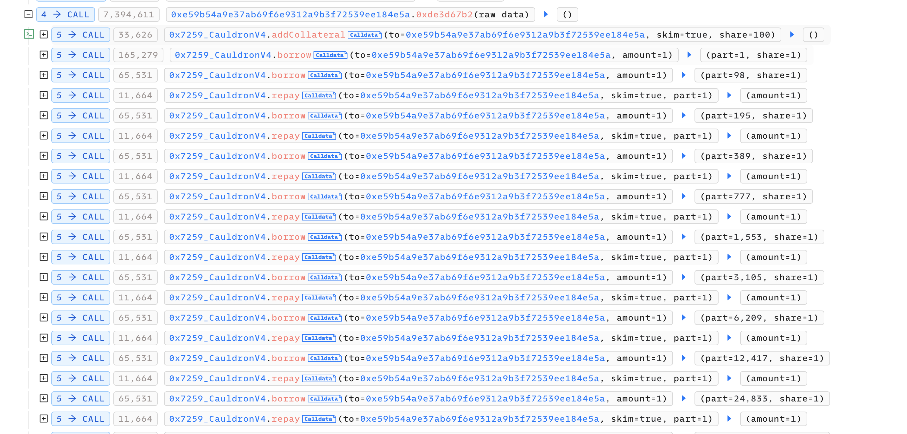

这里发现通过不断的调用 borrow 和 repay 函数将总借款份额不断的增大，但增大的速率非常不正常，跟进代码可以看到漏洞点

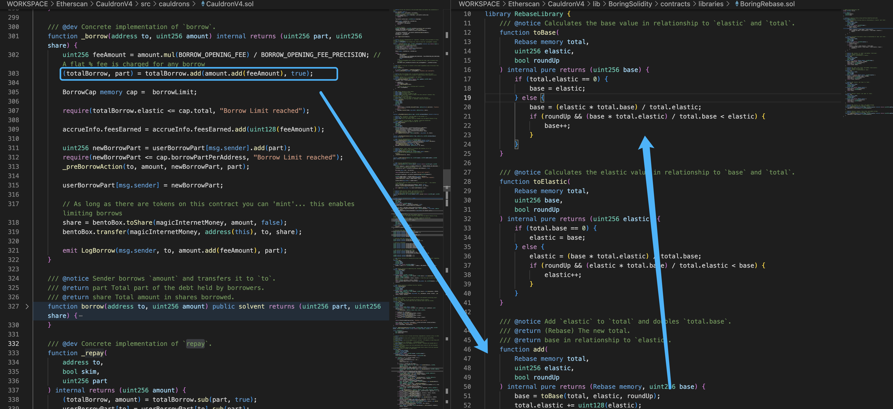

```solidity
function toBase(
        Rebase memory total,
        uint256 elastic,
        bool roundUp
    ) internal pure returns (uint256 base) {
        if (total.elastic == 0) {
            base = elastic;
        } else {
            base = (elastic * total.base) / total.elastic;
            if (roundUp && (base * total.elastic) / total.base < elastic) {
                base++;
            }
        }
    }
```

当 total.elastic 为 0 时，攻击者调用函数借款时 base 与 elastic 相等，此时 elastic 与 base 的值根据代码计算为 1 , 97 + 1 = 98 , 此时攻击者第二次调用 borrow，elastic 与 base 的值根据代码计算为 1 + 1 =2 , 98 + 1 * 98 / 1 = 196

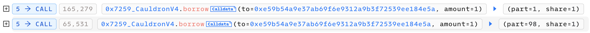

紧接着攻击者调用了函数 repay, 使 elastic 与 base 的值根据代码计算为 2 - 1 * 2/196 = 1, 196 - 1 = 195 ，此时 elastic 的计算就是攻击者利用的漏洞点

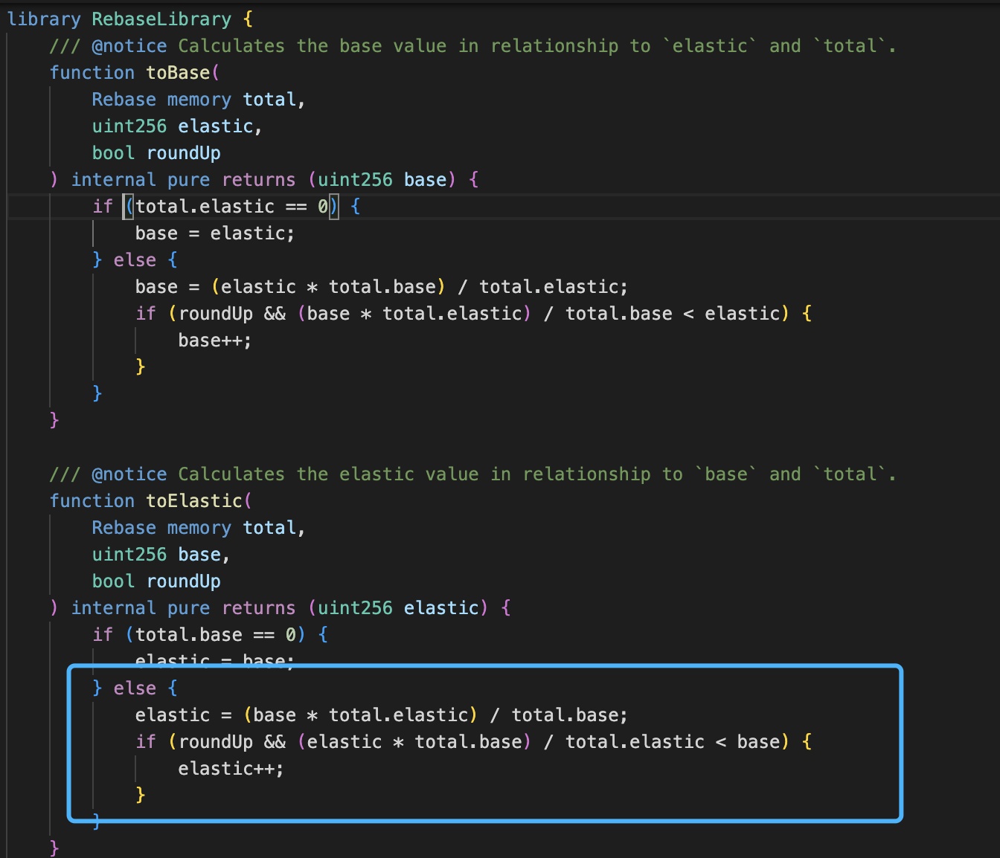

我们在toELastic 和 toBase 函数中可以发现非常重要的一个位置，其计算过程中有一个向上取整的算法，这样就到导致了攻击者可以通过这个特性将 totla.elastic 的值始终保持为 1 并重复上一个借款行为将 totla.base 无限扩大，这里用一张图可以更好理解计算过程

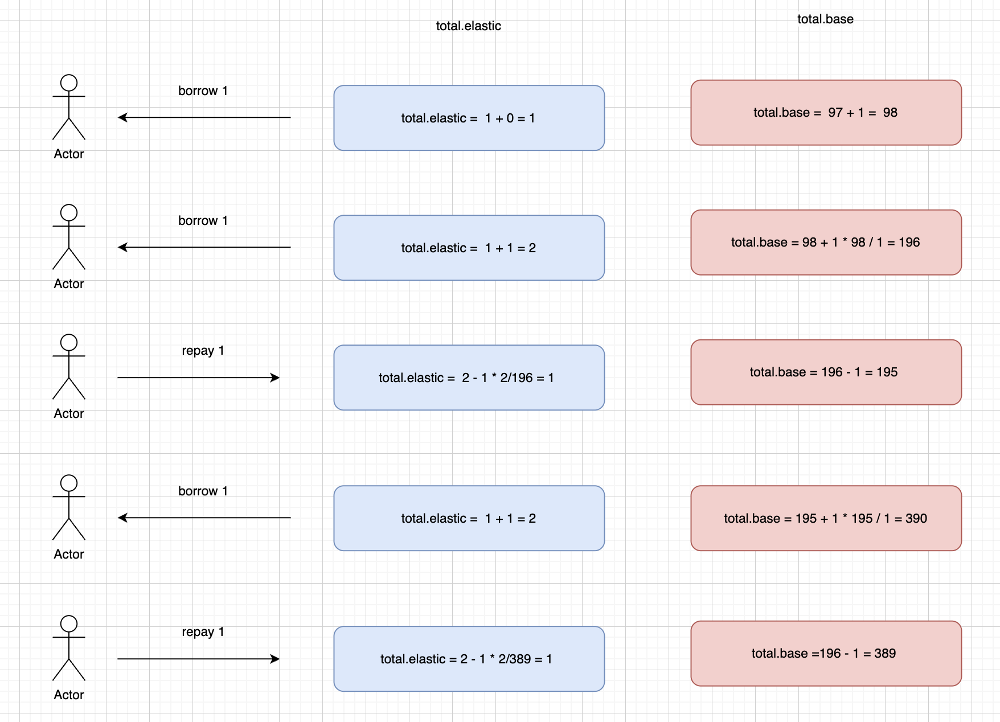

通过漏洞多次进行上述操作 将 base 变成非常庞大的数字，并在最后一次调用中额外 repay 一次将 total.elastic 再次变为 0 

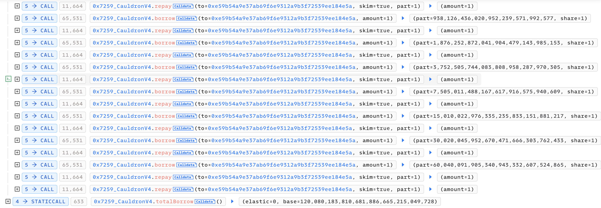

攻击者完成这一切后任意抵押都可以通过 borrow 函数的 solvent 修饰符限制条件拥有借出大量 $MIM 的权限

```solidity
//  _totalBorrow.base 非常庞大
borrowPart.mul(_totalBorrow.elastic).mul(_exchangeRate) / _totalBorrow.base;
```

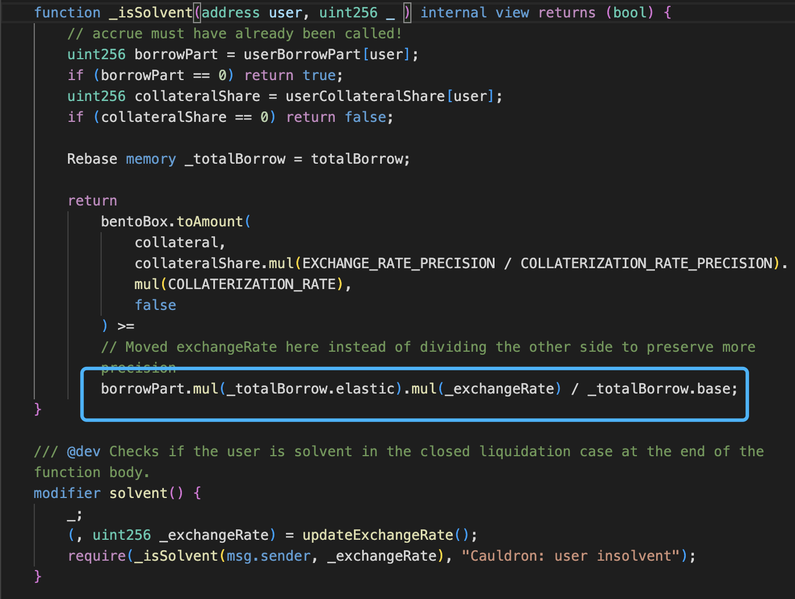

最后攻击者通过 borrow 借出合约中的所有 $MIM 所有代币，归还闪电贷完成攻击

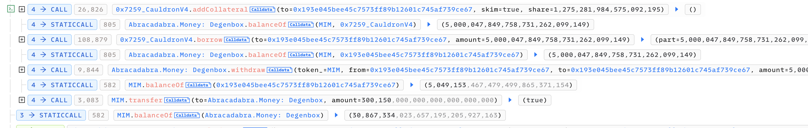