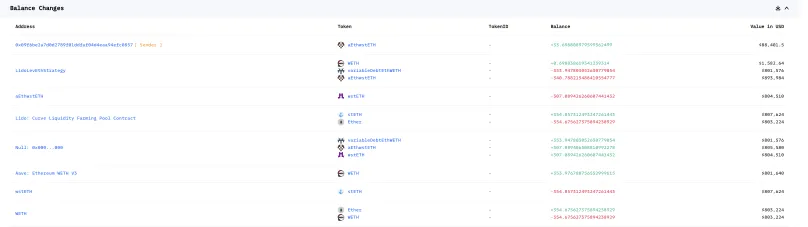
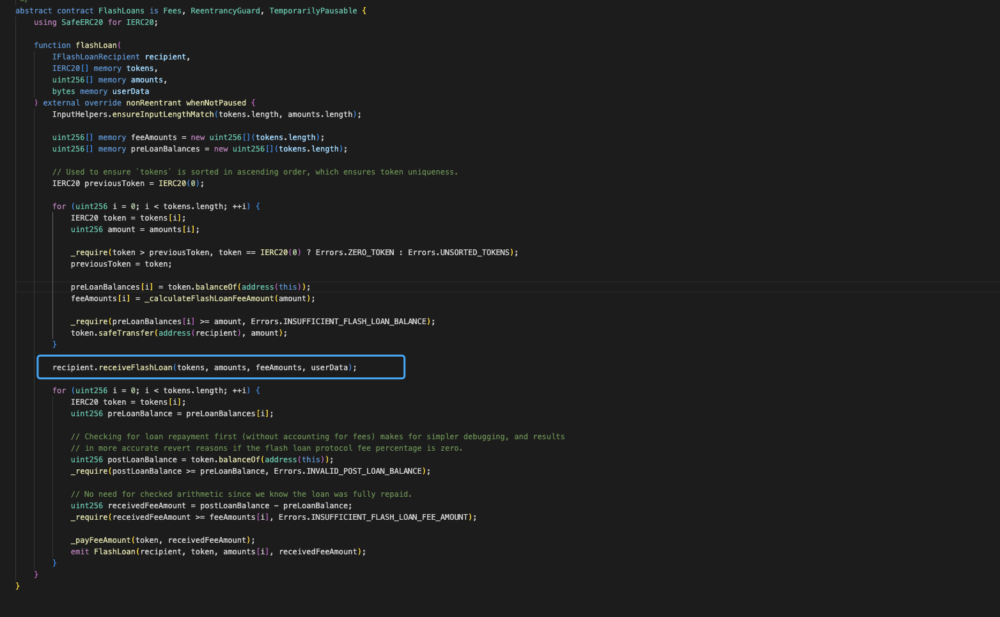
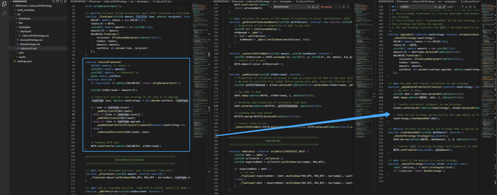
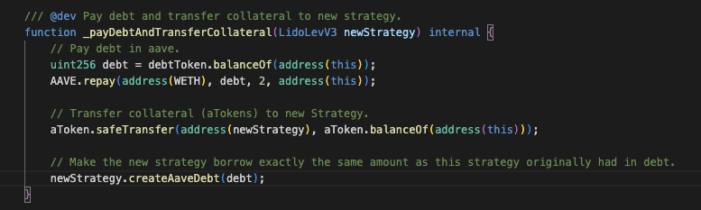
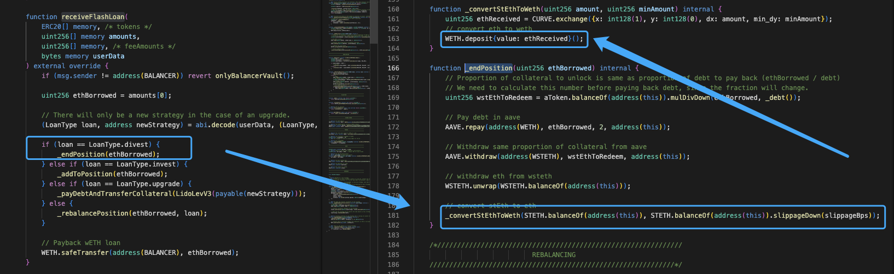
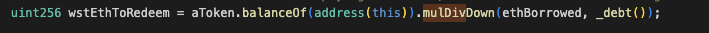
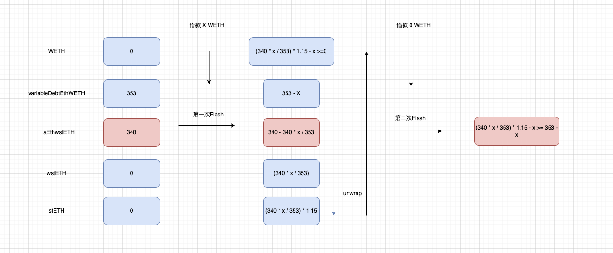
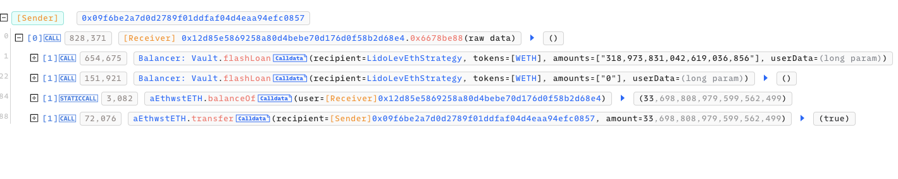

# 20240201 - AffineDeFi - 参数可控 ～ 33 $aEthwstETH

## 相关地址

攻击者地址：0x09f6be2a7d0d2789f01ddfaf04d4eaa94efc0857

攻击合约：0x12d85e5869258a80d4bebe70d176d0f58b2d68e4

被攻击合约：0xcd6ca2f0d0c182c5049d9a1f65cde51a706ae142

攻击交易：0x03543ef96c26d6c79ff6c24219c686ae6d0eb5453b322e54d3b6a5ce456385e5

## 攻击分析



漏洞出现在合约 LidoLevEthStrategu ，代码中通过  onlyBalancerVault() 判断调用来源来限制其他用户的调用，在指定合约中 Flash 函数里，我们可以通过控制 token 参数来调用 漏洞合约中的 receiveFlashLoan 方法





这里可以发现当 loan == LoanType.upgrade 时，newStrategy 参数为用户可控的 userData 参数，而这个参数为函数 _payDebtAndTransferCollateral 中 aToken safeTransfer 的目标



```solidity
/// @dev Pay debt and transfer collateral to new strategy.
    function _payDebtAndTransferCollateral(LidoLevV3 newStrategy) internal {
        // Pay debt in aave.
        uint256 debt = debtToken.balanceOf(address(this));
        AAVE.repay(address(WETH), debt, 2, address(this));

        // Transfer collateral (aTokens) to new Strategy.
        aToken.safeTransfer(address(newStrategy), aToken.balanceOf(address(this)));

        // Make the new strategy borrow exactly the same amount as this strategy originally had in debt.
        newStrategy.createAaveDebt(debt);
    }
```

在调用前，存在 AAVE.repay 逻辑，合约中需要有足够的 WETH 才可以完成全部 variableDebtEthWETH (总债务)的还款，所以这里需要调用函数 _endPosition 取出部分抵押物来满足调用漏洞函数条件



AAVE.withdraw 逻辑中会销毁对应的 aEthwstETH (atoken), _payDebtAndTransferCollateral 函数 safeTransfer 的 Token 恰好是 AAVE.withdraw 中对应销毁的 aToken, 此时的销毁数量计算代码为



 ethBorrowed 为 flash 的借款数量，攻击者为了最大获利，必须使 aToken 的销毁量最小， ethBorrowed 参数越小获利 aToken 数量就会越多，而 repay 使用的 WETH 是 Flash 借来的，所以 exchange 后获取的 ETH 需要足够返还闪电贷，此时攻击者要想最大获利需要满足条件

1.第一次闪电贷 调用 _endPosition 时，借款数量要足够小，且 WETH数量 足够返还闪电贷

2.第二次闪电贷 调用 _payDebtAndTransferCollateral 时，WETH数量在合约中足够 repay 所有债务



最后攻击者使用一笔恰当的借款值，通过控制 userData参数 调用两次 Flash 按顺序执行 _endPosition _payDebtAndTransferCollateral 将合约中的 33 $aEthwstETH 取出

