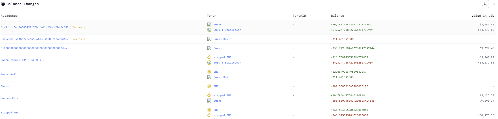
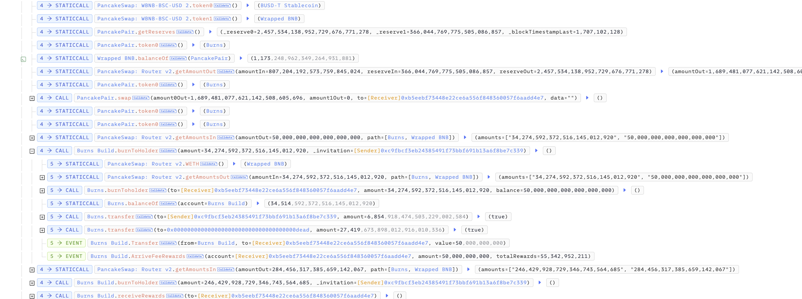
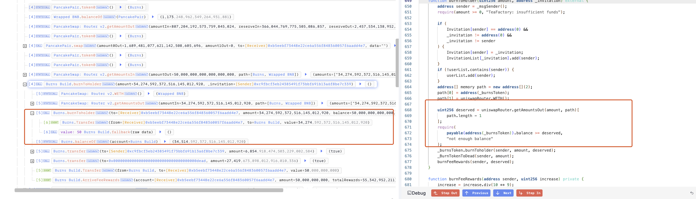
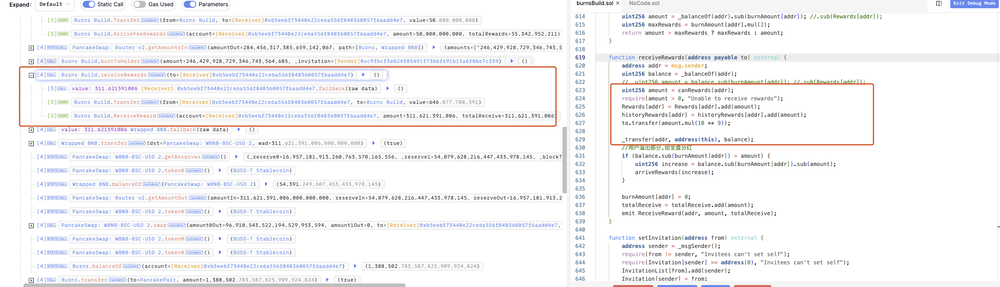
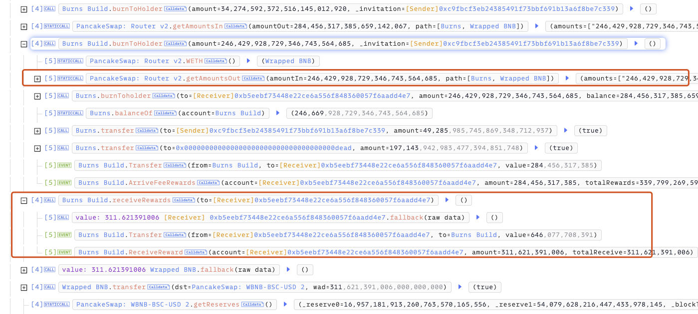

# 20240205 - BurnsDeFi ~ 价格操纵 ～ 64K $BUSDT

## 相关地址

攻击者地址：0xc9fbcf3eb24385491f73bbf691b13a6f8be7c339

被攻击地址：0x4fb9657ac5d311dd54b37a75cfb873b127eb21fd

攻击合约地址：0xb5eebf73448e22ce6a556f848360057f6aadd4e7

攻击交易：0x1d0af3a963682748493f21bf9e955ce3a950bee5817401bf2486db7a0af104b4	

## 攻击分析

攻击者通过闪电贷获取250K $BUSDT 后全部换为 Token 后调用 burnToHolder 方法

该方法的逻辑类似于 Swap交易，按照 getAmountsOut 计算池中Token价格后，将 Token发送至 Burns Build 合约，并把对应价格的 $BNB 发送到 Burns Build 合约中，然后将对应数量的 $BNB 计入用户奖励

调用 receiveRewards 方法可以将用户奖励取出，相当于 Swap的出售过程

由于 burnToHolder 方法里计算交换数量时使用的是 getAmountsOut 方法，如果攻击者通过闪电贷购入大量Token使价格升高，就操纵了 getAmountsOut 数值的大小导致 burnToHolder 方法返回的奖励值额外增大导致攻击

