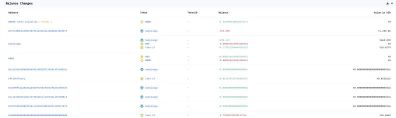
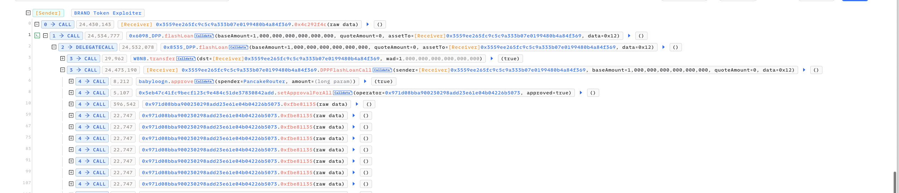
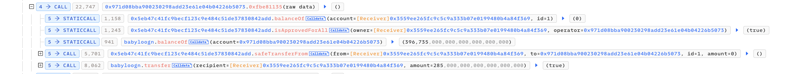
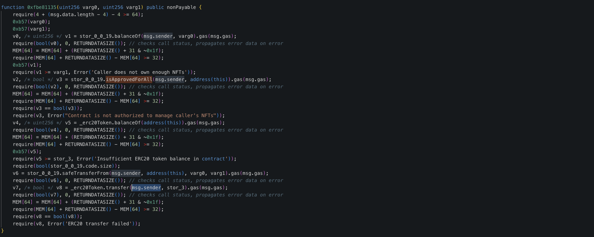

# 20240215 - Babyloogn - 权限缺失 ～ 4 $BNB

## 相关地址

攻击者地址：0x835b45d38cbdccf99e609436ff38e31ac05bc502

被攻击地址：0x971d08bba900230298add23e61e04b04226b5073

攻击合约地址：0x3559ee265fc9c5c9a333b07e0199480b4a84f369

攻击交易：0xd081d6bb96326be5305a6c00dd51d1799971794941576554341738abc1ceb202

## 攻击分析

攻击者调用多次 0x971d08  合约 0xfbe81135 方法获取空投

合约中对 msg.sender 是否有权限没有做验证，直接调用获取大量代币

