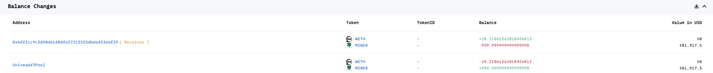
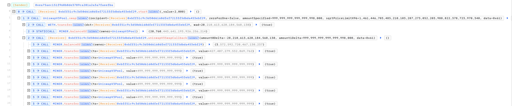
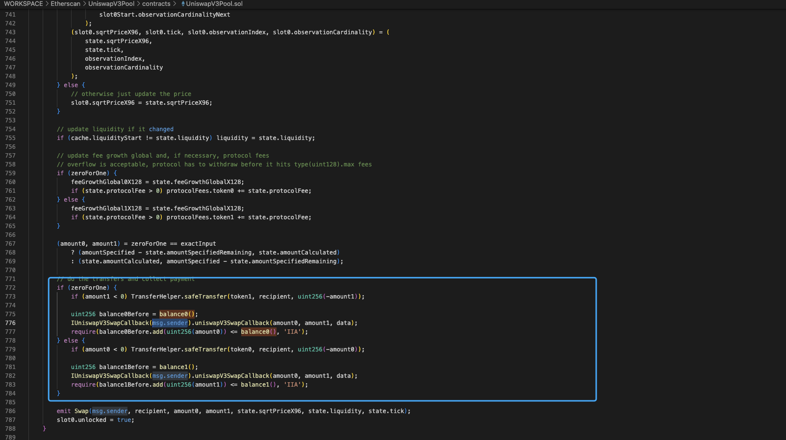
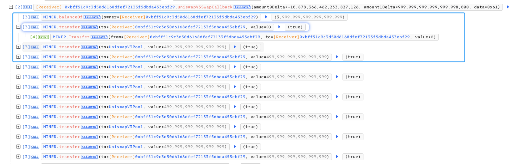
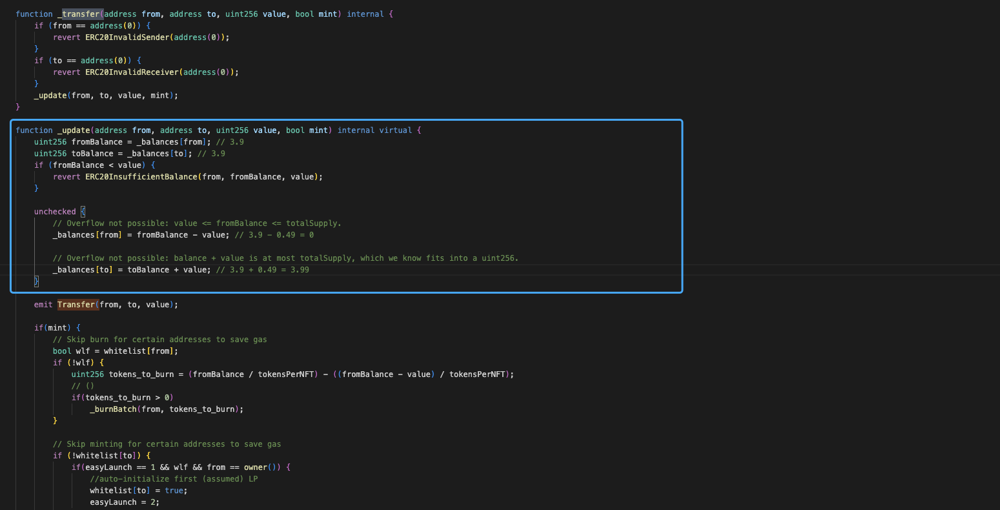
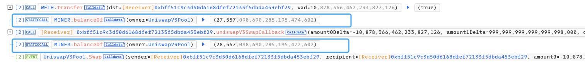
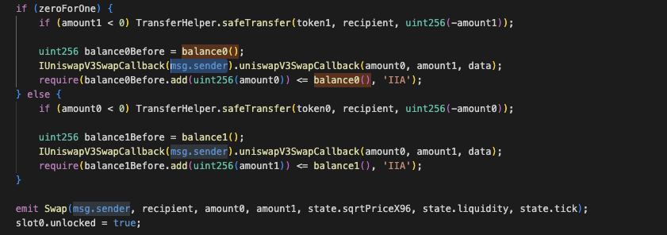

# 20240215 - Miner - 逻辑错误 ～ 28 $ETH

## 相关地址

攻击者地址：0xea75aec151f968b8de3789ca201a2a3a7faeefba

攻击合约：0xbff51c9c3d50d6168dfef72133f5dbda453ebf29

被攻击合约：0x732276168b421d4792e743711e1a48172ea574a2

攻击交易：0x75e3aeb00df69882a1b15d424e5e642650326ca3b923d7fd1922d57c51bc2c78

## 攻击分析

攻击者调用攻击合约，首先调用了 UniswapV3Pool 的 swap

这里将会调用攻击合约 (msg.sender) 的 uniswapV3SwapCallback 函数

此时合约控制权交给攻击合约，攻击合约调用 Miner 合约的 transfer 2000 次

这里注意到合约中 balanceOf 是不足以一直 transfer 给 UniswapV3Pool 的，我们看向 transfer 代码块

如果 from 和 to 相同的时候，_balances[to] 计算的值将会覆盖 _balances[from] (图中备注了数值变化), 也就是说攻击者只要控制 from 和 to 就可以凭空获得 value 数值的余额，攻击者重复 transfer 2000 次，凭空获得了 value * 2000 的代币，最后通过 require 的代币余额检测后就成功获利离场

