# 20240216 - Particle - 参数可控 ～ 50 $ETH

## 相关地址

攻击者地址：0x2c903f97ea69b393ea03e7fab8d64d722b3f5559

攻击合约：0xe55607b2967ddbe5fa9a6a921991545b8277ef8f

被攻击合约：0xe4764f9cd8ecc9659d3abf35259638b20ac536e4

攻击交易：0xd9b3e229acc755881890394cc76fde0d7b83b1abd4d046b0f69c1fd9fd495ff6

## 攻击分析

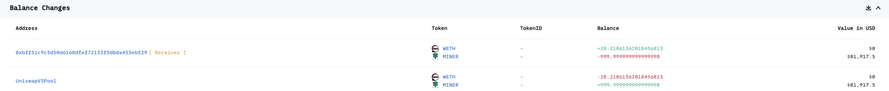

攻击者首先调用合约的 offerBid 函数获取 lienId

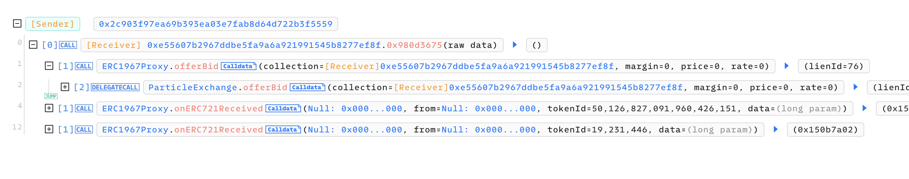

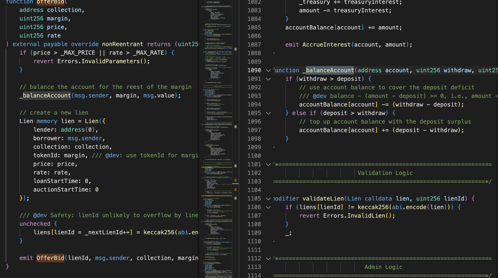

跟据参数会生成对应的 lienId，由于此时 (贷款额度) accountBalance[account] 为 0，所以传入参数为 合约地址,0,0,0 ，这里生成的 liens[lienId] 会在后续函数功能中使用，找到提出贷款功能 withdrawAccountBalance() 可以发现提款数量由 accountBalanace[msg.sender] 参数决定，而函数 _acceptBidSellNftToMarketCheck() 函数可以控制该参数

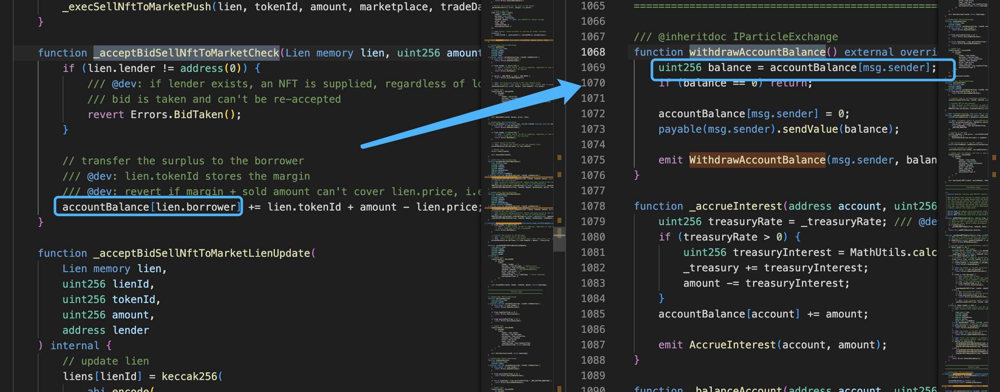

accountBalance 的值主要由 lien.tolenId 来决定 ，像上跟踪代码

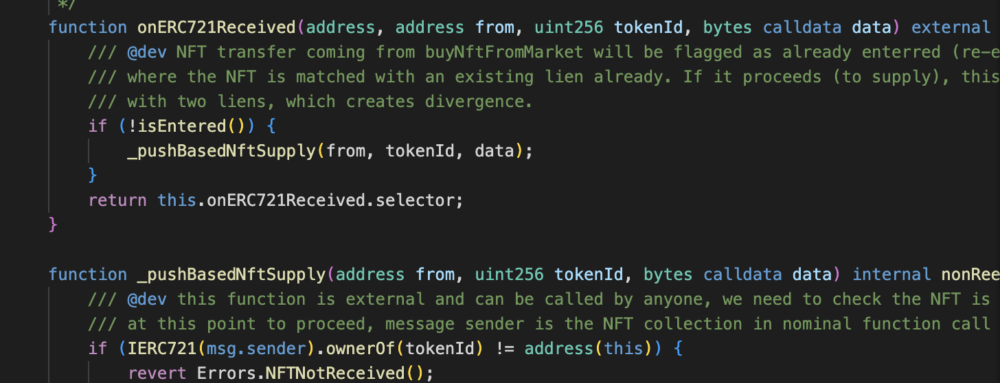

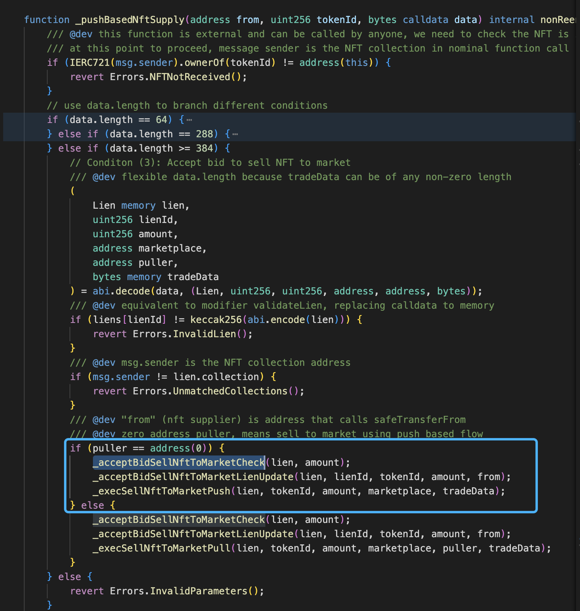

函数的调用为 onERC721Received --> _pushBasedNftSupply --> _acceptBidSellNftToMarketCheck,  此时可控的参数有 from tokenid data, 其中 data 参数为 lien 结构体和部分参数组成，所以此时 lien.tokenId 我们可以通过 data 参数控制

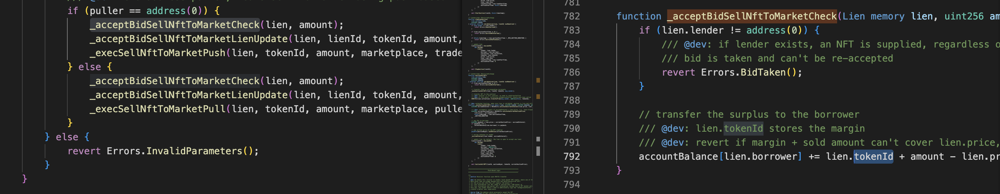

_acceptBidSellNftToMarketLienUpdate 函数功能为更新 liens 参数

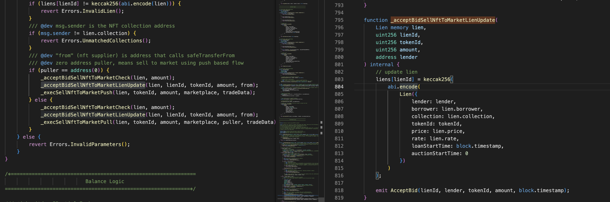

_execSellNftToMarketPull 函数中的 safeTransferFrom， ownerOf 的调用结果攻击合约可控，来源为可控参数 lien.collection

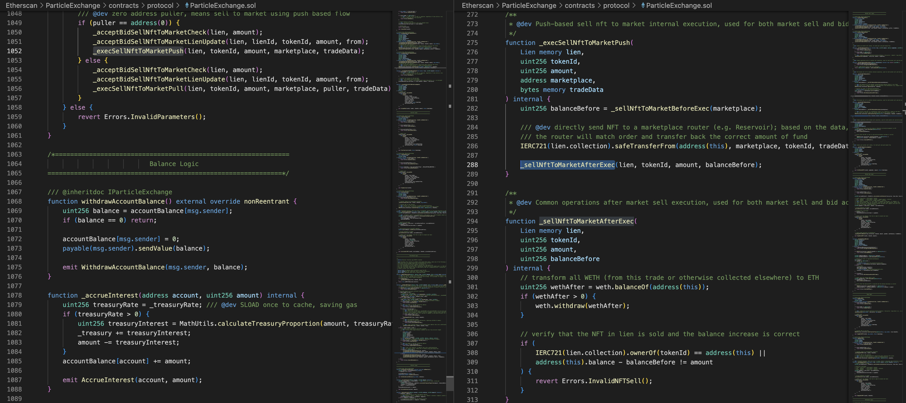

但其中代码逻辑中存在一些参数的检测，这里检测了 liens[lienId] 是不是 offerBid 对应生成的 lien 参数，所以此时 lien.tolenId 只能为 0 导致 accountBalance 是不可控的

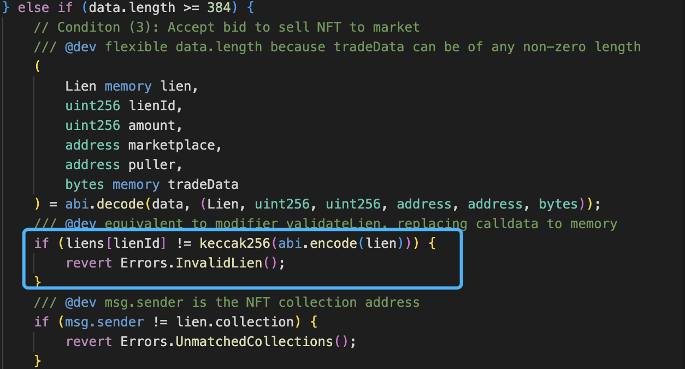

但 _acceptBidSellNftToMarketLienUpdate 函数中会通过可控传参 tokenId 来更新 liens

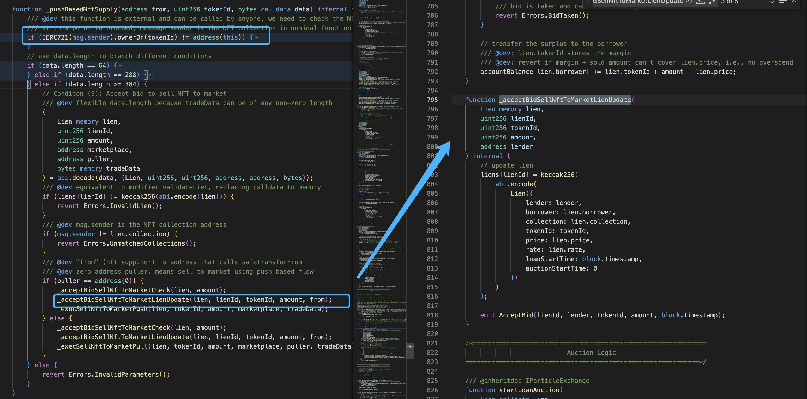

在第一次传入参数时控制 _acceptBidSellNftToMarketLienUpdate 函数更新的 liens，这样如果在第二次调用时 lien.tokenId 已经被覆盖，也就可以控制 accountBalance 的大小

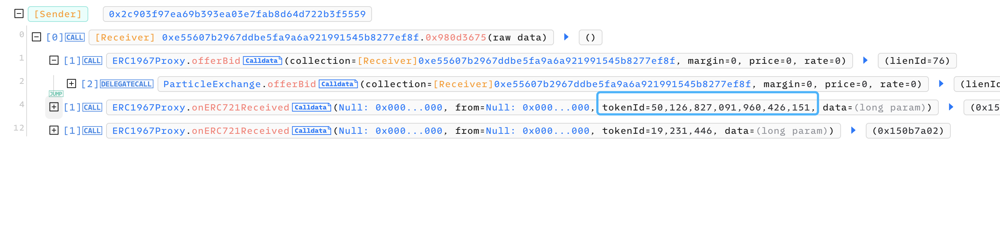

攻击者通过 onERC721Received 函数第一次调用覆盖 lien.tokenId , 然后再一次调用控制 accountBalance 参数，最后在通过函数 withdrawAccountBalance 将对应  accountBalance 大小的 $ETH 提出完成攻击

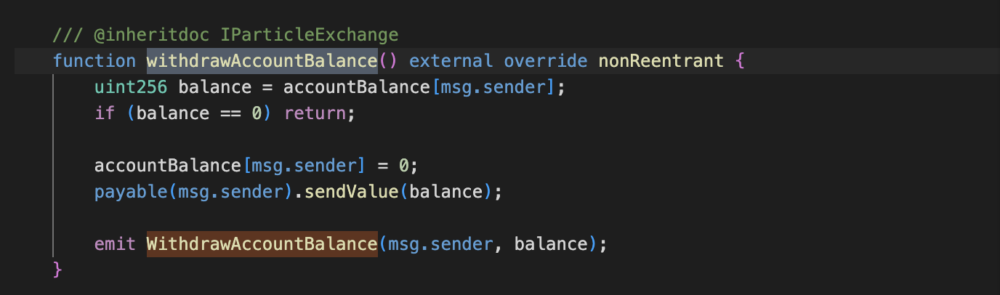

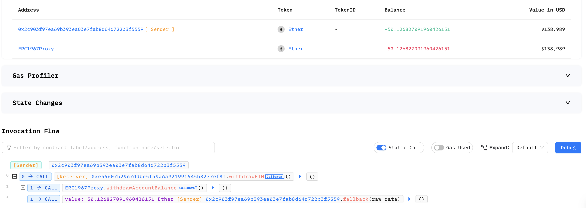

在后续攻击中攻击者还通过类似方法转移出了合约中的 NFT

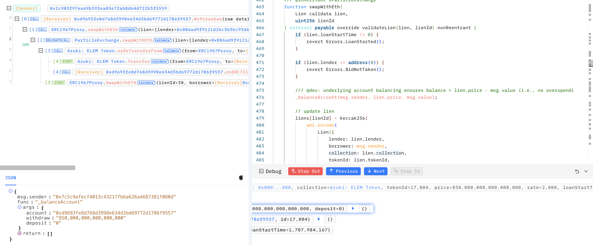

在转移前攻击者同样调用两次 onERC721Received 将 accountBalance 值控制，使 _balanceAccount 方法可以通过

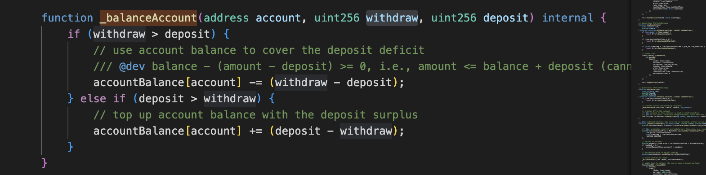

其中需要的参数可以在历史交易中找到对应的 tokenId principal reteBips 的值

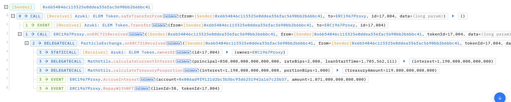

在 swapWithEth 中 lien.collection 是攻击者可控的，此时攻击者可以将合约中的 NFT 转移到攻击合约中

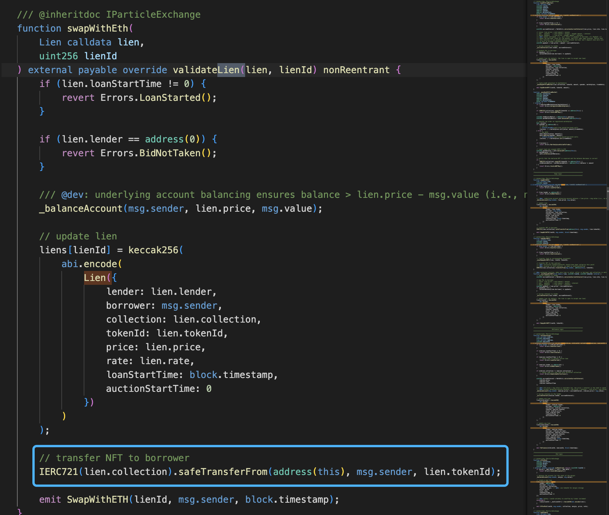

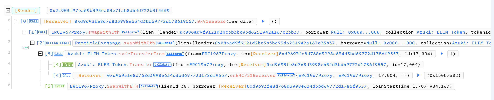