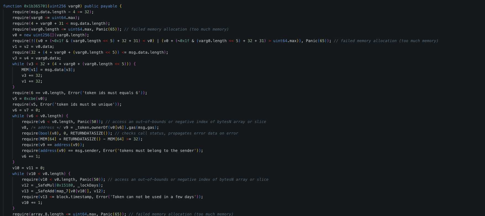
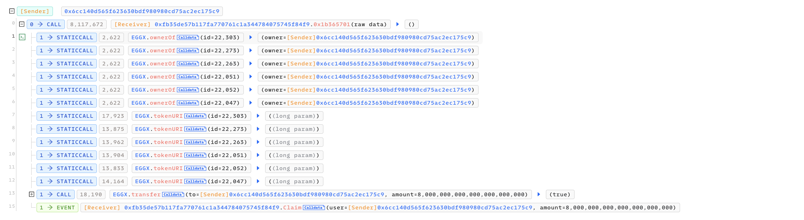
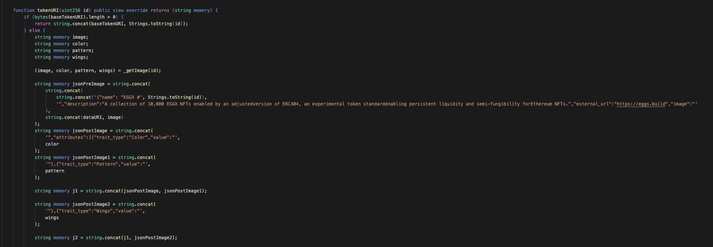
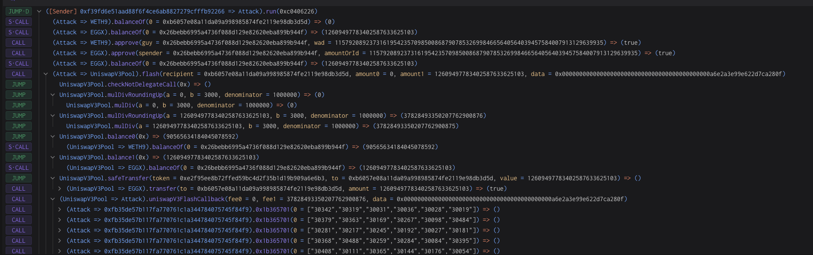

# 20240218 - EGGX - 逻辑错误 ～ 10 $ETH

## 相关地址

漏洞合约：0xfb35de57b117fa770761c1a344784075745f84f9

## 攻击分析

EGGX 的空投合约中通过函数 check 检测6个相同图案不同颜色的是否归 sender用户所有，如果通过，将会发放空投

但在其实现的 ERC404 协议中，图案或者颜色是可以通过 id 值来预测的

当代币 transfer 时会从 0 地址生成对应的 NFT 给用户，这样实际上闪电贷也会触发 NFT的获取，结合刚刚提到的可预测的图案颜色，攻击者可以通过闪电贷一大笔 NFT来进行空投获利

