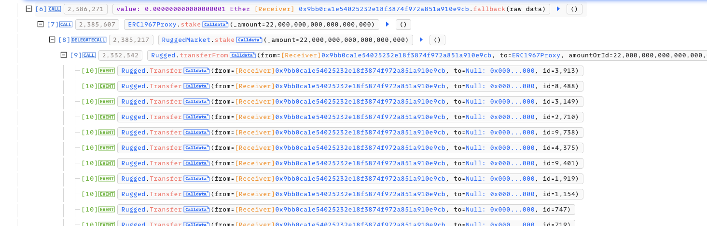
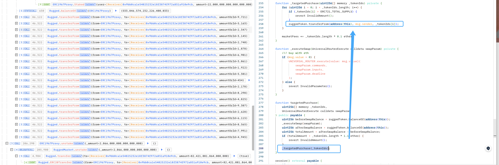
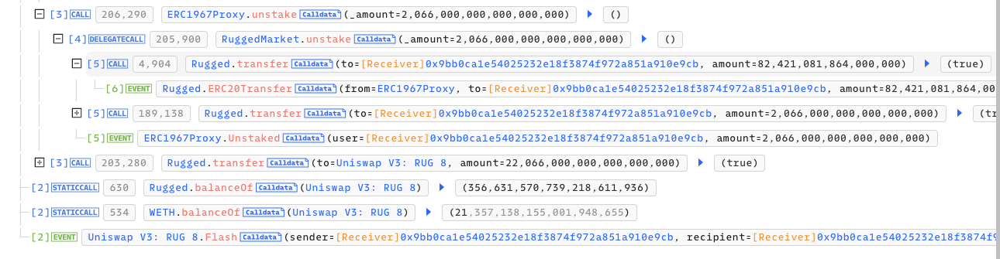
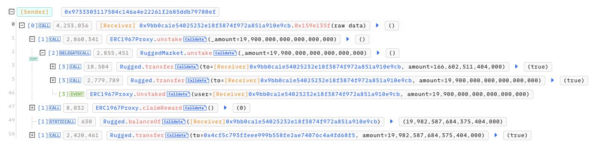
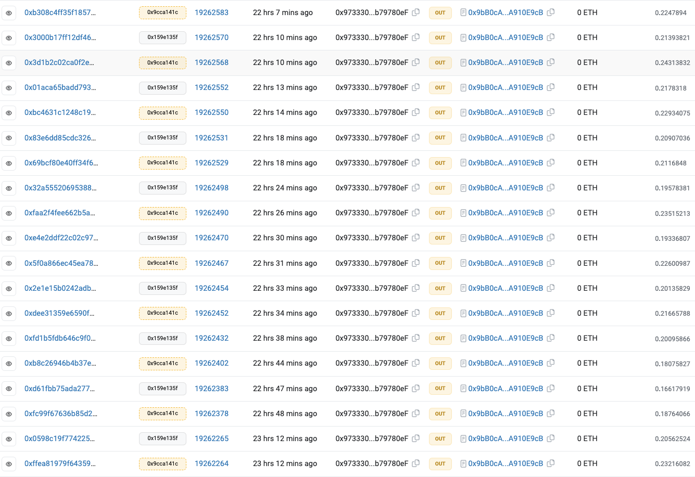

# 20240219 - Rugged Art - 闪电贷逻辑漏洞

## 相关地址

攻击者地址：0x9733303117504c146a4e22261f2685ddb79780ef

攻击合约：0x9bb0ca1e54025232e18f3874f972a851a910e9cb

被攻击合约：0xfe380fe1db07e531e3519b9ae3ea9f7888ce20c6

攻击交易：0x5a63da39b5b83fccdd825fed0226f330f802e995b8e49e19fbdd246876c67e1f

## 攻击分析

攻击合约 fallback 函数中调用 stake 将 NFT 全部质押

质押完成后回到 targetedPurchase 函数，而 _targetedPurchase 的函数逻辑又将刚刚质押的NFT重新通过 transferfrom 发送给攻击合约

此时攻击者又重新拿回 NFT，加上手续费就可以归还闪电贷，但由于调用了 stake 函数将 NFT 质押进合约里，所以此时攻击者 代币总量数量总是翻了一倍 ，随后攻击者通过 unstake 函数将质押在合约中的部分取出作为手续费归还闪电贷

最后攻击者再发送一笔交易通过 unstack 取出质押在合约中的部分，并根据该方法多次调用进行获利

