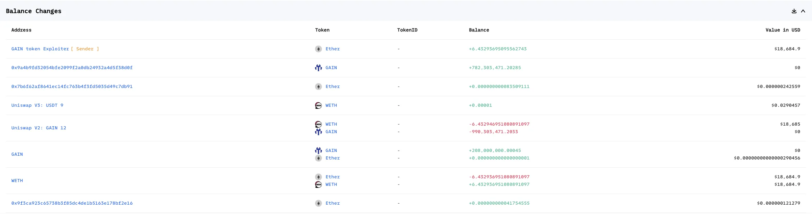
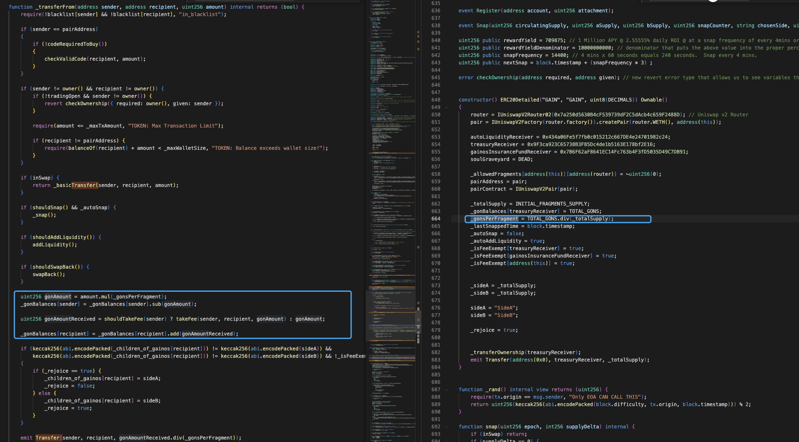
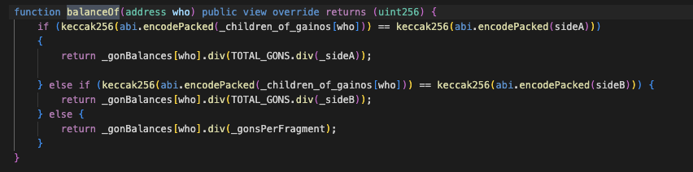
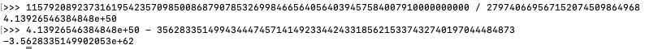
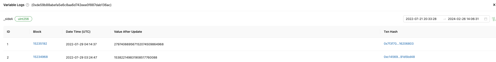
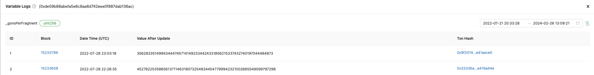
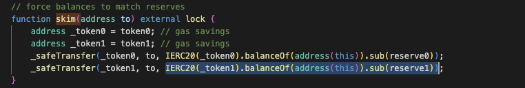
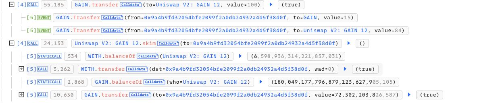
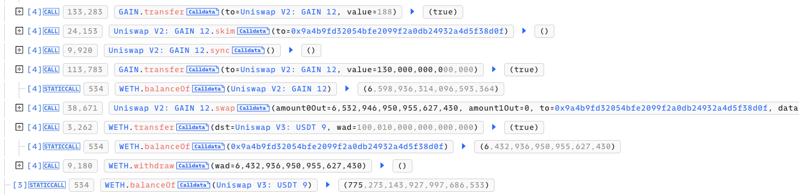

# 20240221 - GainOS - 逻辑错误 ～ 6 $ETH

## 相关地址

攻击者地址：0x0000000f95c09138dfea7d9bcf3478fc2e13dcab

攻击合约：0x9a4b9fd32054bfe2099f2a0db24932a4d5f38d0f

被攻击合约：0xde59b88abefa5e6c8aa6d742eee0f887dab136ac

攻击交易：0x7acc896b8d82874c67127ff3359d7437a15fdb4229ed83da00da1f4d8370764e

## 攻击分析

攻击者通过闪电贷借入 0.1 eth 买入 1 Gain 

在 balanceOf 函数中对于不同的地址来进行不同的计算，用户计算为 _gonBalances[who].div(_gonsPerFragment) ，与 _transferFrom 相对应，而LP对应为 sideA，执行 _gonBalances[who].div(TOTAL_GONS.div(_sideA))

(TOTAL_GONS.div(_sideA)) 的值相对于 _gonsPerFragment 更小，所以当用户像LP中发送 Token 时，LP 的 balanceOf 会相对于 用户发送的 Token 值大更多

 UNI V2 的 skim 函数中，会通过查询 _token 的 balanceOf 函数将大于 reserve 的数量发送给指定地址

所以攻击方式为: 向LP发送 Token，此时 LP 中的 balanceOf 增加相对于用户发送的数量更大的值，而 skim 计算时是计算 LP 的 balanceOf ，所以发送给 to 的量会以  _gonBalances[who].div(TOTAL_GONS.div(_sideA)) 参数来计算，而正常情况发送用户应为 _gonBalances[who].div(_gonsPerFragment) 计算

这里攻击者只发送了 100 Token，通过 skim 就获得了巨额数量，最后攻击者通过两次 skim 获取大量 Token 后将 LP 中的 ETH 全部提取

