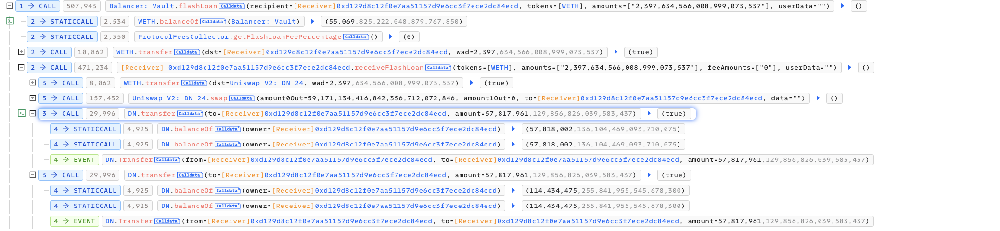

# 20240222 - DeezNutz404 - 逻辑错误 ～ 58 $ETH

## 相关地址

攻击者地址：0xd215ffaf0f85fb6f93f11e49bd6175ad58af0dfd

攻击合约：0xd129d8c12f0e7aa51157d9e6cc3f7ece2dc84ecd

被攻击合约：0xb57e874082417b66877429481473cf9fcd8e0b8a

攻击交易：0xbeefd8faba2aa82704afe821fd41b670319203dd9090f7af8affdf6bcfec2d61

## 攻击分析

攻击者调用闪电贷获取 ～2400 $ETH , 同时通过 swap 全部转化为 DN 代币

漏洞存在于 transfer 之中，from 与 to 为自身让余额增加

攻击者不断给自身转账获取大量 DN 代币后卖出归还闪电贷

最后不断重复过程数次，卖出全部 DN代币，获利离场

