# 20240223 - SwarmMarkets - 权限缺失 ～ 3K $USDC

## 相关地址

攻击者地址：0x38f68f119243adbca187e1ef64344ed475a8c69c

被攻击合约：0x2b9dc65253c035eb21778cb3898eab5a0ada0cce

攻击交易：0xc0be8c3792a5b1ba7d653dc681ff611a5b79a75fe51c359cf1aac633e9441574

## 攻击分析

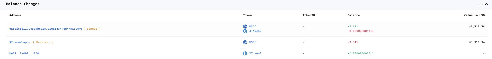

项目方地址创建了3个合约，其中两个为测试 xToken, Caller 为 代币对注册

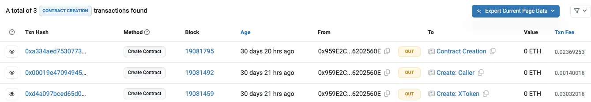

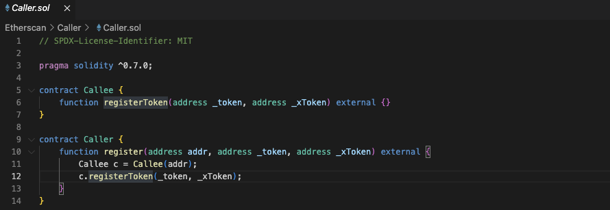

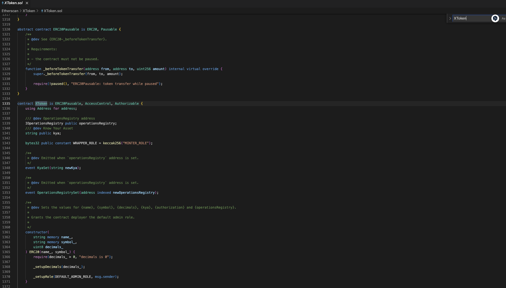

0x958E2C 地址通过 upgrade 函数设置 Caller 代理

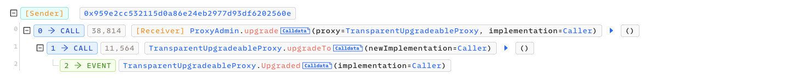

通过代理地址调用 XTokenWrapper 合约的 RegisterToken 时, msg.sender 通过权限判断，函数会注册对应代币对，在后续 unwrap 可以完成交换逻辑

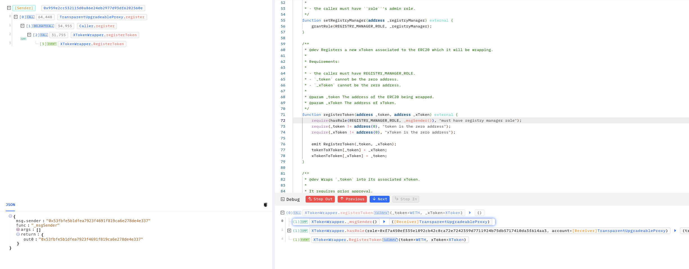

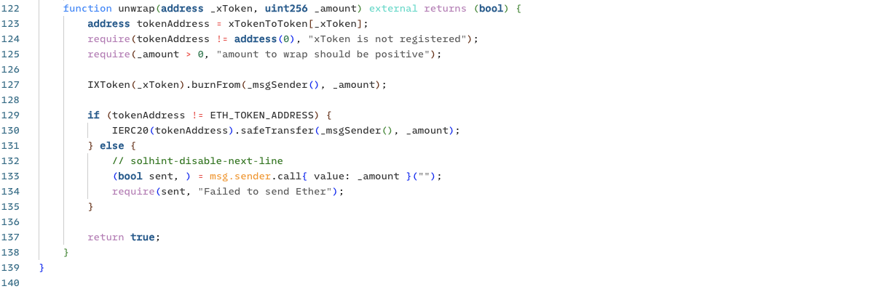

函数会通过传入的 _xToken 找到对应代币对执行销毁 _xToken ，safeTransfer 发送代币给调用者

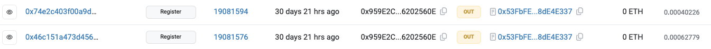

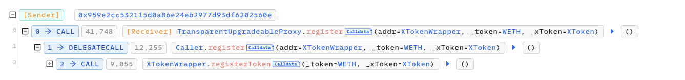

例如上图项目方在注册过程中将 XToken 与 WETH 相关联，而 XToken 为测试代币，可以无限 mint

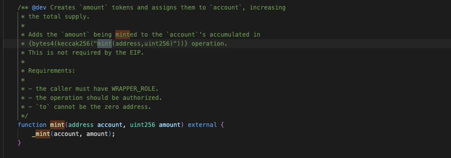

所以此时可以 mint 对应 XToken 代币换出对应 register 的代币

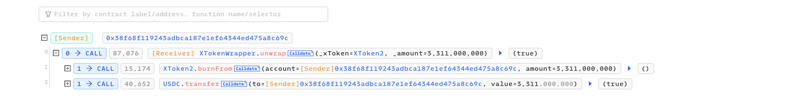