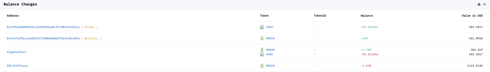
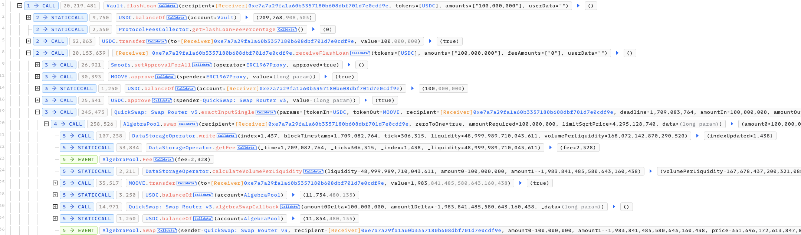
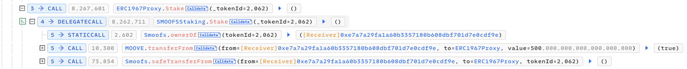
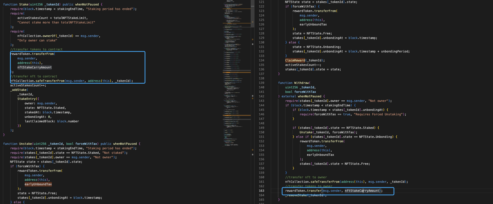
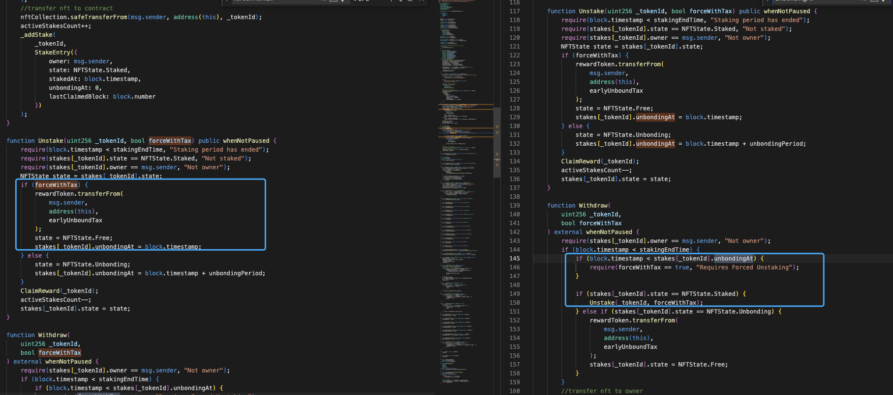
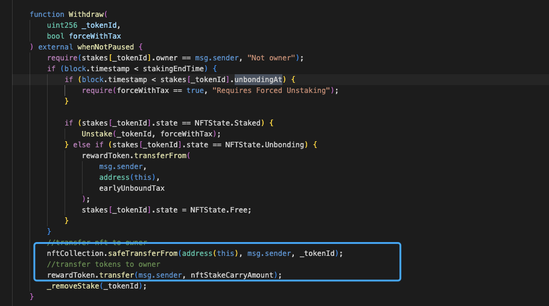
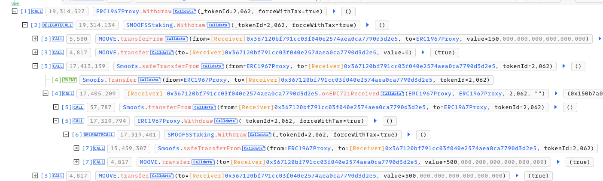

# 20240301-SMOOFSStaking

## 相关地址

攻击者地址：0x149b268b8b8101e2b5df84a601327484cb43221c

攻击合约地址：0xe7a7a29fa1a60b3357180b608dbf701d7e0cdf9e

漏洞合约地址：0x9d6cb01fb91f8c6616e822cf90a4b3d8eb0569c6

攻击交易地址：0xcc3d1a2c1dfc572a2937644dab8f1255796e9757ce5def7cc89ead6c2746945e

## 攻击分析

攻击者通过闪电贷购入部分 MOOVE

接着将之前提前转入的 NFT 和 500 MOOVE 质押进合约

质押结束时会退回刚刚质押的等值的 Token 和 NFT

其中取出过程中包含一笔 150 MOOVE 的手续费

Withdraw 函数中包含一个重入漏洞

这里控制权交给攻击合约后，攻击者通过直接将 NFT 发送到质押合约中跳过 500 MOOVE 的质押，此时攻击者只需要提交 150 MOOVE 手续费就可以通过重入获得解除质押的 500 MOOVE

