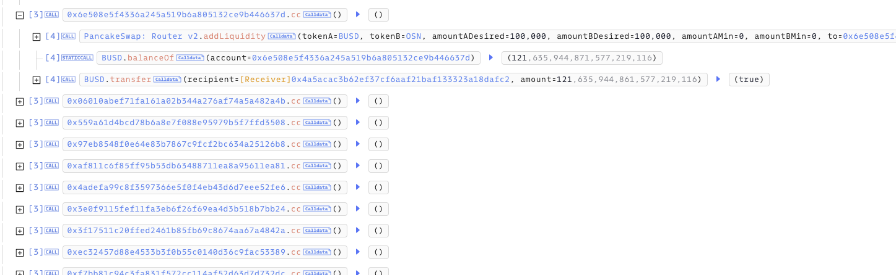

# 20240506 - OSN ～ 逻辑错误 ～ 2K $BUSD

## 相关地址

攻击者地址: 0x835b45d38cbdccf99e609436ff38e31ac05bc502

攻击合约地址: 0x4a5acac3b62ef37cf6aaf21baf133323a18dafc2

被攻击合约地址: 0x810f4c6ae97bcc66da5ae6383cc31bd3670f6d13

攻击交易: 0xc7927a68464ebab1c0b1af58a5466da88f09ba9b30e6c255b46b1bc2e7d1bf09

## 攻击分析

攻击前攻击者通过少量的转账和流动性添加进行准备工作

攻击者通过闪电贷购买 OSN 代币后添加池获取 LP Token

将第一次得到的 LP Token 转移到另一个地址并移除少量流动性，使 lpDividendTracker.setBalance 将对应的流动性代币余额记录到目标地址的分红账户

重复该操作多次给多个地址分红账户赋值，使用一笔 LP Token 复用使多个攻击地址分红账户余额为LP Token值并使用该值参与分红

由于分红的金额来源于用户的交易手续费，攻击者此时通过多次的 Swap 大额交易将分红记录在这些账户中

最后再通过多次小额流动性添加触发分红，进行获利

