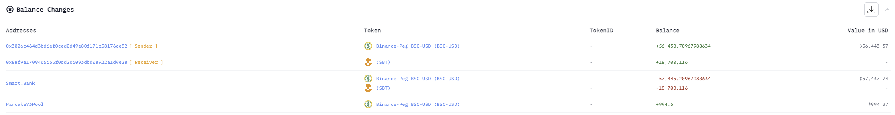
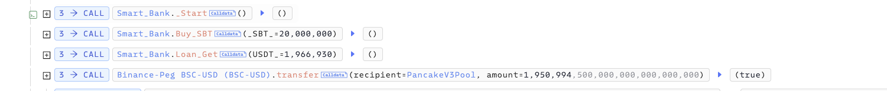
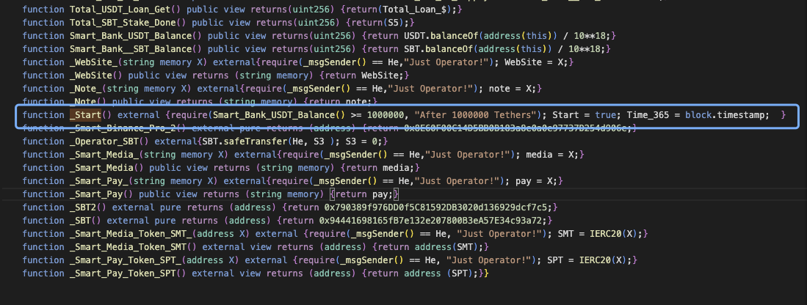
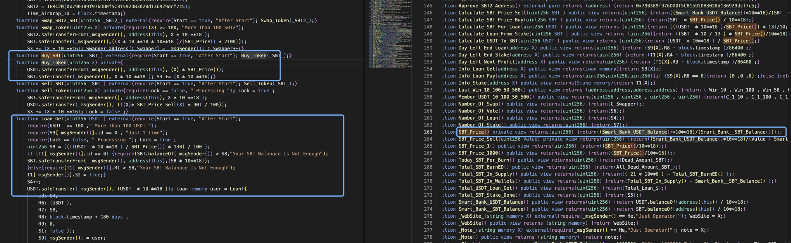
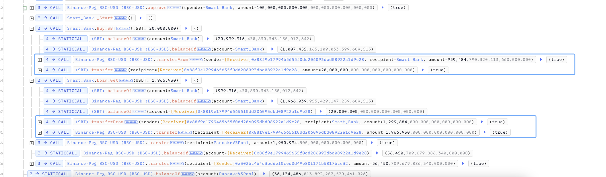

# 20240711 - SBT - 价格操纵 ~ 56K $BUSD

## 相关地址

攻击者地址: 0x3026c464d3bd6ef0ced0d49e80f171b58176ce32

攻击合约地址: 0x88f9e1799465655f0dd206093dbd08922a1d9e28

被攻击合约地址: 0x2b45dd1d909c01aad96fa6b67108d691b432f351

攻击交易: 0x9a8c4c4edb7a76ecfa935780124c409f83a08d15c560bb67302182f8969be20d

## 攻击分析



攻击者通过闪电贷借贷 1,950K $BUSD,  然后把 950K $BUSD 发送给 Smart_Bank，将 Smart_Bank 的 BUSDT 余额大于 1000K，调用函数 _Start() 使 Start 参数设置为 true





此时就可以调用函数 Buy_SBT ,  Loan_Get 进行购买 SBT 和借贷操作



SBT_Price 函数为 SBT 的价格计算，不同于常见的DEX，SBT的价格计算源于 Smart_Bank 合约中的 $BUSD，而 Laon_Get 借贷函数的借贷数量则是通过 SBT_Price 函数来计算借出的 $BUSD 数量，由于合约类似于合约池，我们只需要通过 Buy_SBT 函数 将 SBT_Price 函数计算出的价格抬高，再通过借贷函数换出更多的 $BUSD

```solidity
function Loan_Get(uint256 USDT_) external{require(Start == true, "After Start");
        require(USDT_ >= 100 ," More Than 100 USDT ");
        require(S9[_msgSender()].id == 0 , "Just 1 Time");
        require(Lock == false, " Processing "); Lock = true ;
        
        // 计算借贷 USDT_ 数量的 BUSD 需要多少 SBT, 由于攻击者抬高价格，SBT 在合约中所对应的价值会更大，也就可以换出更多的 BUSD
        uint256 S8 = ((((USDT_ * 10 **18 ) / SBT_Price()) * 130) / 100 );
        if (T1[_msgSender()].id == 0) {require(SBT.balanceOf(_msgSender()) > S8,"Your SBT Balanace Is Not Enough");
        SBT.safeTransferFrom( _msgSender(), address(this),(S8 * 10**18));
        }else{require(T1[_msgSender()].R1 > S8,"Your SBT Balanace Is Not Enough");
        T1[_msgSender()].S2 = true;}
        S4++;
        USDT.safeTransfer(_msgSender(), (USDT_ * 10 **18 )); Loan memory user = Loan({
            id: S4,
            R6: (USDT_),
            R7: S8,
            R8: block.timestamp + 180 days ,
            R9: 0,
            S1: false });
            S9[_msgSender()] = user;  
            S3 += (S8 * 10 **16); 
            Dead_Amount_SBT += (S8 / 20);
            Total_Loan_$ += (USDT_);
            Lock = false ;}
```



攻击者这里利用刚刚提到的思路，首先调用函数 Buy_SBT 将 959K 的 $BUSD 换出 占合约中 ~95% 的 SBT  , 此时价格会拉高，再调用函数 Laon_Get 就可以借贷出 合约中的大部分 $BUSD