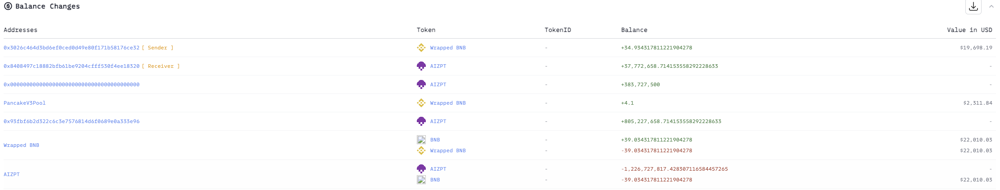
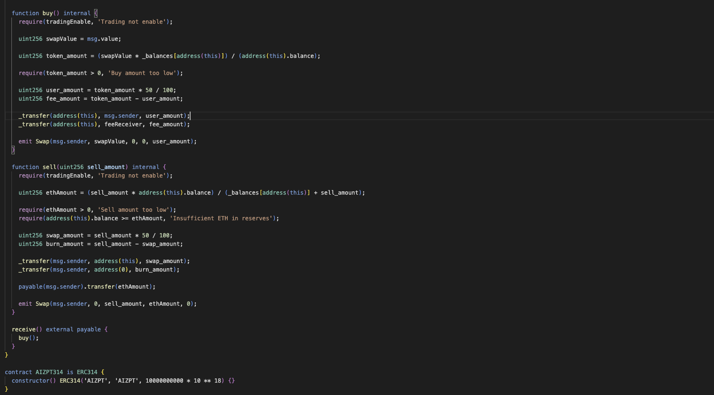

# 20241005 - AIZPT - 价格操纵 ~ 35 $BNB

## 相关地址

攻击者地址: 0x3026c464d3bd6ef0ced0d49e80f171b58176ce32

攻击合约地址: 0x8408497c18882bfb61be9204cfff530f4ee18320

被攻击合约地址: 0xbe779d420b7d573c08eee226b9958737b6218888

攻击交易: 0x5e694707337cca979d18f9e45f40e81d6ca341ed342f1377f563e779a746460d

## 攻击分析

漏洞类型类似于 (20241011 - P719 - 价格操纵 ~ 547 $BNB)

