# 20241011 - P719 - 价格操纵 ~ 547 $BNB

## 相关地址

攻击者地址: 0xfeb19ae8c0448f25de43a3afcb7b29c9cef6eff6

攻击合约地址: 0x3f32c7cfb0a78ddea80a2384ceb4633099cbdc98

被攻击合约地址: 0x6beee2b57b064eac5f432fc19009e3e78734eabc

攻击交易: 0x9afcac8e82180fa5b2f346ca66cf6eb343cd1da5a2cd1b5117eb7eaaebe953b3

## 攻击分析

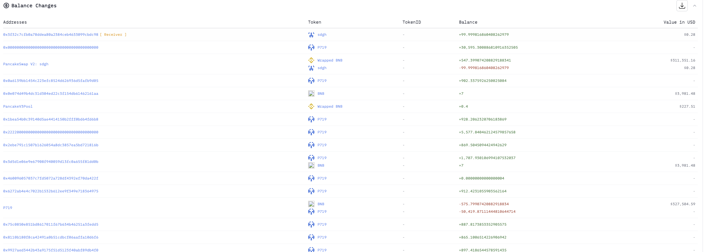

攻击者通过闪电贷获取 4000 $BNB 后，多次发送 10 $BNB 至合约中

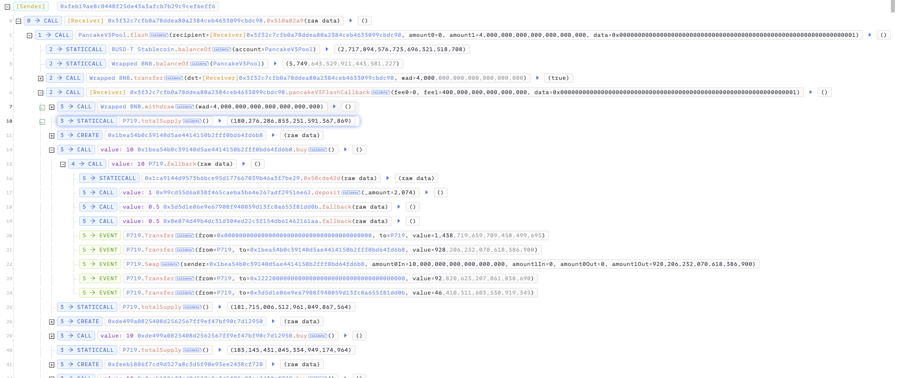

合约的 receive 方法反编译如下，大致的逻辑为代币Token的购买，相当于在合约中完成 AMM 的操作

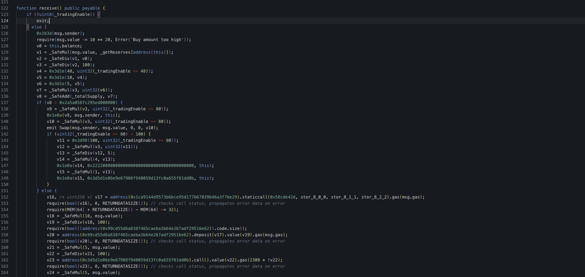

当 v8 < 200,000 * 1e18 时,  代币为 0x1d4b (_mint) 方法从0地址铸造给购买者

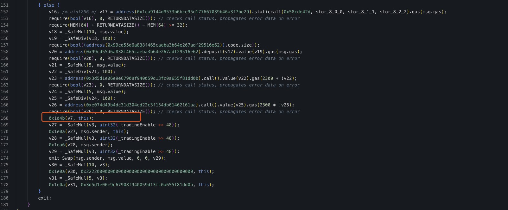

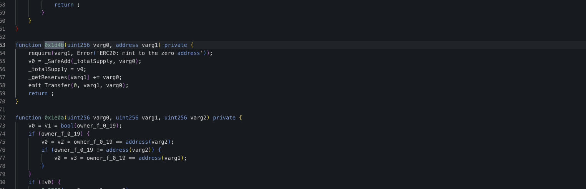

当 v8 > 200,000 * 1e18 时,  代币则是从合约中直接发送代币给购买者

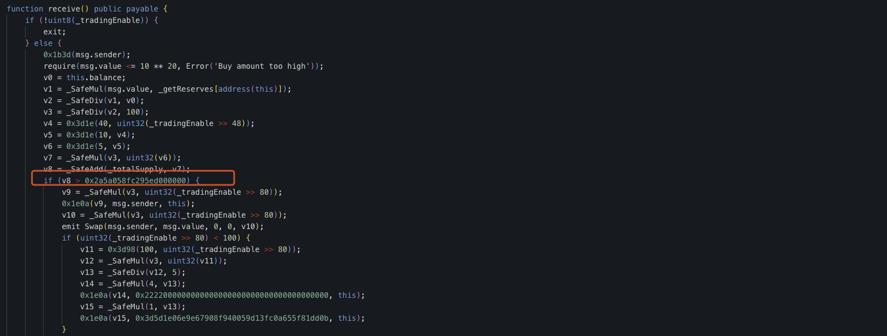

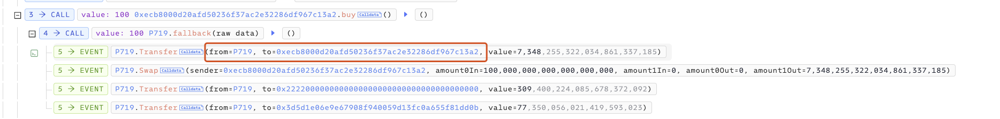

当 transfer 方法调用时如果接收者为合约时对应逻辑为代币卖出, 而转入的 Token 将会被 0x322e(_burn) 方法销毁

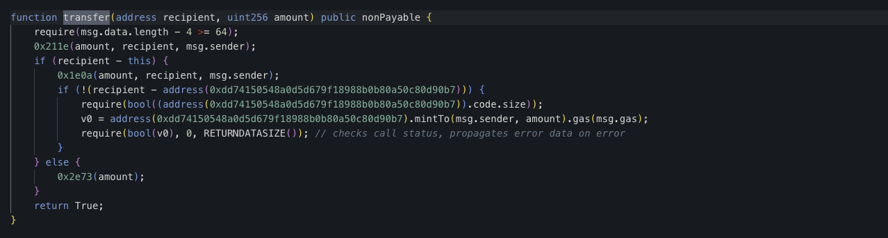

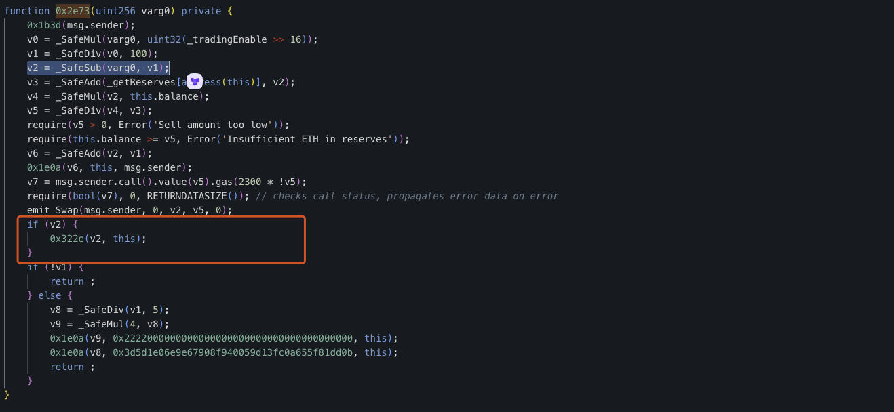

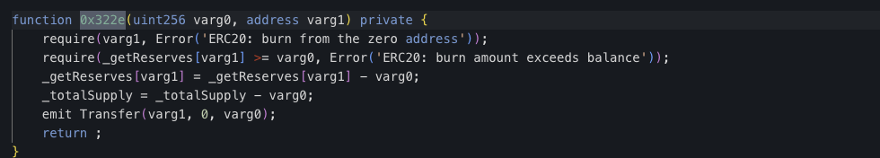

正常购买逻辑应为购买后将代币从零地址 mint 给购买者，当购买者卖出时再通过 burn 进行销毁对应代币来保持代币的平衡

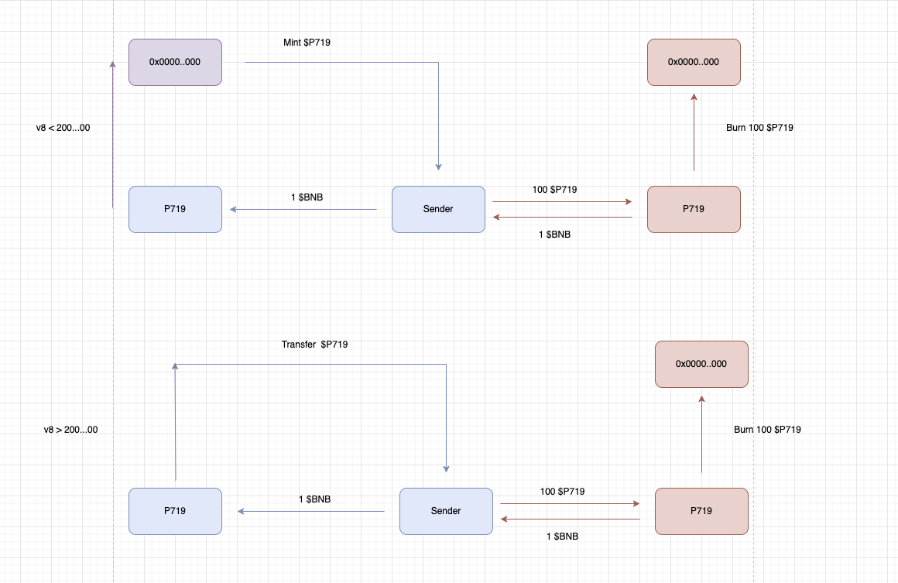

当 v8 ( totalSupply) 大于 200...000 时将从合约中发送代币，此时相当于在销毁合约中的代币从而价格操纵，所以攻击者通过14次 10 $BNB 的交易将 v8 参数控制为大于 200...000 后多次买入转移合约中的代币

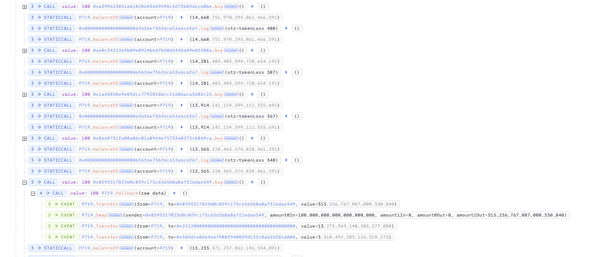

攻击者购买大量的代币后将代币发送给合约，合约内部进行卖出逻辑发送 $BNB 给攻击者并从合约中销毁这部分数量代币，此时由于销毁代币不为 mint 出的代币而是合约本身的代币导致价格操纵

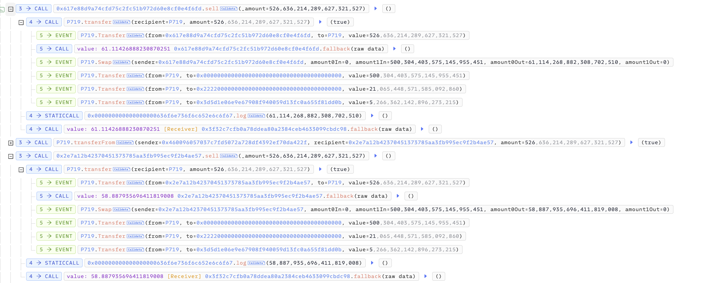

最后攻击者归还闪电贷并通过购买自创建的代币避免前置运行后获利离场

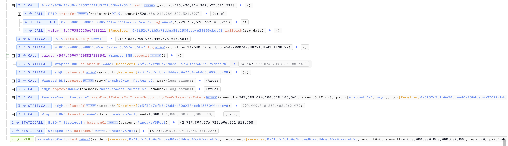