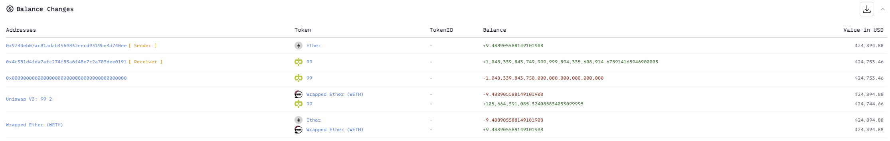

# 20241016 - ERC99 ~ 权限缺失 ~ 9 $ETH

## 相关地址

攻击者地址：0x9744eb07ac81adab4569832eecd9319be4d740ee

被攻击地址：0x2c9526def0e6a620122ac72057e11d82a8ecdacd

攻击合约地址：0x4c381d4fda7afc274f53a6f48e7c2a703dee0191

攻击交易：0x7879fe4c3cb11e7ef5dd53c4559ce744f118758ede9e824c1604af2961b7ce0c

## 攻击分析

漏洞出现在合约的 generateTokens 函数中，这里直接 mint Token给攻击者且没有权限验证

