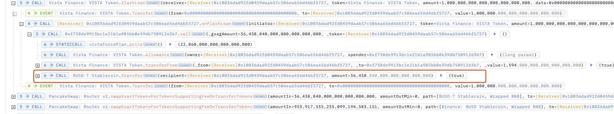

# 20241021 - VISTA - 逻辑错误 ~ 48 $BNB

## 相关地址

攻击者地址: 0x3d71366228ebd5196d45ee72f82405da601190ad

攻击合约地址: 0x10036dad92fd0459daab57c506ea656d46bf5727

被攻击合约地址: 0xf738de9913bc1e21b1a985bb0e39db75091263b7

攻击交易: 0x84c385aab658d86b64e132e8db0c092756d5a9331a1131bf05f8214d08efba56

## 攻击分析

攻击者通过闪电贷获取 BUSD 后在合约 VistaFinanceICO 中进行质押 

这里的质押为 1:1 兑换 Token, 在合约 0xf738de 中的Token价格更高，但只有结束质押才可调用 sell 卖出

在合约中调用 sell 时使用 transferFrom 将 Token发送到合约中，而 transferFrom 调用时有条件

getFreeBalance 方法检测了 Token 是否还在质押中，如果还在质押将不允许转移代币，但检测的条件为 Token 余额 - Token 质押数量 = 可转移 Token 数量，由于合约存在闪电贷方法可借出 Token 让 Token 余额变得非常大，导致可转移数量变大使被质押的代币也可被转出

该闪电贷方法使用 mint 和 burn 完成闪电贷操作，并没有检测 burn 的代币是否为质押的代币，此时相当于提前结束了所有代币的质押并领取质押结束的奖励，攻击者通过该方法转移走了合约中所有 USDT 后归还闪电贷离场

