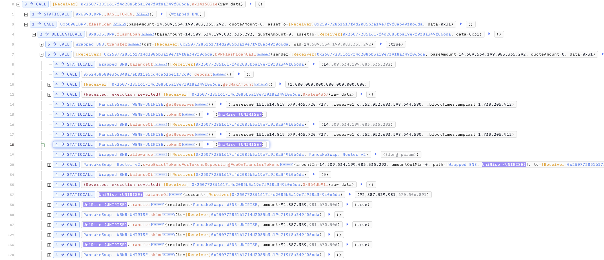

# 20241029 - UniRise - 逻辑错误 ～ 9 $BNB

## 相关地址

攻击者地址: 0xbd8192dfb71ad0191760536af35922b7db5feb62

攻击合约地址: 0x250772851617f4d2085b3a19e7f9f8a349f066da

被攻击合约地址: 0xa0706fce57e02dfae00248d40bcccd54cf08eeef

攻击交易: 0x7f5148fce482cfe4a70e351551b9470f3dd1724dab17cff4780b9f09ad7b38dc

## 攻击分析


攻击者通过闪电贷买入14 $BNB 的代币后重复发送购入代币的 1% 到池中，再通过 skim 拿回发送的代币



当调用 transfer 方法时合约通过 swapExactETHForTokensSupportingFeeOnTransferTokens 方法回购部分 Token


```solidity
    function _transfer(
        address from,
        address to,
        uint256 amount
    ) private {
        require(from != address(0), "ERC20: transfer from the zero address");
        require(to != address(0), "ERC20: transfer to the zero address");
        require(amount > 0, "Transfer amount must be greater than zero");
        if(from != owner() && to != owner()) {
            require(amount <= _maxTxAmount, "Transfer amount exceeds the maxTxAmount.");
        }

        uint256 contractTokenBalance = balanceOf(address(this));
        bool overMinimumTokenBalance = contractTokenBalance >= minimumTokensBeforeSwap;
        
        if (!inSwapAndLiquify && swapAndLiquifyEnabled && to == uniswapV2Pair) {
            if (overMinimumTokenBalance) {
                contractTokenBalance = minimumTokensBeforeSwap;
                swapTokens(contractTokenBalance);    
            }
	        uint256 balance = address(this).balance;
            if (buyBackEnabled && balance > uint256(1 * 10**18)) {
                
                if (balance > buyBackUpperLimit)
                    balance = buyBackUpperLimit;
                
                buyBackTokens(balance.div(100));
            }
        }
        
        bool takeFee = true;
        
        //if any account belongs to _isExcludedFromFee account then remove the fee
        if(_isExcludedFromFee[from] || _isExcludedFromFee[to]){
            takeFee = false;
        }
        
        _tokenTransfer(from,to,amount,takeFee);
    }
```


需要关注的位置为 buyBackTokens 方法，这里将使用合约中的 1% $BNB 余额回购 Token, 触发条件为将 Token 接收目标为 Pair 池时, 通过池的 skim 方法将可以取回发送的代币并触发 buyBackTokens 进行回购，由于池并不大，该合约中约14个 $BNB 多次回购将大幅拉高价格，攻击者只需要 transfer 时 2% + 9% 的发送Token数量的手续费即可多次触发


攻击者将合约中 $BNB 消耗殆尽拉升价格后卖出 Token 归还闪电贷离场

