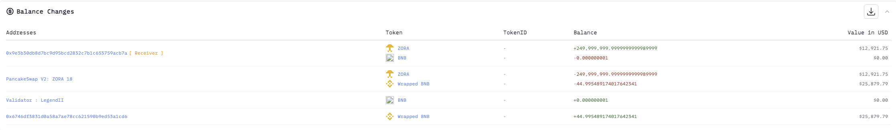
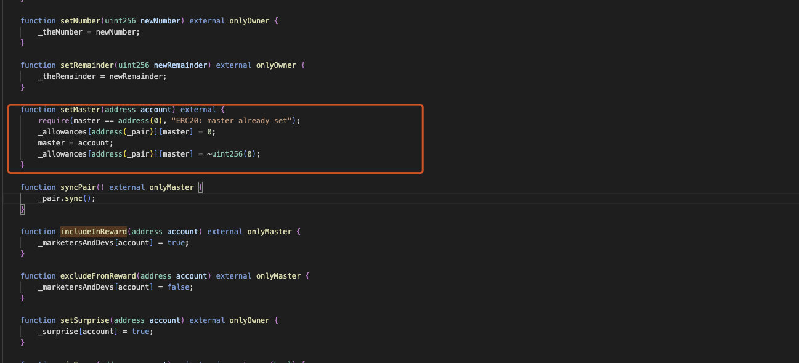
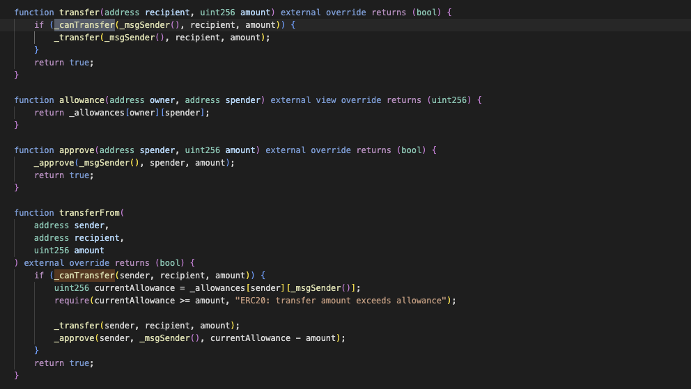
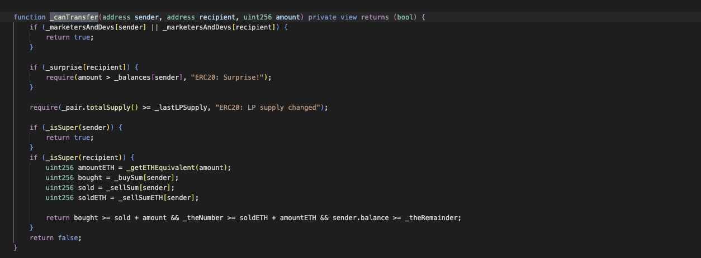
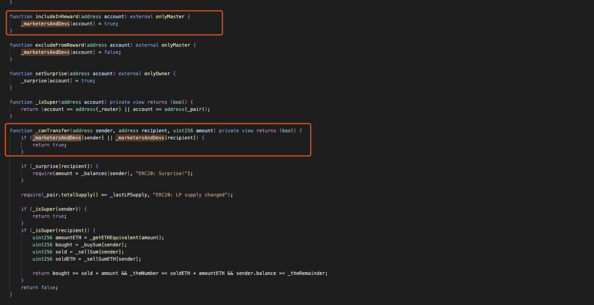
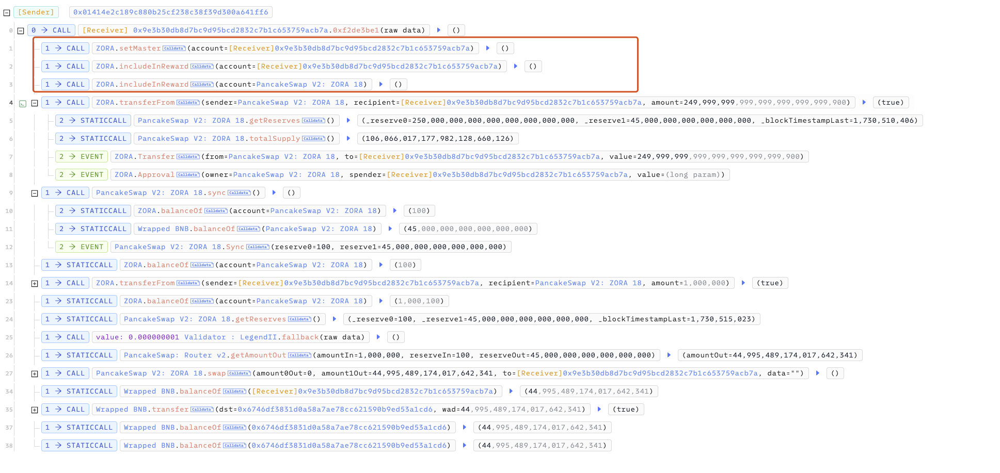

# 20241102 - ZORA - 参数可控 ~ 45 $BNB

## 相关地址

攻击者地址: 0x01414e2c189c880b25cf238c38f39d300a641ff6

攻击合约地址: 0x9e3b30db8d7bc9d95bcd2832c7b1c653759acb7a

被攻击合约地址: 0x52fbd9a94587f8ce757d1bd0a89abfe8d6233591

攻击交易: 0x28f8e92e64595edf2680a40c5ca1dcfddf2a74fde6f2b51efc09d31edef09d0f

## 攻击分析

漏洞出现在合约中的 setMaster 方法

这里 account 参数可控，导致攻击者可以通过控制参数随意转移池中代币，在 transfer 中有参数检查，需要  _canTransfer 方法返回 True 才可以转移代币

想要通过这一部分的逻辑只需要通过 includeInReward 方法将 _marketersAndDevs[account] 参数进行配置，之前由于通过 setMaster 方法控制了参数 master，所以  includeInReward 方法也可以任意调用

此时，攻击者可以任意转移池中代币

