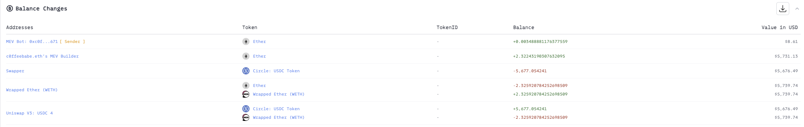
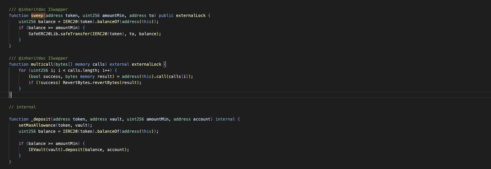
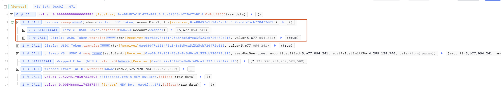

# 20241105 - Euler Swapper ～ 权限缺失 ~ 2 $ETH

## 相关地址

攻击者地址: 0xc0ffeebabe5d496b2dde509f9fa189c25cf29671

攻击合约地址: 0xe08d97e151473a848c3d9ca3f323cb720472d015

被攻击合约地址: 0x9b2583d98fb39aa675caa33b81efbd539bdf276c

攻击交易: 0xd46350993431658ca87229961898acd384fe06da4297e45d9bfcb72db1509a84

## 攻击分析



漏洞出现在合约的 sweep 方法中



```solidity
    function sweep(address token, uint256 amountMin, address to) public externalLock {
        uint256 balance = IERC20(token).balanceOf(address(this));
        if (balance >= amountMin) {
            SafeERC20Lib.safeTransfer(IERC20(token), to, balance);
        }
    }
```

任何人可以通过调用该方法清空合约指定Token余额



