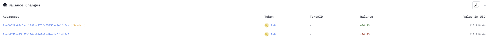
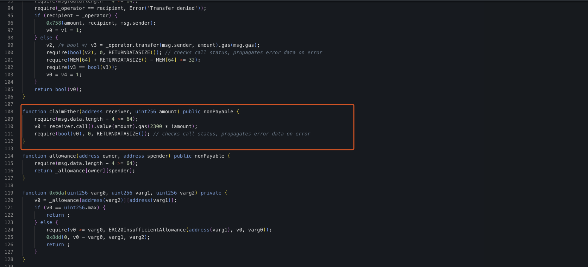
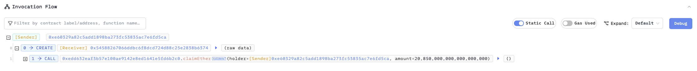
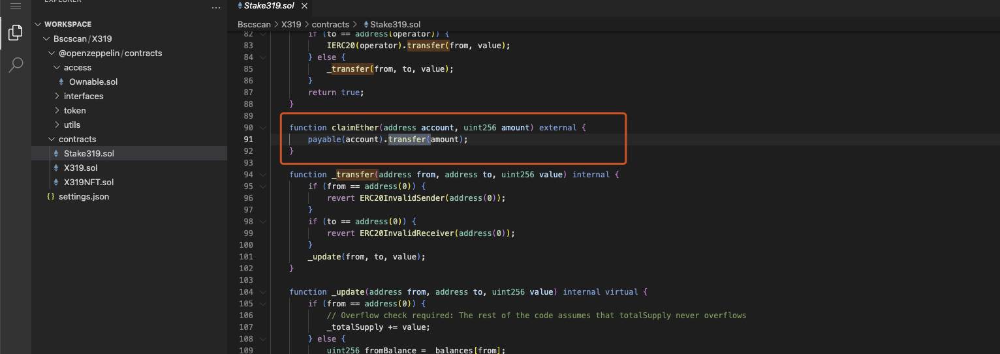

# 20241109 - X319 ～ 权限缺失 ~ 20 $BNB

## 相关地址

攻击者地址: 0xe60329a82c5add1898ba273fc53835ac7e6fd5ca

攻击合约地址: 0x54588267066ddbc6f8dcd724d88c25e2838b6374

被攻击合约地址: 0xedd632eaf3b57e100ae9142e8ed1641e5fd6b2c0

攻击交易: 0x679028cb0a5af35f57cbea120ec668a5caf72d74fcc6972adc7c75ef6c9a9092

## 攻击分析

合约中 claimEther 方法未做权限设置，调用将取走合约中的 $BNB

