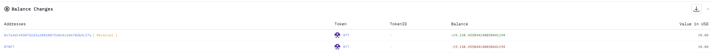
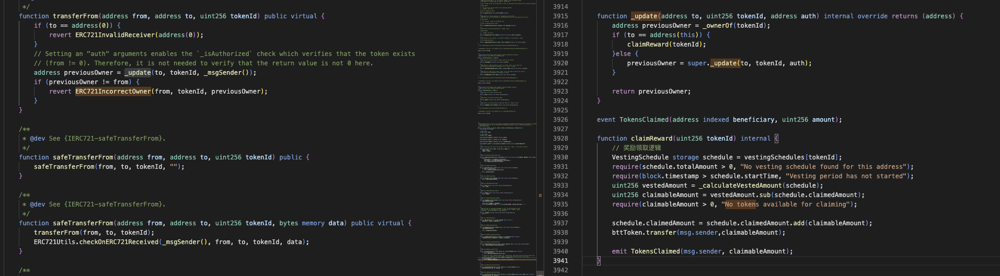
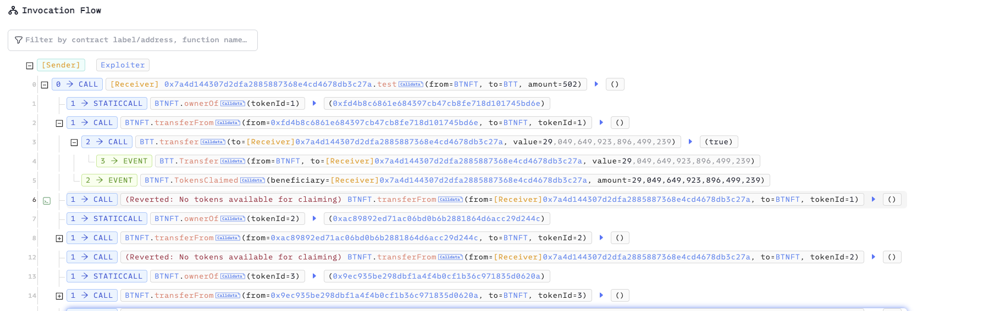

# 20250418 - BTNFT - 逻辑错误 ～ 19k $BUSD

## 相关地址

攻击者地址: 0xbda2a27cdb2ffd4258f3b1ed664ed0f28f9e0fc3

攻击合约地址: 0x7a4d144307d2dfa2885887368e4cd4678db3c27a

被攻击合约地址: 0x0fc91b6fea2e7a827a8c99c91101ed36c638521b

攻击交易: 0x1e90cbff665c43f91d66a56b4aa9ba647486a5311bb0b4381de4d653a9d8237d

## 攻击分析



漏洞出现在合约的 transferFrom 方法中，调用时会走到 _update 方法，当 to 参数为当前合约地址时会通过 claimReward 函数提取奖励



但奖励提取的目标地址为 msg.sender ，而 transferFrom 方法任意用户可调用，只需要控制 from 地址为 nft 的所有者就可以领取所有nft持有者的奖励

```solidity
function claimReward(uint256 tokenId) internal {
        // 奖励领取逻辑
        VestingSchedule storage schedule = vestingSchedules[tokenId];
        require(schedule.totalAmount > 0, "No vesting schedule found for this address");
        require(block.timestamp > schedule.startTime, "Vesting period has not started");
        uint256 vestedAmount = _calculateVestedAmount(schedule);
        uint256 claimableAmount = vestedAmount.sub(schedule.claimedAmount);
        require(claimableAmount > 0, "No tokens available for claiming");

        schedule.claimedAmount = schedule.claimedAmount.add(claimableAmount);
        bttToken.transfer(msg.sender,claimableAmount);

        emit TokensClaimed(msg.sender, claimableAmount);
    }
```

