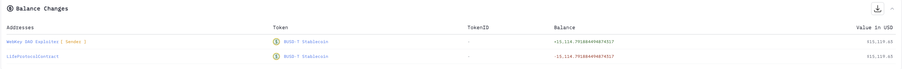
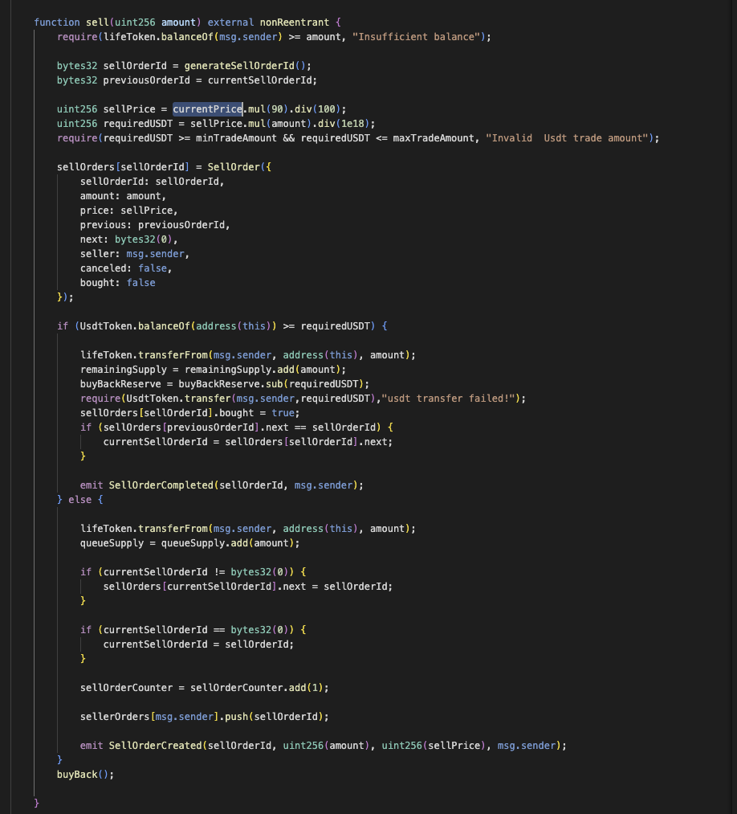
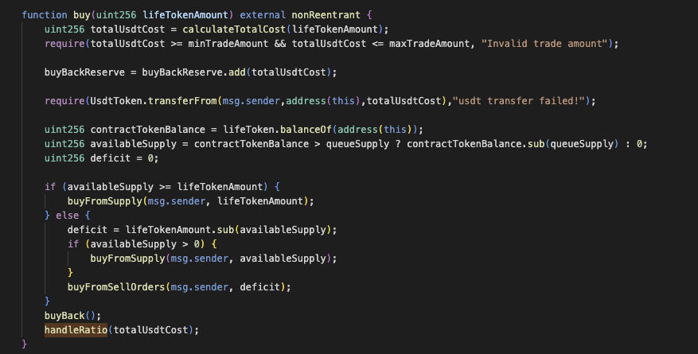
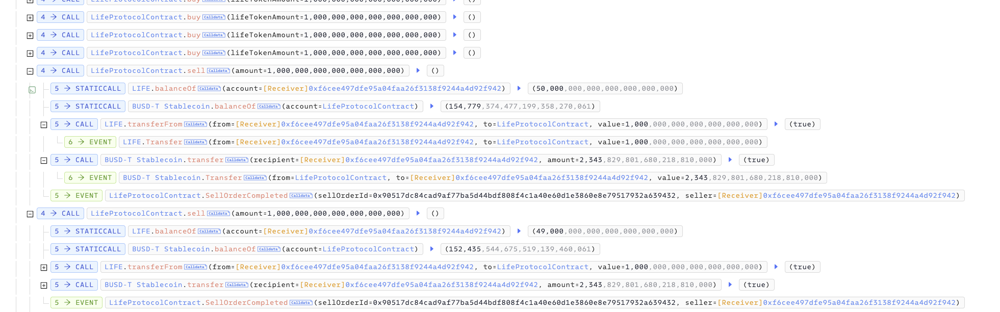

# 20250426 - Lifeprotocol - 价格操纵 ～ 15k $BUSD

## 相关地址

攻击者地址: 0x3026c464d3bd6ef0ced0d49e80f171b58176ce32

攻击合约地址: 0xf6cee497dfe95a04faa26f3138f9244a4d92f942

被攻击合约地址: 0x42e2773508e2ae8ff9434bea599812e28449e2cd

攻击交易: 0x487fb71e3d2574e747c67a45971ec3966d275d0069d4f9da6d43901401f8f3c0

## 攻击分析

漏洞出现在合约中的 sell 函数中，当用户调用时会通过 currentPrice 参数计算卖出代币获得的 $BUSD

currentPrice 参数计算来自于 handleRatio 函数，当用户通过 buy 函数购买代币时会在最后调用该函数更新价格

由于卖出时没有更新实时价格，攻击者可以通过不断的通过函数 buy 购买代币提升价格，最后再通过不变的高价进行全部卖出获利

