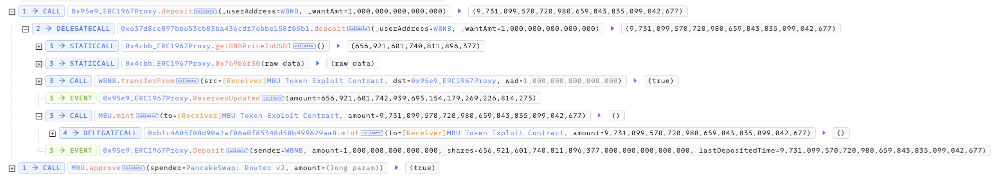

## 20250511 - MBU - 逻辑错误  ～ 2k $BUSD

## 相关地址

攻击者地址: 0xb32a53af96f7735d47f4b76c525bd5eb02b42600

攻击合约地址: 0x631adff068d484ce531fb519cda4042805521641

被攻击合约地址: 0x637d8ce897bb653cb83ba436cdf76bbe158f05b1

攻击交易: 0x2a65254b41b42f39331a0bcc9f893518d6b106e80d9a476b8ca3816325f4a150

## 攻击分析

漏洞出现在合约的 deposit 函数中，合约逻辑与购买对应 Token 相似，计算路径为 BNB -> BUSD -> MBU , 再通过 mint 发送给调用者对应 Token

函数 0x371b 的 BNB -> BUSD 兑换逻辑中缺失了 Token 精度的计算，导致 BUSD 的值变得非常大，可换出更多的 Token

攻击者通过少量 BNB 大量获利

